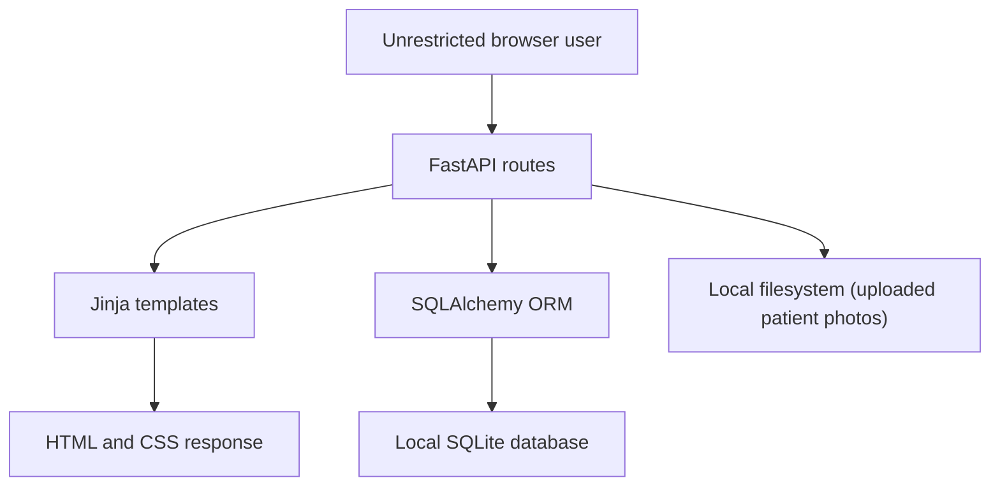
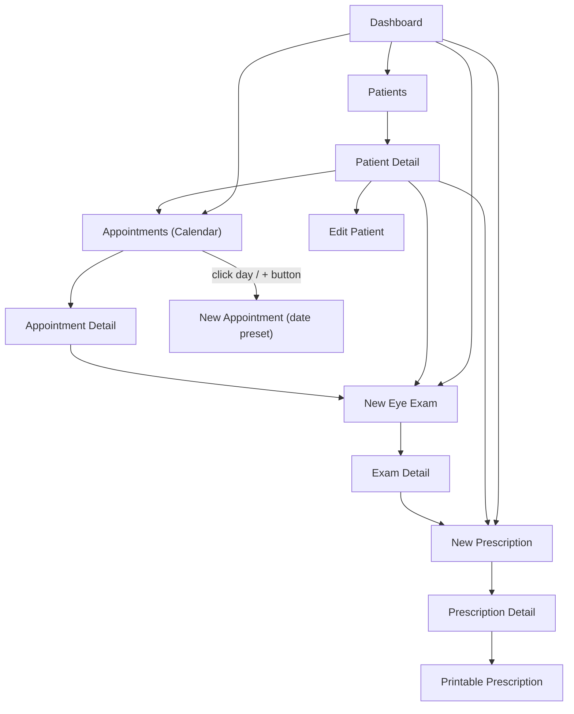
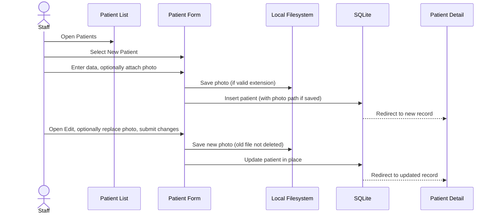
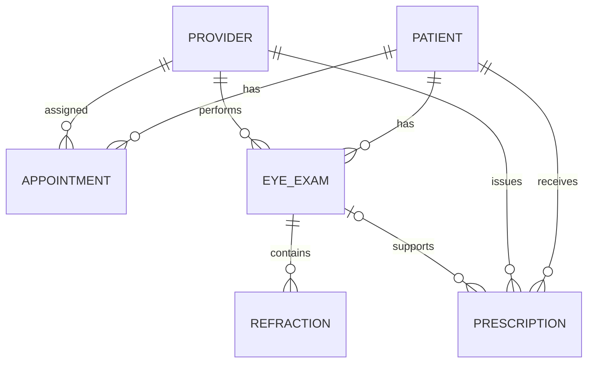

# New Path Vision EHR
## Baseline Product Definition and Current-State Functional Specification

**Document version:** 2.28 (supersedes v2.27; Calendar & Appointments UX Overhaul Phase 2 -- adds Waitlist Management: a new `WaitlistEntry` model, a per-patient waitlist tab, a staff-facing global queue, and surfacing matching entries on an appointment's detail page when it's cancelled; see new §47; none of this bears on the four go-live prerequisites, which are unchanged from v2.6)
**Baseline date:** September 9, 2026
**Application-reported version:** 1.0.0
**Baseline source:** `setup_ehr.py` self-contained scaffold script (locally generated `visioncare_ehr/` project directory; see §2.2)
**Status:** Verified current-state baseline
**Intended use:** Record keeping, regression reference, product planning, and controlled expansion of the application

---

## ⚠ DO NOT USE WITH REAL PATIENT DATA — READ BEFORE GOING LIVE

> **Status as of v2.6: 2 of 4 go-live prerequisites are fully done, 1 is substantially — but not completely — addressed, and 1 remains entirely untouched. Do not go live yet.**
>
> **What changed in v2.6:** the Neon point-in-time-recovery restore procedure documented in v2.5 (§38.3) has now actually been performed, not just described. A branch was restored to an earlier point in time, and its `patients`/`users`/`appointments` row counts were confirmed to exactly match the expected seeded data. This closes go-live prerequisite 4.
>
> **What changed in v2.5 (carried forward):** the application moved off a single local machine entirely. It now runs on Vercel, backed by Neon (managed Postgres) and Cloudinary (managed object storage) — see §38. Vercel terminates TLS for every request, Neon's connection is TLS-required, and both Neon and Cloudinary encrypt their storage by platform default (§38.2). Patient photo access was closed from a public/guessable URL to a session-auth-gated route (§38.4), and an automated end-to-end test suite now runs in CI on every change (§38.5).
>
> **What did NOT change:** nobody has signed a Business Associate Agreement with Vercel, Neon, or Cloudinary (prerequisite 2 — still completely open, and the one item on this list that is a legal/procurement action, not an engineering one). This document's author could not independently re-verify Vercel/Neon/Cloudinary's current published encryption-at-rest and BAA terms while writing §38.2 (the review environment's network policy blocked reaching vendor documentation directly) — treat that section's characterization as reasoned from general, standard practice for this class of managed provider, not as a re-confirmed fact, and verify current terms directly with each vendor before relying on it. Record-level "who viewed this specific photo" auditing beyond the session-auth gate still does not exist. CSRF protection, absent through v2.18, was resolved in v2.19 (§37.7) and is not the subject of this notice.
>
> **This application MUST NOT be used to store, process, or display real patient data or any other real PHI until, at minimum, all of the following are in place:**
> 1. ~~Real authentication, authorization, and audit logging (who did what, to which record, when).~~ **Done as of v2.4** — see §37. (Note the scope: the audit log covers login/logout/access-denied events, not yet a full per-field "who changed this clinical value" trail — see §37.6.)
> 2. Deployment on compliant hosting, under a signed Business Associate Agreement (BAA) with the hosting/infrastructure provider. **Still fully open — a business/legal action, not something this or any future engineering pass can complete on its own.** See §38.1.
> 3. Encryption in transit (TLS) and at rest (database and file storage). **Substantially addressed as of v2.5** via the managed platforms now in use — see §38.2 for exactly what was and wasn't verified, and its caveats.
> 4. ~~Real backup and disaster-recovery capability, tested and documented.~~ **Done as of v2.6** — Neon's point-in-time recovery is the mechanism, §38.3 documents the procedure, and a live test restore has been performed and confirmed correct. See §38.3 for the one narrower caveat that remains (Cloudinary-stored photos aren't covered by a Neon restore).
>
> **The user has engaged compliance/legal counsel for this project.** Readiness for real-patient go-live must be confirmed with that counsel — not inferred from this document, and not determined by engineering judgment alone. This document is a technical and product baseline; it is not legal advice, and nothing in it should be read as counsel's sign-off on go-live. Completing prerequisites 1 and 4, and making real progress on 3, does not make the still-fully-open prerequisite 2 any less mandatory.
>
> This notice is referenced from §4.1 (Access-control baseline), §15 (Security, Privacy, and Compliance Baseline), §37 (Authentication build), and §38 (Deployment infrastructure), which describe the underlying facts in detail. Read those sections for the specifics; read this box first for what those facts mean in practice.

---

## 1. Document Purpose

This document establishes the verified baseline of the New Path Vision EHR application (formerly branded "VisionCare EHR") as it exists after the September 2026 rebrand and feature round. It records what the product currently is, what it does, how its screens and workflows behave, how its data is structured, and which important capabilities are not present.

This is a current-state specification, not a statement that the application is complete, production-ready, legally compliant, or clinically sufficient. Future feature specifications should identify whether they add to, change, replace, or retire behavior documented here.

### 1.1 Ground-truth authority

This document is the authoritative product and implementation baseline for the platform. It records the verified application structure, routes, workflows, data model, physical database schema, and known limitations as of the baseline date.

From version 1.1 forward (unchanged rule, retained from the prior baseline):

- A platform change is not considered fully documented until this specification or an explicitly versioned successor is updated.
- Database changes must include both a migration and a corresponding update to the logical and physical schema sections of this document.
- Route, workflow, validation, permission, integration, and infrastructure changes must identify the baseline sections they modify.
- If running code, database structure, and this specification diverge, the divergence is a documentation or implementation defect that must be reconciled before release.
- Historical versions must be retained so the platform's evolution remains traceable.

**Version 1.2 change log (relative to v1.1):**

| Area | Change |
| --- | --- |
| Product name / brand | Renamed from "VisionCare EHR" to "New Path Vision EHR" across navigation, page titles, dashboard, and printable prescription header. |
| Visual language | Global color palette changed from blue to green (see §14.1). Status badges are unchanged. |
| Logo | The eye-emoji brand mark was replaced with an ``-based logo placeholder (green eye/leaf SVG) pending delivery of the client's final logo asset. |
| Responsive design | Screen-size media queries were added; the platform now has verified breakpoint behavior instead of the untested/inferred risk noted in v1.1 (see §14.3). |
| New capability | Patient photo upload, storage, and display (list thumbnail, detail-page photo, form upload) — see §9.2–9.5, §12.2, §25. |
| New capability | Appointment calendar click-to-create: clicking (or hovering the `+` on) a day cell opens the new-appointment form with that date pre-filled (see §9.7). |
| Distribution model | The baseline source of truth is now a self-contained `setup_ehr.py` scaffold script run by the end user locally, not a fixed zip archive with pinned checksums (see §2.2). |

**Version 1.3 change log (relative to v1.2):**

| Area | Change |
| --- | --- |
| New capability | Full Appointment Scheduling Module accepted into baseline per the *Appointment Scheduling Module Target-State Specification v1.0*: appointment types, new/established patient classification, type-based color coding, scheduled diagnostic tests, day/week calendar views (added alongside existing month/list views), provider-level conflict detection, and an unauthenticated administration area for appointment types/tests/resources/availability/audit. See new §26. |
| Data model | `appointments` gains 15 new columns (appointment-type version reference, patient-relationship snapshot, follow-up flag, calculated end time, buffers, resolved color, override flags/reasons, `updated_at`). 12 new tables added. See §26.6 and updated Appendix A. |
| Schema evolution | The application now runs an embedded, idempotent, ordered migration mechanism (a `schema_migrations` table plus schema-inspecting migration functions) at startup, ahead of `create_all()`. This replaces reliance on `create_all()` alone for the tables/columns it manages, closing part of the risk documented in v1.2 §12.8/§18.2 item 11/§25.15. `create_all()` is still used for any net-new tables and is unchanged for the pre-existing six tables. |
| Route catalog | `GET /appointments/day` and `GET /appointments/week` added. `GET /appointments/{appt_id}/edit`, `POST /appointments/{appt_id}/edit`, `POST /appointments/{appt_id}/reschedule`, and a stub `GET /appointments/availability` added. A full `/admin/scheduling/*` route family added (types, tests, resources, availability templates, audit log). All pre-existing appointment routes remain available and behave as documented, with the exceptions noted in §26. |
| Behavior change | Appointment creation and editing now enforce type/patient-relationship eligibility and provider-conflict checks **server-side**, returning HTTP 400 with a message instead of silently accepting or 500ing. This intentionally changes the v1.2 baseline behavior recorded in §9.8, §13, and §18.2 items 5 and 7 — see §26.9 for the reconciliation. |
| Scope not yet built | Room/lane/device/technician conflict enforcement, the color-rule builder UI, real open-slot availability search, CSRF protection, drag-and-drop, and any `created_by`/`updated_by` attribution (no user/auth model exists) — see §26.10. |

**Version 1.4 change log (relative to v1.3) — Global navigation redesign:**

| Area | Change |
| --- | --- |
| Navigation structure | The horizontal top navigation links (Patients, Appointments, New Exam, New Rx) were replaced by a **left sidebar**, collapsible to icon-only width (state remembered via `localStorage`) and converting to an off-canvas drawer at the existing ≤900px breakpoint. Sidebar groups: Dashboard; Patients (with a "Recently viewed" list sourced from a browser cookie, capped at 5); Appointments (Month/Week/Day/List); New Exam; New Rx; Administration ▸ Scheduling (the appointment-type/test/resource/availability/audit screens added in v1.3). See §7 (superseded — see note below) and new §27.1. |
| Top bar repurposed | The top bar no longer carries navigation links. It now shows, left to right: a sidebar toggle, the logo (linking to `/`), an **environment badge** (reads `EHR_ENV`, default `development`; shows amber "TEST/DEV: &lt;value&gt;" for anything other than exactly `production`, else a green "PRODUCTION" badge — purely informational, not an access control), a **quick patient switcher** (type-ahead against a new `GET /patients/search` JSON endpoint, navigates to patient detail), a **client-side live clock** (browser-local time, explicitly labeled "Local time" since it is not server time), and a **staff name picker** (free-text, stored in a `npv_staff_name` browser cookie for one year). See new §27.2. |
| New capability, explicitly not authentication | The staff name picker is a display-only convenience with **no authentication behind it** — it does not gate access to any page or action, and the access-control baseline in §4.1 is otherwise unchanged (still no authentication or authorization anywhere in the application). |
| New capability | **Active patient context strip**: a bar shown directly under the top bar whenever the current page is tied to a specific patient (patient detail/edit; an appointment, exam, or prescription belonging to that patient; or a list/calendar view given an explicit `?patient_id=`). Shows photo/initials, name, age (computed from DOB), sex, DOB, phone, a red "Allergies" flag shown only when the patient's allergies field is non-empty and not a "none"/NKDA-style value, and quick-action links (Schedule, New Exam, New Rx, Patient Detail). Patient info is stacked vertically; a "Balance Due" indicator is shown at the right in a visually prominent red card and always reads "N/A — billing not implemented," since no billing/balance data exists anywhere in this application — this value is never fabricated. See new §27.3. |

**Version 1.5 change log (relative to v1.4) — Practice-operations stubs and Holidays/Closures:**

| Area | Change |
| --- | --- |
| New sidebar sections | Four new top-level sidebar groups were added: **Store Operations** (Daily Closing, Change Payments), **Orders** (Order Management), **Claim Management**, and **Catalog** (Frames, Eyeglass Lenses, Contact Lenses, Accessories, Insurance Plans). All route to real, rendering pages; most are intentionally polished placeholders describing a future capability rather than working features — see new §27.4 for exactly which screens are real versus placeholder. |
| New capability (real, not a placeholder) | **Daily Closing** (`/store-ops/daily-closing`): a payment-type reconciliation form (Cash, Check, Credit Card, ATM/Debit, CareCredit, American Express) with editable Actual amounts, client-side variance calculation, a posting-date field with a mismatch warning banner, and persisted history. "Calculated" amounts are pinned at $0.00 with an explicit, honestly-labeled note that no transaction ledger exists yet to compute against — following the same no-fabrication pattern already used for the patient Balance Due field. Persisted in a new `daily_closings` table, added via the existing idempotent migration runner. See §27.4, §28 (schema). |
| New capability (real, not a placeholder) | **Holidays / Closures** (new screen under Administration ▸ Scheduling): administrators can record practice-wide closure dates with a label and optional notes, persisted in a new `practice_closures` table. Attempting to book a new appointment on a closure date is now rejected server-side with HTTP 400 ("The practice is closed on this date: &lt;label&gt;"), enforced inside the same scheduling-rules service that already enforces provider conflicts and type/relationship eligibility (§26.9). See §27.4, §28 (schema), §27.5 (schema-fit decision). |
| New capability | **Merge Patient** stub: a sidebar link under Patients (next to "Recently viewed") routing to a placeholder page describing duplicate-patient detection/merge as a future capability. Not functional. |
| New shared component | A reusable **alert banner** Jinja macro (`ehr/templates/_alert_banner.html`; message + severity — warning/error/info) intended as the standard pattern for future in-app alerts. Used for the Daily Closing posting-date-mismatch warning and for a new **Dashboard** banner that flags when one or more of today's appointments are still in `scheduled` status after their scheduled time has passed (a likely missed check-in/no-show signal). See §27.4. |
| Product-strategy origin | This round followed a competitive screenshot review of Eyefinity Encompass, an established optometry practice-management product. The four items built were selected as the highest-value, lowest-risk subset of that review (real Daily Closing and Holidays features; polished stubs reserving the information architecture for Orders/Claim Management/Catalog/Merge Patient). Deferred items from that review (a full optical product/inventory data model, real insurance-claim submission, a resource-schedule grid view, VSP-specific bulk authorizations) are recorded as open backlog in §19 and §27.6, not silently dropped. |

## 2. Inspection Scope and Evidence

The v1.1 baseline was produced from four forms of evidence gathered against a fixed `visioncare_ehr.zip` archive:

1. Live execution of the FastAPI application on port 8000.
2. HTTP-level inspection of all known user-facing and framework-provided routes.
3. End-to-end workflow testing against a disposable copy of the included SQLite data.
4. Source inspection of the application entry point, route handlers, SQLAlchemy models, Jinja templates, CSS, seed logic, and dependency manifest.

The v1.2 update was produced the same way, but against the current generated codebase, re-verified after each feature change (rebrand, green palette, responsive CSS, photo upload, calendar click-to-create) by writing the scaffold to a clean directory, installing dependencies, seeding the database, starting Uvicorn, and confirming HTTP 200 plus expected HTML/behavior for the affected routes.

### 2.1 Baseline limitations

- The application was tested through its live HTTP interface and rendered HTML output. A local graphical browser binary was unavailable in the inspection environment, so pixel-level and device-level visual verification was not performed for either v1.1 or v1.2.
- Responsive behavior is now backed by explicit CSS media queries (see §14.3), but the visual result at specific device widths has not been screenshot-verified.
- The included seed data appears synthetic. Patient-level seed values are intentionally not reproduced in this document.
- No external systems, credentials, deployment configuration, or production data were provided.
- Automated regression testing for the photo-upload feature covered file-extension validation, thumbnail rendering, and placeholder fallback, but did not test malicious file content, oversized files, or concurrent uploads.

### 2.2 Distribution model change

Unlike the v1.1 baseline, which was inspected from a fixed `visioncare_ehr.zip` archive with recorded SHA-256 checksums, the current platform is distributed as a single self-contained Python script (`setup_ehr.py`) that:

1. Writes the full `visioncare_ehr/` project tree (application code, templates, CSS, and a placeholder logo asset) to disk.
2. Installs dependencies from an embedded requirements list.
3. Seeds the SQLite database if it is not already seeded.
4. Starts the Uvicorn server.

Because the script is regenerated and redistributed each time the platform changes, fixed source-archive checksums (as recorded in v1.1 §25.1) are not meaningful for this distribution model and are not reproduced here. Instead, each specification revision documents the functional and schema delta from the prior version (see the change log in §1.1).

## 3. Product Definition

### 3.1 Current product

New Path Vision EHR is a small, server-rendered optometry record-management prototype. It gives a single unrestricted staff user access to:

- A practice dashboard with record counts, upcoming appointments, and recently created patients.
- Patient registration, search, profile review, profile editing, and patient photo upload/display.
- Appointment scheduling, list and calendar views (including click-to-create from a calendar day), appointment review, and manual status updates.
- Eye-exam documentation, including visual acuity, manifest refraction, intraocular pressure, cover testing, slit-lamp findings, fundus findings, assessment, plan, diagnosis codes, and follow-up interval.
- Glasses and contact-lens prescription entry, review, exam linkage, and browser printing.

### 3.2 Product boundary

The current product is not a complete electronic health record or practice-management system. It does not currently provide user accounts, security roles, patient authentication, clinical signing, amendments, audit history, billing, claims, payments, optical orders, inventory, general document storage, clinical imaging, messaging, reminders, reporting, interoperability, or compliance controls. Patient photo upload is a narrow exception (a single profile-style image per patient) and should not be read as general document/image management capability — see §19.

### 3.3 Intended operational model inferred from the product

The interface appears designed for a small optometry practice in which front-desk and clinical staff use the same unrestricted application. Providers are stored as clinical data records but do not log in and do not have a management interface.

This operating model is inferred from the implementation. No explicit persona, security, or workflow documentation was included with the source.

## 4. Current Users, Roles, and Access

| Actor or record type | Current status | Current access or purpose |
| --- | --- | --- |
| Unauthenticated staff user | Implemented implicitly | Can view and change all available application data without signing in. |
| Provider | Data entity only | Can be selected on appointments, exams, and prescriptions. No login or maintenance screen exists. |
| Patient | Data entity only | Has demographics, insurance, history, appointments, exams, prescriptions, and an optional photo. No portal access exists. |
| Administrator | Not implemented | No separate administrative role or interface. |
| Front desk, technician, optician, clinician | Not differentiated | All would have identical unrestricted access if they can reach the application. |

### 4.1 Access-control baseline

**See the go-live safety notice at the top of this document (before §1).** Authentication/authorization/audit are now implemented (v2.4, see §37) — the facts below are updated accordingly, but the remaining go-live prerequisites (compliant hosting, encryption, backups) are still open, and this application must not be used with real patient data until they are addressed and compliance counsel confirms readiness.

- Authentication: **yes, as of v2.4** — real login required on every route (see §37.3).
- Authorization: **yes, as of v2.4** — 8-role model enforced at the route level (see §37.4).
- Role-based access control: **yes, as of v2.4**, with documented judgment calls where a role's exact boundary wasn't independently specified in advance (see §37.4).
- Session management: **yes, as of v2.4** — server-side, revocable sessions with a 12-hour hard expiry and a 30-minute inactivity timeout (see §37.3).
- Tenant or practice separation: none (unchanged; this baseline remains explicitly single-location, §3.3, §19).
- Record ownership restrictions: none beyond role-level access (e.g., no restriction limiting a Provider to only their own patients).
- Break-glass access: none.
- Patient consent controls: none.
- File-upload access control: **unchanged — still none.** Anyone with an authenticated session that can reach the patient form can upload a photo for any patient, and uploaded files are still served from a public static path with no per-file access check (see §15.1). Authentication now controls who reaches the form at all, but does not add per-record or per-file authorization beyond that.

## 5. Technology and Runtime Baseline

| Layer | Current implementation |
| --- | --- |
| Application framework | FastAPI 0.111 or later |
| Web server | Uvicorn 0.30 or later |
| Rendering | Server-side Jinja2 templates |
| ORM | SQLAlchemy 2.0 or later |
| Database | Local SQLite file named `ehr.db` |
| Form parsing | `python-multipart` (also used for the patient photo file upload) |
| Front end | Plain HTML and one custom CSS file, now including screen-size media queries (see §14.3) |
| Client-side JavaScript | Only `window.print()` on the prescription print page |
| API documentation | Default FastAPI Swagger UI, ReDoc, and OpenAPI schema |
| Database initialization | `create_all()` at application startup, preceded by the migration runner below |
| Schema migrations | **Corrected in v2.3 — was stale since v1.3.** An embedded, idempotent, ordered migration runner (`ehr/db/migrations.py`) exists and runs at every startup, before `create_all()`: 6 `COLUMN_MIGRATIONS` (ALTER TABLE steps on pre-existing tables, run first) and 5 `POST_CREATE_ALL_MIGRATIONS` (data-seed/backfill steps, run after `create_all()`), each recorded by id in a `schema_migrations` table so it never re-runs. See §12.8 and §25.16a for detail. `create_all()` is still the only mechanism for brand-new tables. |
| Automated tests | None included |
| Packaging or container definition | None included |
| Environment configuration | None included |

### 5.1 Startup

From the project root, after running `python3 setup_ehr.py` to generate and seed the project (or, if already generated, from within `visioncare_ehr/`):

```bash
python3 -m venv .venv
source .venv/bin/activate
pip install -r requirements.txt
uvicorn ehr.app:app --host 0.0.0.0 --port 8000
```

The application expects to be started from the project root because the database, template, and static-asset paths are relative to the working directory.

### 5.2 Application structure

**Corrected/expanded in v2.3.** This section was last fully accurate around v1.2; the tree below reflects the current `FILES` dict in `setup_ehr.py`. The `templates/` subtree has grown to 60+ files across the patient workspace, admin/scheduling, and store-ops/orders/claims/catalog areas (§26–§28, §35), so it is shown here as a representative structural pattern (one row per meaningful subdirectory, not every individual `.html` file) rather than an exhaustive flat listing — an exhaustive listing would be long without adding verifiable information beyond what §8 (route catalog) and §26–§28/§35 already give per-screen.

```text
visioncare_ehr/
├── requirements.txt
├── ehr.db
└── ehr/
    ├── app.py                        # mounts /static, includes all 6 routers
    ├── env_info.py                   # EHR_ENV lookup for the top-bar environment badge (§27.2)
    ├── utils.py
    ├── db/
    │   ├── seed.py
    │   └── migrations.py             # schema_migrations runner: COLUMN_MIGRATIONS + POST_CREATE_ALL_MIGRATIONS (§12.8, §25.16a)
    ├── models/
    │   └── database.py               # 20 SQLAlchemy model classes (§25)
    ├── services/
    │   └── scheduling.py             # provider + resource conflict detection, eligibility, closures (§26.9, §27.5, §31)
    ├── routes/
    │   ├── patients.py                # patient list/search/CRUD + workspace tabs (§28)
    │   ├── appointments.py            # list/calendar/day/week/CRUD/reschedule/status (§8.1, §26.7)
    │   ├── exams.py
    │   ├── prescriptions.py
    │   ├── admin_scheduling.py        # /admin/scheduling/* — types, tests, resources, availability, holidays, audit (§26.2, §27.5)
    │   └── store_ops.py               # /store-ops/*, /orders/*, /claims/*, /catalog/* (§27.4, §35)
    ├── static/
    │   ├── css/app.css                # includes the v2.0 design-token system (§33)
    │   ├── js/app.js
    │   ├── img/logo.svg               # placeholder brand logo (removed from sidebar/top bar in v1.6; still used on the print page)
    │   └── uploads/                   # patient photo uploads, created at runtime
    └── templates/
        ├── base.html, dashboard.html, _alert_banner.html (§27.4.1)
        ├── appointments/              # list, calendar, day, week, detail, edit/reschedule, availability stub
        ├── exams/, prescriptions/
        ├── patients/                  # list, new/edit form, and a workspace/ subtree: overview, demographics,
        │                              #   addresses, appointments, recalls, insurance(+eligibility, +relationships),
        │                              #   rx(+glasses, +contacts), orders(+exams, +eyeglass, +contacts),
        │                              #   correspondence(+documents, +notes), merge (§28.1–§28.2)
        ├── admin/scheduling/          # appointment-types (+new/edit/history), tests, resources, availability,
        │                              #   holidays, audit (§26.2, §27.5)
        └── store_ops/, orders/, claims/, catalog/   # daily-closing, change-payments, order management,
                                       #   5 claims sections (§35.2), 5 catalog sections — all placeholders
                                       #   except Daily Closing and Holidays/Closures (§27.4)
```

## 6. Architecture Baseline



### 6.1 Architectural characteristics

- The application is a single-process monolith.
- HTML pages and form handlers are implemented in the same service.
- All database access is synchronous.
- There is no service layer between route handlers and SQLAlchemy models.
- Business rules are embedded directly in routes and templates.
- The application uses one local database and has no tenant, location, or organization boundary.
- Static assets, including uploaded patient photos, are served by the same FastAPI process from the local filesystem.
- There is no background-job mechanism, cache, message queue, object store, or external API client.

## 7. Navigation and Information Architecture

### 7.1 Global navigation

**This section describes the v1.1/v1.2 horizontal top-nav baseline and is superseded by the v1.4 sidebar/top-bar redesign — see §27.1 (sidebar contents) and §27.2 (repurposed top bar).** Retained for historical traceability per §1.1, following the same convention already used for §14.1. It is reproduced below unchanged from the pre-v1.4 baseline.

Every page extending the base template displays a fixed-height top navigation bar containing a logo image and brand text, followed by:

| Label | Destination | Purpose |
| --- | --- | --- |
| (logo) New Path Vision EHR | `/` | Dashboard/home |
| Patients | `/patients/` | Patient list and search |
| Appointments | `/appointments/calendar` | Monthly appointment calendar |
| New Exam | `/exams/new` | Create an eye exam |
| New Rx | `/prescriptions/new` | Create a prescription |

The standalone prescription print page does not use the global navigation, but displays the same logo image above its own header.

### 7.2 Site map

**Simplified/historical — not a complete current site map (noted in v2.3).** This diagram predates the sidebar navigation (§27.1: Store Operations, Orders, Claim Management, Catalog, Administration ▸ Scheduling), the patient workspace's sub-tabs (§28.1–§28.2), and the day/week calendar views (§26.7); it still correctly shows the core clinical flow (dashboard → patient → appointment → exam → prescription → print) and is retained for that purpose rather than redrawn into a much larger diagram. See §8.1 for the authoritative, current route-by-route catalog and §27.1/§28 for the current full navigation structure.



## 8. Route Catalog

### 8.1 User-facing routes

| Method | Route | Screen or action | Verified |
| --- | --- | --- | --- |
| GET | `/` | Dashboard | Yes, HTTP 200 |
| GET | `/patients/` | Patient list and search (now with photo thumbnails/initials) | Yes, HTTP 200 |
| GET | `/patients/search` | JSON type-ahead search (new in v1.4, powers the top-bar quick patient switcher) | Yes, HTTP 200 |
| GET | `/patients/merge` | Merge Patient placeholder (new in v1.5; not functional, see §27.4) | Yes, HTTP 200 |
| GET | `/patients/new` | New-patient form (now includes photo upload field) | Yes, HTTP 200 |
| POST | `/patients/new` | Create patient (multipart; accepts optional photo) | Yes, redirects to patient detail |
| GET | `/patients/{patient_id}` | Patient detail (now displays photo or placeholder) | Yes, HTTP 200; missing record returns 404 |
| GET | `/patients/{patient_id}/edit` | Edit-patient form (now includes photo upload/replace field) | Yes, HTTP 200; missing record returns 404 |
| POST | `/patients/{patient_id}/edit` | Update patient (multipart; optional photo replace) | Yes, redirects to patient detail |

**Patient workspace tabs (added in v1.6, §28; corrected into this catalog in v2.3 — these routes existed and were documented in §28.1/§28.2 but were never added as rows here):**

| Method | Route | Screen or action | Verified |
| --- | --- | --- | --- |
| GET | `/patients/{patient_id}/demographics` | Demographics tab (real) | Yes, HTTP 200 |
| GET | `/patients/{patient_id}/addresses` | Additional Addresses tab (placeholder) | Yes, HTTP 200 |
| GET | `/patients/{patient_id}/appointments` | Appointments tab (real; this patient's appointments) | Yes, HTTP 200 |
| GET | `/patients/{patient_id}/recalls` | Recalls tab (placeholder) | Yes, HTTP 200 |
| GET | `/patients/{patient_id}/insurance` | Insurance tab (real) | Yes, HTTP 200 |
| GET | `/patients/{patient_id}/insurance/eligibility` | Insurance ▸ Eligibility/Authorization sub-tab (placeholder) | Yes, HTTP 200 |
| GET | `/patients/{patient_id}/insurance/relationships` | Insurance ▸ Relationships sub-tab (placeholder) | Yes, HTTP 200 |
| GET | `/patients/{patient_id}/rx` | Rx tab, all prescriptions (real) | Yes, HTTP 200 |
| GET | `/patients/{patient_id}/rx/glasses` | Rx ▸ Glasses sub-tab (real, filtered) | Yes, HTTP 200 |
| GET | `/patients/{patient_id}/rx/contacts` | Rx ▸ Contacts sub-tab (real, filtered) | Yes, HTTP 200 |
| GET | `/patients/{patient_id}/orders` | Material Orders landing (placeholder) | Yes, HTTP 200 |
| GET | `/patients/{patient_id}/orders/exams` | Material Orders ▸ Exams sub-tab (real; reuses eye-exam history, see §28.1's interpretation note) | Yes, HTTP 200 |
| GET | `/patients/{patient_id}/orders/eyeglass` | Material Orders ▸ Eyeglass Order sub-tab (placeholder) | Yes, HTTP 200 |
| GET | `/patients/{patient_id}/orders/contacts` | Material Orders ▸ Contact Lens Order sub-tab (placeholder) | Yes, HTTP 200 |
| GET | `/patients/{patient_id}/correspondence` | Correspondence landing (placeholder) | Yes, HTTP 200 |
| GET | `/patients/{patient_id}/correspondence/documents` | Correspondence ▸ Documents sub-tab (placeholder) | Yes, HTTP 200 |
| GET | `/patients/{patient_id}/correspondence/notes` | Correspondence ▸ Notes sub-tab (placeholder) | Yes, HTTP 200 |

`/patients/{patient_id}/correspondence/ecr-upload` and `/ecr-view` (the ECR Vault placeholders) were removed in v1.9 (§32) and now return 404 — confirmed absent from the current route table.

| Method | Route | Screen or action | Verified |
| --- | --- | --- | --- |
| GET | `/appointments/` | Chronological appointment list | Yes, HTTP 200 |
| GET | `/appointments/calendar` | Monthly appointment calendar (now with click-to-create per day, type color, and NEW/EST badge) | Yes, HTTP 200 |
| GET | `/appointments/day` | Day view (new in v1.3; provider/type/relationship/status/test filters) | Yes, HTTP 200 |
| GET | `/appointments/week` | Week view (new in v1.3; same filters as day view) | Yes, HTTP 200 |
| GET | `/appointments/new` | New-appointment form (now accepts optional `date` query param; now enforces type/relationship eligibility per §26) | Yes, HTTP 200 |
| POST | `/appointments/new` | Create appointment (now type/relationship/conflict-validated server-side, see §26.9) | Yes, redirects to appointment detail; ineligible or conflicting requests return HTTP 400 |
| GET | `/appointments/{appt_id}` | Appointment detail (now shows type, color, NEW/EST, tests) | Yes, HTTP 200; missing record returns 404 |
| GET | `/appointments/{appt_id}/edit` | Edit/reschedule form (new in v1.3) | Yes, HTTP 200 |
| POST | `/appointments/{appt_id}/edit` | Update appointment (type/relationship/conflict-revalidated) | Yes, redirects to appointment detail; invalid requests return HTTP 400 |
| POST | `/appointments/{appt_id}/reschedule` | Change date/time only, with conflict recheck (new in v1.3) | Yes |
| GET | `/appointments/availability` | Open-slot availability search (new in v1.3 as a stub; **real search since v2.7** — see §26.11) | Yes, HTTP 200 |
| POST | `/appointments/{appt_id}/status` | Update appointment status | Yes for valid status |
| GET | `/exams/new` | New-eye-exam form | Yes, HTTP 200 |
| POST | `/exams/new` | Create eye exam and optional refraction | Yes, redirects to exam detail |
| GET | `/exams/{exam_id}` | Eye-exam detail | Yes, HTTP 200; missing record returns 404 |
| GET | `/prescriptions/new` | New-prescription form | Yes, HTTP 200 |
| POST | `/prescriptions/new` | Create prescription | Yes, redirects to prescription detail |
| GET | `/prescriptions/{rx_id}` | Prescription detail | Yes, HTTP 200; missing record returns 404 |
| GET | `/prescriptions/{rx_id}/print` | Printable prescription (now shows logo image) | Yes, HTTP 200; missing record returns 404 |
| GET, POST | `/store-ops/daily-closing` | Daily Closing reconciliation (new in v1.5; real/functional, see §27.4) | Yes, HTTP 200/303 |
| GET | `/store-ops/change-payments` | Payment-method configuration placeholder (new in v1.5) | Yes, HTTP 200 |
| GET | `/orders/` | Order Management placeholder (new in v1.5) | Yes, HTTP 200 |
| GET | `/claims/` | Directly renders the Claim Search placeholder content in place — **corrected in v2.3: this is not an HTTP redirect**, `claim_management()` calls the same rendering helper as `/claims/search` (new in v1.5, expanded to 5 sections in v2.2, see §35) | Yes, HTTP 200 |
| GET | `/claims/search` | Claim Search placeholder (new in v2.2) | Yes, HTTP 200 |
| GET | `/claims/billing` | Billing Claims placeholder (new in v2.2) | Yes, HTTP 200 |
| GET | `/claims/payments` | Process Payments placeholder (new in v2.2) | Yes, HTTP 200 |
| GET | `/claims/reports` | Billing Reports placeholder (new in v2.2) | Yes, HTTP 200 |
| GET | `/claims/statements` | Batch Patient Statements placeholder (new in v2.2) | Yes, HTTP 200 |
| GET | `/catalog/{frames,eyeglass-lenses,contact-lenses,accessories,insurance-plans}` | Catalog placeholders (new in v1.5, 5 routes) | Yes, HTTP 200 |
| GET, POST | `/admin/scheduling/holidays` | Holidays/Closures list and create (new in v1.5; real, enforced against appointment booking, see §27.5) | Yes, HTTP 200/303 |
| POST | `/admin/scheduling/holidays/{closure_id}/delete` | Delete a closure (new in v1.5) | Yes, redirects to holidays list |

**Remaining `/admin/scheduling/*` routes (new in v1.3, §26.2; added as explicit rows in v2.3 — previously only described generically in §8.2, not itemized here):**

| Method | Route | Screen or action | Verified |
| --- | --- | --- | --- |
| GET | `/admin/scheduling/appointment-types` | Appointment-type list | Yes, HTTP 200 |
| GET | `/admin/scheduling/appointment-types/new` | New-appointment-type form | Yes, HTTP 200 |
| POST | `/admin/scheduling/appointment-types/new` | Create appointment type + initial version | Yes, redirects to type detail |
| GET | `/admin/scheduling/appointment-types/{type_id}` | Appointment-type detail (current version) | Yes, HTTP 200 |
| GET | `/admin/scheduling/appointment-types/{type_id}/edit` | Edit-as-new-version form | Yes, HTTP 200 |
| POST | `/admin/scheduling/appointment-types/{type_id}/versions` | Publish a new immutable version (§26.2) | Yes, redirects to type detail |
| POST | `/admin/scheduling/appointment-types/{type_id}/activate` | Activate a type | Yes, redirects to type detail |
| POST | `/admin/scheduling/appointment-types/{type_id}/deactivate` | Deactivate a type | Yes, redirects to type detail |
| POST | `/admin/scheduling/appointment-types/{type_id}/clone` | Clone a type | Yes, redirects to the new type's detail |
| GET | `/admin/scheduling/appointment-types/{type_id}/history` | Version history | Yes, HTTP 200 |
| GET | `/admin/scheduling/tests` | Diagnostic-test list | Yes, HTTP 200 |
| POST | `/admin/scheduling/tests/new` | Create a diagnostic test | Yes, redirects to test list |
| POST | `/admin/scheduling/tests/{test_id}/toggle` | Toggle a test's active flag | Yes, redirects to test list |
| GET | `/admin/scheduling/resources` | Resource list | Yes, HTTP 200 |
| POST | `/admin/scheduling/resources/new` | Create a resource | Yes, redirects to resource list |
| GET | `/admin/scheduling/availability` | Availability-template list (resource-scoped) | Yes, HTTP 200 |
| POST | `/admin/scheduling/availability/new` | Create an availability template row | Yes, redirects to availability list |
| GET | `/admin/scheduling/provider-availability` | Provider working-hours list (new in v2.7, see §26.11) | Yes, HTTP 200 |
| POST | `/admin/scheduling/provider-availability/new` | Create a provider working-hours row | Yes, redirects to provider-availability list |
| GET | `/admin/scheduling/appointment-types/{type_id}/color-rules` | Color-rule builder for a type's latest version (new in v2.7, see §26.10 item 2) | Yes, HTTP 200 |
| POST | `/admin/scheduling/appointment-types/{type_id}/color-rules` | Create a color rule | Yes, redirects to color-rules page |
| POST | `/admin/scheduling/appointment-types/{type_id}/color-rules/{rule_id}/delete` | Delete a color rule | Yes, redirects to color-rules page |
| GET | `/admin/scheduling/audit` | Scheduling audit log (last 100 appointment audit events + last 100 appointment-type audit events) | Yes, HTTP 200 |

All of the above share the same "no authentication or permission check" posture already noted for `/admin/scheduling/holidays` — see §8.2 and §26.1 item 1.

### 8.2 Framework and static routes

| Route | Current behavior |
| --- | --- |
| `/static/css/app.css` | Publicly serves the application stylesheet. |
| `/static/img/logo.svg` | Publicly serves the placeholder brand logo. |
| `/static/uploads/{filename}` | Publicly serves any uploaded patient photo by its generated filename; no authorization check. |
| `/admin/scheduling/*` | New in v1.3. Appointment-type, diagnostic-test, resource, availability-template, and scheduling-audit administration screens. **No authentication or permission check exists** — anyone who can reach the application can reach these screens, matching the rest of the baseline's access posture (see §4.1) but explicitly flagged because the target-state spec assumed a permission model that does not exist yet (see §26.2). |
| `/docs` | Publicly exposes FastAPI Swagger UI. |
| `/redoc` | Publicly exposes ReDoc. |
| `/openapi.json` | Publicly exposes the route schema. |

## 9. Detailed Screen Specifications

### 9.1 Dashboard

**Route:** `GET /`

**Purpose:** Provide a compact operational summary and direct access to recent patient records.

**Displayed summary cards:**

- Total patients.
- Total appointments, including every status and date.
- Total eye exams.
- Total prescriptions.

**Upcoming Appointments panel:**

- Includes appointments scheduled on or after the server's current UTC time.
- Includes only appointments with status `scheduled`.
- Orders appointments ascending by scheduled date and time.
- Limits the result to five appointments.
- Displays month/day, 12-hour time, patient link, and reason.
- Does not link directly to the appointment record.

**Recent Patients panel:**

- Orders patients by `created_at` descending.
- Limits the result to five patients.
- Displays patient name, date of birth, and phone number.
- Links the name to patient detail.
- Does not display the patient photo (thumbnail is shown only on the patient list, not on the dashboard recent-patients panel).

**Not implemented:** date-range controls, provider filtering, actionable alerts, clinical tasks, schedule-day view, billing metrics, configurable widgets, or user-specific content.

### 9.2 Patient List and Search

**Route:** `GET /patients/`

**Purpose:** Locate patient records and begin registration or scheduling.

**Columns:** Name (with photo thumbnail or initials avatar), date of birth, phone, insurance provider, and action.

**Photo/avatar display (new in v1.2):**

- If the patient has an uploaded photo, a small circular thumbnail (36×36px) is shown to the left of the name.
- If no photo exists, a circular placeholder showing the patient's first- and last-initial is shown instead.

**Ordering:** Last name ascending. No secondary ordering is explicitly defined.

**Search behavior:**

- The `q` query parameter is optional.
- Search is case-insensitive and performs partial matching.
- Search checks first name, last name, or phone.
- The same search string is applied to all three fields with OR logic.
- Insurance ID, email, date of birth, address, and record ID are not searchable.
- A Clear control appears only when a query is active.

**Row action:** Schedule opens the new-appointment form with that patient preselected.

**Not implemented:** pagination, result counts, sorting controls, advanced filters, duplicate detection, archived patients, bulk action, export, or patient merge.

### 9.3 New Patient

**Route:** `GET /patients/new`; submission to `POST /patients/new` (multipart/form-data)

**Sections and fields:**

| Section | Fields |
| --- | --- |
| Photo | Optional photo upload (new in v1.2) |
| Identity | First name, last name, date of birth, gender |
| Contact | Phone, email, address, city, state, ZIP code |
| Insurance | Insurance provider, insurance ID |
| Emergency contact | Name, phone |
| Medical history | Allergies, medical history |
| Ocular history | Ocular history, family ocular history |

**Photo upload behavior (new in v1.2):**

- Accepted file extensions: `.jpg`, `.jpeg`, `.png`, `.gif`, `.webp` (checked by filename extension only, not by file content/MIME sniffing).
- Files are saved under `ehr/static/uploads/` with a randomly generated filename (UUID-based); the original filename is discarded.
- No file-size limit is enforced by the application.
- No image dimension, orientation, or re-encoding/normalization is performed.
- A file with a disallowed extension is silently ignored (no photo is saved) rather than rejected with a validation message.

**Required fields:** First name and last name only.

**Gender choices:** blank, M, F, Other.

**Successful result:** Creates the patient (with photo path if uploaded), commits the transaction, and issues an HTTP 303 redirect to patient detail.

**Validation baseline:**

- Required-name omission produces FastAPI HTTP 422 output instead of a form-level error.
- Email receives browser-level format checking because the input type is `email`; the server does not independently validate its format.
- Date of birth receives browser-level date input behavior but is stored as a string.
- State, ZIP code, phone, insurance ID, and names have no server length or format rules.
- Duplicate records are allowed.
- Uploaded photo content is not scanned, virus-checked, or validated beyond the filename extension check described above.

### 9.4 Patient Detail

**This section describes the v1.1/v1.2 flat patient-detail page and is superseded by the v1.6 patient workspace restructure — see §28.** The route (`GET /patients/{patient_id}`) still resolves to the same URL (now rendering the workspace's Overview tab, §28.3), so the route itself did not change, but the page content, layout, and available data (balances, appointment history, MRN, preferred name) described below are out of date. Retained for historical traceability per §1.1.

**Route:** `GET /patients/{patient_id}`

**Header actions:** Edit, Schedule Appt, New Exam, New Rx.

**Photo display (new in v1.2):** A larger (140×140px) photo is shown next to the patient's name if one was uploaded; otherwise an 80×80px "No Photo" placeholder is shown.

**Displayed patient areas:**

- Demographics: date of birth, gender, phone, email, formatted address.
- Insurance and emergency contact.
- Medical and ocular history.
- Eye-exam history table.
- Prescription history table.

**Eye-exam history:** Sorted in the template by `exam_date` descending. Displays date, provider, chief complaint, diagnosis codes, and View.

**Prescription history:** Sorted in the template by `issue_date` descending. Displays date, type, summarized OD/OS values, View, and Print.

**Display defect from v1.1:** originally recorded as resolved in v1.2, this bug (empty-value placeholders rendering as the literal text `&mdash;`) **regressed across ~90 template locations by v1.9 and was fixed globally again in v2.0** — see §33.4 for the full current status; do not treat the "now resolved" framing below as current.

**Not implemented (as of v1.1/v1.2; several of these are now resolved by the v1.6 workspace restructure — see §28):** appointment history ~~on the patient detail page~~ — now a real workspace tab (§28.1); attachments (beyond the single profile photo, still true); alerts, problem list, medication list, communications (still true); ~~balances~~ — now present via `Patient.balance_due`, the context-strip Balance Due box (§27.3/§34), and the Overview tab's Balances & Credits card (§28.1); consents, patient status, pronouns (still true); ~~preferred language~~ — a `preferred_name` field exists (§12.2) but this is a display name, not a language preference, so "preferred language" specifically remains genuinely absent; record deletion (still true).

### 9.5 Edit Patient

**Route:** `GET /patients/{patient_id}/edit`; submission to `POST /patients/{patient_id}/edit` (multipart/form-data)

- Reuses the new-patient form.
- Prepopulates all supported patient fields.
- Displays the existing photo (if any) with a "Replace Photo" label on the upload field; if no photo exists, the label reads "Upload Photo" and a placeholder is shown.
- Uploading a new photo overwrites the patient's photo reference; the previous uploaded file is **not** deleted from disk (orphaned files accumulate in `ehr/static/uploads/`).
- Requires first and last name.
- Updates the record in place and redirects to patient detail.
- Does not display success confirmation or maintain a change history.
- Does not use optimistic locking or detect simultaneous edits.

### 9.6 Appointment List

**Route:** `GET /appointments/`

**Purpose:** Show all appointments in one chronological list.

**Columns:** Date/time, patient, provider, reason, status, and View action.

**Ordering:** `scheduled_at` ascending across all dates and statuses. Past appointments remain at the top.

**Status display:** Status-specific badge styling exists for all six statuses; badge colors are unchanged from v1.1 (they follow status semantics, not the new green brand palette).

**Available actions:** Switch to Calendar View, create a new appointment, open patient detail, or view appointment detail.

**Not implemented on this specific list screen (corrected in v2.3 — several of these are genuinely implemented elsewhere and this line had gone stale since v1.3):** sorting, pagination, search, deletion, check-in shortcut, recurring appointments, or wait list remain absent everywhere, including here. ~~Provider/day views~~ — day and week views exist since v1.3 (`GET /appointments/day`, `GET /appointments/week`, §26.7), just not as filters on *this* list route. ~~Rescheduling~~ — `POST /appointments/{appt_id}/reschedule` exists since v1.3 (§9.9, §26.9), reachable from appointment detail, not from this list. ~~Room/resource assignment~~ — resource reservations exist and are enforced since v1.9 (§31), automatically derived from appointment type, not manually assigned from this list. ~~Conflict detection~~ — provider and resource conflict detection are enforced server-side on create/edit/reschedule since v1.3/v1.9 (§26.9, §31); this list view itself has no filtering UI, but the underlying capability exists. Filtering by provider/type/relationship/status is available on the day/week views (§26.7), not on this chronological list.

### 9.7 Appointment Calendar

**Route:** `GET /appointments/calendar`

**Parameters:** Optional integer `year` and `month`.

**Behavior:**

- Defaults to the server's current year and month.
- Uses Sunday as the first day of the week.
- Queries appointments from the first instant of the month up to, but not including, the next month.
- Groups appointments by calendar day.
- Displays time and patient last name inside each day, with the appointment chip color-coded by status (using the unchanged status badge colors).
- Links calendar entries (appointment chips) to appointment detail.
- Provides Previous, Today, Next, List View, and New Appointment controls.
- Marks the server's current date visually (light-green highlight with a green border, consistent with the new palette).
- Month 0 and month 13 are normalized to the previous December or next January respectively.
- A nonnumeric month produces HTTP 422.

**Click-to-create behavior (new in v1.2):**

- Each day cell is clickable. Clicking anywhere on a day cell (outside an existing appointment chip) navigates to `GET /appointments/new?date=YYYY-MM-DD` for that day.
- Hovering a day cell reveals a small `+` button in its corner as a visual affordance for the same action; clicking the `+` button behaves identically to clicking the cell.
- Clicking an existing appointment chip within a day still navigates to that appointment's detail page and does **not** trigger the day's create action (click event propagation is stopped on the chip).
- The new-appointment form pre-fills the date/time input with the selected date at 09:00, which the user can adjust before saving.
- **Corrected in v2.3 — stale since v1.3:** this bullet originally read "there is still no availability, business-hours, duplicate, overlap, or provider-conflict validation." That has not been true since v1.3: provider-conflict and type/relationship-eligibility validation are enforced server-side on every create (including via click-to-create), returning HTTP 400 rather than silently accepting the booking — see §9.8 and §26.9. Room/lane/device resource-conflict validation was added in v1.9 (§31). ~~What remains genuinely absent: real open-slot availability search (`/appointments/availability` is still a placeholder, §26.10 item 3)~~ **resolved in v2.7, see §26.11** — and any business-hours/practice-schedule check beyond the holiday-closure check added in v1.5 (§27.5).

**Not implemented on the month calendar specifically (corrected in v2.3 — day/week views exist elsewhere since v1.3):** ~~week/day views~~ — these are separate routes/screens (`GET /appointments/day`, `GET /appointments/week`, §26.7), not alternate renderings of this month view; they do include the filtering (provider/type/relationship/status) this month view still lacks. Drag-and-drop, resource columns, overlapping-event layout, appointment duration visualization, print, and timezone selection remain genuinely absent from all calendar views (month, day, and week alike).

### 9.8 New Appointment

**Route:** `GET /appointments/new`; submission to `POST /appointments/new`

**Fields:** Patient, provider, date and time, duration in minutes, and reason.

**Defaults:** Duration is 30 minutes. Status is `scheduled` at the database-model level. If a `date` query parameter is present (from calendar click-to-create), the date/time field defaults to that date at 09:00.

**Patient preselection:** `patient_id` in the GET query string preselects the matching option when the template comparison succeeds.

**Successful result:** Creates the appointment and redirects with HTTP 303 to appointment detail.

**Validation and business-rule baseline:**

- Patient, provider, and scheduled date/time are required.
- The server parses `scheduled_at` with `datetime.fromisoformat()`.
- ~~A malformed date/time produces HTTP 500 rather than a controlled validation response.~~ **Resolved in v2.7** — the parse is now wrapped in `try`/`except`, returning the same HTTP 400-with-re-rendered-form response every other validation failure here already returns, on create, edit, and reschedule.
- No rule prevents negative, zero, or unusually long durations at the server level — though duration is now normally *derived* from the appointment type/relationship rather than freely typed (§26.5), so this matters mainly for a manually overridden duration (`duration_overridden`, §12.4).
- ~~No availability, business-hours, duplicate, overlap, or provider-conflict validation exists, even when the appointment is created via calendar click-to-create.~~ **Corrected in v2.3 — resolved since v1.3/v1.5/v1.9, stale claim left uncorrected through v2.2.** Provider-conflict and eligibility validation is enforced server-side (HTTP 400 on conflict), including via calendar click-to-create (§9.7, §26.9); practice-closure/holiday checking is enforced (§27.5); room/lane/device resource-conflict validation is enforced (§31). Real open-slot availability *search* (as opposed to conflict rejection at booking time) remains a placeholder (§26.10 item 3).
- No foreign-record existence check is performed before insert.
- No timezone is stored.

### 9.9 Appointment Detail and Status

**Route:** `GET /appointments/{appt_id}`

**Displayed fields:** Patient, provider, date/time, duration, reason, and current status.

**Actions:**

- Update status using a select control.
- Start Exam, which opens the exam form with the patient preselected.
- Return to appointment list.

**Statuses:**

1. `scheduled`
2. `checked_in`
3. `in_progress`
4. `completed`
5. `cancelled`
6. `no_show`

**Transition rule:** Any status may be changed directly to any other status. There is no transition matrix, timestamp capture, actor capture, or status history.

**Error behavior:** Submitting an unrecognized status produces HTTP 500. Updating a nonexistent appointment redirects to its detail URL, which then returns 404.

**Data-model gap:** The Appointment model has a `notes` field, but no appointment screen displays or edits it.

### 9.10 New Eye Exam

**Route:** `GET /exams/new`; submission to `POST /exams/new`

**Header behavior:** The form defaults the exam date to the server's current date and can preselect a patient using `patient_id` in the query string.

**Documented fields:**

| Area | Fields |
| --- | --- |
| Visit | Patient, provider, exam date, chief complaint |
| Visual acuity | OD/OS uncorrected and corrected acuity |
| Manifest refraction | OD/OS sphere, cylinder, axis, add, visual acuity |
| Tonometry | OD/OS IOP and method |
| Alignment | Cover test |
| Slit lamp | OD/OS lids, cornea, lens |
| Fundus | OD/OS disc, macula, vessels, periphery |
| Clinical conclusion | Assessment, plan, diagnosis codes, follow-up weeks |

**Tonometry choices:** Goldmann, Non-contact, iCare.

**Required fields:** Patient, provider, and exam date through the HTML form. The server directly casts patient and provider IDs to integers.

**Refraction creation rule:** A separate Refraction record is created only when at least one of OD sphere or OS sphere can be parsed as a float. Entering only cylinder, axis, add, or acuity does not create a refraction record.

**Numeric conversion behavior:** Exam and prescription float/integer helpers silently convert blank or malformed numeric values to null. This can discard invalid clinical input without notifying the user.

**Successful result:** Creates an EyeExam, optionally creates one manifest Refraction, commits both in one transaction, and redirects to exam detail.

**Not implemented:** draft/save-later, exam templates, copy-forward, review of systems, vitals, dilation, pupils, motility, fields, color vision, keratometry, contact-lens evaluation, orders, imaging, coding assistance, signature, co-signature, addendum, amendment, deletion, or appointment completion linkage.

### 9.11 Eye Exam Detail

**Route:** `GET /exams/{exam_id}`

**Displayed areas:** Visit Info, Visual Acuity, Manifest Refraction when present, Slit Lamp, Fundus, and Assessment & Plan.

**Actions:** Return to patient or Write Rx with both patient ID and exam ID carried into the prescription form.

**Refraction display rule:** If several refractions exist, the page displays only the first related record. There is no explicit relationship ordering.

**Not implemented:** editing, signing, locking, addenda, print, attachments, trend comparison, or structured diagnoses.

### 9.12 New Prescription

**Route:** `GET /prescriptions/new`; submission to `POST /prescriptions/new`

**Fields:**

- Patient and provider.
- Type: glasses or contacts.
- Issue and expiration dates.
- OD and OS sphere, cylinder, axis, add, prism, and base.
- OD and OS contact-lens base curve, diameter, and brand.
- Notes.
- Optional hidden exam ID when the form is opened from an exam.

**Defaults:** Issue date defaults to the server's current date. Type defaults to glasses.

**UI behavior:** Contact-lens fields remain visible even when type is glasses. There is no dynamic field switching or prescription-type-specific validation.

**Exam-link behavior:** The exam is linked only when `exam_id` is present. The server does not confirm that the exam belongs to the selected patient or provider.

**Successful result:** Creates a prescription and redirects with HTTP 303 to prescription detail.

**Not implemented:** copying refraction values into the form, expiration rules, prescription status, finalization, provider signature, pupillary distance, segment height, lens design, contact-lens power-specific controls, quantity, refills, substitution, release tracking, electronic transmission, edit, void, or renewal.

### 9.13 Prescription Detail

**Route:** `GET /prescriptions/{rx_id}`

**Displayed information:** Patient, provider, type, issue date, expiration date, OD/OS sphere, cylinder, axis, add, and notes.

**Actions:** Return to patient or open Print.

**Display gap:** Prism and base values are stored but are not displayed. Contact-lens base curve, diameter, and brand are also omitted from the regular detail page.

### 9.14 Printable Prescription

**Route:** `GET /prescriptions/{rx_id}/print`

**Purpose:** Provide a simplified browser-printable prescription.

**Displayed information:** Logo image, product name ("New Path Vision EHR"), prescription type, patient name and date of birth, provider, issue and expiration dates, OD/OS sphere, cylinder, axis, add, notes, and provider license/NPI in the signature line.

**Conditional contact-lens information:** Base curve, diameter, and brand columns appear only when `rx_type` exactly equals `contacts`.

**Actions:** Browser Print and Back.

**Print styling:** Hides the action area when printing. No practice address, phone, fax, wet/electronic signature, or verification identifier is present (the logo image was added in v1.2, closing part of this gap, but the remaining practice-identity fields are still absent).

**Display gap:** Prism and base are not included in the printed prescription even though they are captured and stored.

## 10. Functional Workflow Baseline

### 10.1 Patient registration and maintenance



### 10.2 Appointment-to-exam workflow

1. Staff selects a patient and schedules an appointment (directly, or by clicking a date on the calendar).
2. The appointment begins in `scheduled` status.
3. Staff can manually select any other status.
4. Staff can select Start Exam from the appointment detail screen.
5. The exam form carries the patient ID but does not carry or retain the appointment ID.
6. Saving the exam does not automatically change appointment status.

**Important baseline gap (unchanged from v1.1):** Appointment and eye-exam records have no relationship. The product cannot reliably determine which exam resulted from which appointment.

### 10.3 Exam-to-prescription workflow

1. Staff opens a completed exam record.
2. Staff selects Write Rx.
3. Patient ID and exam ID prepopulate the prescription form.
4. Provider and prescription values must be entered separately.
5. Saving creates a prescription linked to the exam.
6. The prescription can be reviewed and printed.

**Important baseline gaps (unchanged from v1.1):** Refraction values are not copied into the prescription, provider selection is not inherited, and the application does not verify that patient, provider, and exam are consistent.

## 11. CRUD and Data-Lifecycle Matrix

| Entity | Create | Read | Update | Delete | Finalize or lock | History |
| --- | --- | --- | --- | --- | --- | --- |
| Patient (incl. photo) | Yes | Yes | Yes (photo replace only, no delete-photo action) | No | No | No |
| Provider | Seed only | Indirectly | No | No | No | No |
| Appointment | Yes | Yes | **Corrected in v2.3 — was stale since v1.3:** Full update (type/relationship/date/time/duration, re-validated for conflicts, §26.9) via `/edit`, plus a dedicated date/time-only `/reschedule`, plus status | No | No | Status not retained; but appointment-level changes are now recorded in `appointment_audit_events` (§26.6, §25.8a) |
| EyeExam | Yes | Yes | No | No | No | No |
| Refraction | Created with exam | Within exam | No | No | No | No |
| Prescription | Yes | Yes | No | No | No | No |

No soft-delete, archive, retention, restore, or purge mechanism is implemented. There is likewise no mechanism to remove a patient's uploaded photo independent of replacing it, and replaced photo files are not cleaned up on disk (see §9.5).

## 12. Data Model

### 12.1 Entity relationships



### 12.2 Patient

| Field | Type | Required or default | Current use |
| --- | --- | --- | --- |
| id | Integer | Primary key | Record URL and relationships |
| first_name | String | Required | Entry, search, display |
| last_name | String | Required | Entry, search, ordering, display |
| **preferred_name** | **String** | **Optional (new in v1.6)** | **Displays as `Last, First "Preferred"`; see §27.6/§28** |
| **mrn** | **String** | **Optional, unique when set (new in v1.6; uniqueness enforced v1.7)** | **Medical record number; manually entered, no auto-numbering; searchable (§28.4); see §29.2** |
| date_of_birth | String | Optional | Entry and display |
| gender | String | Optional | Entry and display |
| phone | String | Optional | Entry, search, display |
| email | String | Optional | Entry and display |
| address | String | Optional | Entry and display |
| city | String | Optional | Entry and display |
| state | String | Optional | Entry and display |
| zip_code | String | Optional | Entry and display |
| insurance_provider | String | Optional | Entry, list, display |
| insurance_id | String | Optional | Entry and display |
| emergency_contact_name | String | Optional | Entry and display |
| emergency_contact_phone | String | Optional | Entry and display |
| allergies | Text | Optional | Entry and display; blank is presented as NKDA |
| medical_history | Text | Optional | Entry and display |
| ocular_history | Text | Optional | Entry and display |
| family_ocular_history | Text | Optional | Entry and display |
| **photo_path** | **String** | **Optional (new in v1.2)** | **Relative URL to the uploaded photo (e.g. `/static/uploads/<uuid>.<ext>`); used for list thumbnail and detail-page display; null renders as an initials avatar or "No Photo" placeholder** |
| **balance_due** | **Float** | **Optional (new in v1.6)** | **Manually-entered balance snapshot (not computed from any ledger); drives the three-state Balance Due box (§27.3, §34) and the Balances & Credits card (§28.1)** |
| created_at | DateTime | Defaults to naive UTC | Dashboard recent-patient ordering |

**Model observations (updated in v2.3 — `mrn`/`preferred_name`/`balance_due` were added in v1.6 but this observation line was never corrected to stop listing them as absent):** No suffix, middle name, status, deceased flag, guardian, communication preference, consent, responsible party, or multiple-insurance structure. `mrn` and `preferred_name` (v1.6) and `balance_due` (v1.6) close the "no medical-record number/preferred name" and "no balance field" gaps this line used to describe — all three remain manually entered with no source-of-truth system behind them (no auto-numbering for MRN, no ledger for balance). The `photo_path` field stores only a single file reference per patient with no history of prior photos, no content-type/dimension metadata, and no ownership/audit trail of who uploaded or replaced it.

### 12.3 Provider

| Field | Type | Required or default | Current use |
| --- | --- | --- | --- |
| id | Integer | Primary key | Relationships and form values |
| first_name | String | Required | Stored but not normally displayed |
| last_name | String | Required | Selection and display |
| license_number | String | Optional | Printed prescription |
| npi | String | Optional | Printed prescription |
| specialty | String | Defaults to Optometry | Stored but not displayed |

**Model observations:** No user account, location, schedule, taxonomy, DEA number, signature, status, effective dates, contact details, or credential management.

### 12.4 Appointment

| Field | Type | Required or default | Current use |
| --- | --- | --- | --- |
| id | Integer | Primary key | Detail URL |
| patient_id | Integer | Required foreign key | Patient relationship |
| provider_id | Integer | Required foreign key | Provider relationship |
| scheduled_at | DateTime | Required | Scheduling, ordering, calendar |
| duration_minutes | Integer | Defaults to 30; now type/relationship-derived by default (see §26.5) | Entry and detail display |
| reason | String | Optional | Entry and display |
| status | Enum | Defaults to scheduled | Status controls, badges, and calendar chip color |
| notes | Text | Optional | Not exposed in the interface |
| created_at | DateTime | Defaults to naive UTC | Stored but unused in UI |
| **appointment_type_version_id** | **Integer FK (new in v1.3)** | **Required after migration** | **References the immutable `appointment_type_versions` row in effect at booking; see §26.6** |
| **patient_relationship_at_booking** | **String (new in v1.3)** | **Required; `new` or `established`** | **Drives eligibility, duration, and color rules; see §26.4** |
| **patient_relationship_source** | **String (new in v1.3)** | **Required** | **`automatic` or `manual_override`** |
| **patient_relationship_override_reason** | **Text (new in v1.3)** | **Required only when overridden** | **Free text** |
| **is_follow_up** | **Boolean (new in v1.3)** | **Defaults false** | **Medical color-rule input, see §26.4** |
| **scheduled_end_at** | **DateTime (new in v1.3)** | **Required** | **Calculated from duration; used by conflict detection** |
| **buffer_before_minutes / buffer_after_minutes** | **Integer (new in v1.3)** | **Required, default 0** | **Booking-time snapshot from the appointment-type version** |
| **arrival_lead_minutes** | **Integer (new in v1.3)** | **Required, default 0** | **Booking-time snapshot** |
| **resolved_color / resolved_color_reason** | **String (new in v1.3)** | **Required** | **Calendar chip/card color and the rule that produced it** |
| **duration_overridden / duration_override_reason** | **Boolean / Text (new in v1.3)** | **Default false / conditional** | **Set when staff manually changes the calculated duration** |
| **conflict_overridden / conflict_override_reason** | **Boolean / Text (new in v1.3)** | **Default false / conditional** | **Set when staff force-books over a detected conflict** |
| **updated_at** | **DateTime (new in v1.3)** | **Required** | **Last modification time** |

`created_by_user_id`/`updated_by_user_id` from the target-state spec's §18.2 were **not** added — there is no user/auth model to reference (see §26.2, §26.10).

### 12.5 EyeExam

| Field group | Fields and types |
| --- | --- |
| Identity | `id` Integer PK; `patient_id` Integer FK; `provider_id` Integer FK |
| Visit | `exam_date` String required; `chief_complaint` Text |
| Visual acuity | `od_sc`, `os_sc`, `od_cc`, `os_cc` String |
| Tonometry | `iop_od`, `iop_os` Float; `iop_method` String |
| Alignment | `cover_test` String |
| Slit lamp | OD/OS lids, cornea, lens as String |
| Fundus | OD/OS disc, macula, vessels, periphery as String |
| Conclusion | `assessment`, `plan` Text; `diagnosis_codes` String; `follow_up_weeks` Integer |
| Refractive assessment *(v2.10, see §12.5a)* | `refractive_diagnosis`, `refractive_laterality`, `refractive_stability`, `refractive_secondary_findings` — all String |
| Metadata | `created_at` DateTime defaulting to naive UTC |

**Model observations:** Clinical findings are primarily unstructured strings, aside from the v2.10 structured refractive-assessment fields (§12.5a). Diagnosis codes are stored as one free-text string rather than related coded records.

### 12.5a Structured Refractive Assessment fields (v2.10)

`VISION_EHR_DATA_STANDARDS_RESEARCH.md` §5.1 documented a structured Assessment field set, translated from an uploaded requirements document, extending — not replacing — the free-text `assessment`/`diagnosis_codes` fields above. Built as four plain nullable `VARCHAR` columns, no DB-level enum, matching this schema's existing convention for other multi-choice fields (e.g. `Refraction.refraction_type`):

- `refractive_diagnosis` — comma-delimited multi-value (Myopia, Hyperopia, Astigmatism, Presbyopia, Anisometropia, Emmetropia).
- `refractive_laterality` — `OD` / `OS` / `OU`.
- `refractive_stability` — Stable / Progressing / Improving.
- `refractive_secondary_findings` — comma-delimited multi-value (Amblyopia, Strabismus history, Cataract suspect, Suspect Glaucoma).

Added via migration `015_refractive_assessment_and_plan`, verified against fresh SQLite and Postgres databases (including idempotent re-run). All four are optional — an exam with none of them set renders identically to a pre-v2.10 exam (the new "Refractive Assessment" card on the detail page is conditionally hidden when all four are empty). The new-exam form captures diagnosis and secondary findings as checkbox groups (this app's existing `test-chip` pattern) and laterality/stability as dropdowns. Diagnosis coding stays free-text via the existing `diagnosis_codes` field — no ICD-10 lookup table, per the v2.9 decision to defer terminology-server work (§22, §4.4 of the research doc).

### 12.5b Anterior Segment / Dry Eye dashboard and the Visit Focus navigation model (v2.11)

**Superseded, v2.23 — see new §42.** Everything this section built was, and always is described below as, entirely dry-eye/OSD content (conjunctival injection, corneal staining, MGD, TBUT, Schirmer) despite the "Anterior Segment" name — there was never a structural anterior-segment exam. In v2.23 the table/dashboard documented here was renamed to `DryEyeAssessment` (no column or data change) and given its own Visit Focus chip, and a real, new `AnteriorSegmentAssessment` structural dashboard was built alongside it. This section is kept verbatim for historical accuracy about what v2.11 actually built and named; the Visit Focus navigation model it introduced remains exactly as described below.

`VISION_EHR_DATA_STANDARDS_RESEARCH.md` §5.2, the second of five clinical dashboards from the same reviewed requirements document, needed a genuinely new table (not an extension of `EyeExam`/`Prescription` the way §5.1 was):

**New table `AnteriorSegmentAssessment`** — `exam_id` FK (mirroring `Refraction`'s exam-scoped child-row shape, `cascade="all, delete-orphan"` on `EyeExam`), plus:

- `primary_diagnosis_code` (free-text), `severity` (Mild / Moderate / Severe)
- `conjunctival_injection_od`/`_os`, `corneal_staining_od`/`_os`, `mgd_expression_od`/`_os` — grading scale `0`/`1+`/`2+`/`3+`/`4+`, rendered as `<select>` dropdowns rather than the source document's button-group UI, consistent with this app's existing dropdown convention (e.g. `iop_method`)
- `tbut_seconds_od`/`_os`, `schirmer_mm_od`/`_os` — Integer
- `plan_therapeutics` — comma-delimited multi-value; `follow_up_interval`; `clinical_notes` — Text

Added via migration `016_create_anterior_segment_assessments` (`CREATE TABLE IF NOT EXISTS`, same pattern as migrations 006/007/014), verified against fresh SQLite and Postgres databases including idempotent re-run. One exam is expected to have at most one row; the detail page reads `exam.anterior_segment_assessments[0]` and shows the card only when a row exists.

**Visit Focus navigation model.** With two Assessment & Plan dashboards now sharing one exam form, unconditionally showing both (as v2.10 did with just Refractive Assessment) would put every future exam through irrelevant fields for its actual visit type. A "Visit Focus" checkbox group at the top of `exams/form.html` (before Visual Acuity) lets a clinician choose which dashboard section(s) apply; more than one can be checked (a visit can genuinely be both). "Comprehensive / Refractive" defaults checked (highest-volume visit type); "Anterior Segment / Dry Eye" defaults unchecked. Each checkbox has a `data-target` attribute naming the `<div id="focus-...">` wrapper around its dashboard's section; a small inline `<script>` (matching the existing per-form-file convention already used in `appointments/form.html` and `store_ops/daily_closing.html` — this app centralizes only true global/layout behavior in `static/js/app.js`) toggles the plain HTML5 `hidden` attribute on change.

This is deliberately **client-side-only** — no new `visit_focus` column. What actually renders on the saved exam's detail page is driven by which dashboard's fields were populated (the same "show the card only if populated" rule from v2.10), independent of which chips were checked during entry. A stored `visit_focus` field, if ever wanted for future recall/reporting by visit type, is a clean, separable follow-up — noted here, not built. The pattern extends directly to §5.3–§5.5: one more chip, one more wrapped `<div>`, no changes to the toggle script itself.

**Verified**: local SQLite instance — new-exam form shows both Visit Focus chips with the correct default checked/visible state; an exam created with Anterior Segment fields set renders the new card; an exam with none of those fields set shows no empty card; Postgres migration verified fresh + idempotent re-run; the full Playwright suite passes, including a new browser-level check (`test_visit_focus_toggle_shows_hides_assessment_sections`) that the checkbox toggle actually shows/hides the right section — the one behavior a `curl`-based check can't confirm.

### 12.5c Assessment & Plan auto-composer (v2.12)

The user asked whether the free-text `assessment`/`plan` fields (§12.5) should be prefilled from the structured fields built in §12.5a/§12.5b, since a clinician otherwise has to separately re-type in prose what they already selected as chips/dropdowns. Investigation found they weren't connected at all, and surfaced a documentation gap: the source requirements document's UI mockup for §5.1 included an "Auto-Generated Clinical Note Output Summary" — a narrative synthesized from structured fields — that was dropped during the v2.9 translation pass because it was framed as a React component, not a data concern. `VISION_EHR_DATA_STANDARDS_RESEARCH.md` §5.1 now carries a correction note, and its "Next steps" item 8 tracked this as the thing this section builds.

**No schema, migration, or route change** — `assessment`/`plan` are submitted and stored exactly as before (`ehr/routes/exams.py`'s `create_exam` still just reads `g("assessment")`/`g("plan")`). This is a template + inline-JS-only feature, added to `exams/form.html` alongside the existing Visit Focus toggle script:

- As the clinician fills in Refractive Assessment or Anterior Segment fields, a composer function rebuilds a draft sentence per active, populated dashboard (e.g. `"Myopia OU, stable."`, `"Moderate dry eye disease (H04.123)."`) and writes it into the `assessment` textarea; a similar composer covers `plan` from Anterior Segment's `plan_therapeutics`/`follow_up_interval`, falling back to `EyeExam.follow_up_weeks` when neither dashboard supplies plan text.
- **Never overwrites a manual edit.** A real keystroke fires a textarea's native `input` event; the composer's own `.value =` assignment does not. Each textarea tracks a one-way `edited` flag that flips true on its first `input` event; once true, the composer stops writing to that field for the rest of the session. Verified directly: checking a diagnosis chip populates the Assessment textarea; typing custom text into it and then checking another chip leaves the manual text untouched.
- Listens on both `change` (selects, checkboxes) and `input` (text/number fields like `asa_primary_diagnosis_code`, `follow_up_weeks`) — a `change`-only listener misses a live update on a plain text field, since `change` there only fires on blur; this was caught and fixed during this round's own verification.

**Known, explicitly out-of-scope limitation**: `Prescription`'s lens-design fields (the actual "Plan" per §5.1 — lens type/material/treatments, recall interval, patient education) are entered in a separate step (`Write Rx`, after the exam is saved) and don't exist yet at exam-creation time, so this round's Plan composer cannot include them. Extending the composer to also update after the Rx is written would mean writing back to an already-saved exam from the prescription-creation flow — a separate, larger follow-up, not attempted here.

**Verified**: real-browser checks (not just curl, since this is live JS) — composed Assessment/Plan sentences match the fields entered; a manual edit is never overwritten by a later structured-field change; an exam saved with the composed text renders it identically to hand-typed text on the detail page (no distinction is stored, by design — this is a drafting aid, not a provenance-tracked field); the full Playwright suite passes, including a new `test_assessment_plan_auto_composed_then_not_overwritten_after_manual_edit`.

### 12.5d ICD-10 auto-suggestion and diagnosis-driven recall interval (v2.15)

Two further extensions to the same composer, from `VISION_EHR_DATA_STANDARDS_RESEARCH.md` §7.2's two compatible candidate ideas surfaced during the reqs3 reconciliation (v2.13). Same no-schema-change, client-side-only treatment as §12.5c — both extend `exams/form.html`'s existing composer script rather than adding a new endpoint.

- **ICD-10 auto-suggestion**: a small hardcoded JS lookup (`ICD10_BY_DX`), keyed on (diagnosis, laterality), covering exactly the six diagnoses already offered as Refractive Assessment chips (Emmetropia intentionally excluded — normal refractive status, not a billable diagnosis; Presbyopia and Anisometropia have no laterality split in real ICD-10 and map to one code regardless of OD/OS/OU). Populates the existing `diagnosis_codes` field with one code per checked diagnosis chip, comma-joined, matching that field's existing free-text convention. Explicitly **not** real ICD-10 code-set integration — the same narrow-lookup treatment already used elsewhere, still subject to the terminology-server deferral (§22, `VISION_EHR_DATA_STANDARDS_RESEARCH.md` §4.4).
- **Diagnosis-driven recall interval**: the existing `follow_up_weeks` field is now auto-suggested (26 weeks if "Suspect Glaucoma" is checked among the Refractive Assessment's secondary findings, 52 weeks otherwise), gated on the same "has actual diagnosis data" condition the Assessment composer already uses. Because the Plan composer's existing fallback already reads `follow_up_weeks`'s live value, the suggested interval flows into the composed Plan sentence automatically on the same refresh cycle — no change was needed to the Plan-composing function itself, only to the order fields are refreshed in.
- Both new fields follow the identical "never overwrite a manual edit" mechanism as `assessment`/`plan` (§12.5c): a dedicated `edited` flag per field, flipped by that field's own `input` event.

**Verified**: real-browser checks — Myopia+OU suggests `H52.13`; adding Astigmatism appends `H52.203` (`H52.13, H52.203`); checking "Suspect Glaucoma" changes the suggested follow-up from 52 to 26 weeks and the composed Plan text reflects it; manually editing either `diagnosis_codes` or `follow_up_weeks` stops further auto-suggestion for that field; a full exam submission persists the suggested values correctly; the full Playwright suite passes, including a new `test_icd10_suggestion_and_diagnosis_driven_recall_interval`.

### 12.5e Posterior Segment / Glaucoma Tracking dashboard, with longitudinal trend view (v2.16)

The third of five clinical dashboards documented in `VISION_EHR_DATA_STANDARDS_RESEARCH.md` §5, and the first to want trending across visits rather than a single-visit snapshot — confirmed with the user to build the full spec, including the trend view, not just the snapshot dashboard `BUILD_BACKLOG.md` had flagged as needing that scope decision.

**Dashboard (exam-scoped, same convention as §12.5b's `AnteriorSegmentAssessment`):** a new `GlaucomaTracking` table (`exam_id` FK, `back_populates`, `cascade="all, delete-orphan"` on `EyeExam`) via migration `017_create_glaucoma_trackings`. Deliberately kept exam-scoped rather than patient-scoped (unlike the source document's own `(patient_id, created_at)`-indexed design) so its linkage shape stays consistent with every other dashboard; trending is achieved by querying every row across a patient's exam history via a join on `EyeExam.patient_id`, not a redundant column on this table. Fields: `primary_diagnosis_code`; `target_iop_od`/`_os` and `iop_current_od`/`_os` (Integer, mmHg); `iop_time_measured`, `iop_method`; `cup_disc_ratio_od`/`_os` (Float); `nerve_tissue_status_od`/`_os`; `oct_rnfl_average_microns_od`/`_os`, `visual_field_md_db_od`/`_os`, `vf_reliability_od`/`_os`; `prescribed_glaucoma_meds`, `diagnostic_orders` (comma-delimited multi-value); `follow_up_interval`, `clinical_notes`.

A third Visit Focus chip, "Posterior Segment / Glaucoma" (`data-target="focus-glaucoma"`), joins the two from §12.5b — same toggle mechanism, no changes needed. `create_exam` builds the row only if at least one glaucoma field was filled in, matching every other dashboard's "any subset, all optional" rule. The exam detail page shows a conditionally-hidden "Posterior Segment / Glaucoma Assessment" card, with a "View full history →" link into the new trend tab (below). The composer (§12.5c) gained a glaucoma clause for both Assessment (diagnosis code + current/target IOP) and Plan (meds + diagnostic orders + follow-up interval), same never-overwrite-a-manual-edit mechanism as the existing fields.

**Trend view (new — the part beyond the other two dashboards' shape):** a new patient-workspace tab, "Glaucoma Tracking," added to `_workspace.html`'s subnav. `GET /patients/{id}/glaucoma-trend` (`ehr/routes/patients.py`) walks a patient's exam history (oldest to newest) collecting each exam's `GlaucomaTracking` row where present, and renders `patients/glaucoma_trend_tab.html`: a table (Date, Target/Current IOP OD/OS, Method, Cup-Disc OD/OS, newest first, each row linking to its exam) and, when at least one exam has a current-IOP value, an inline `<svg>` line chart of current IOP OD/OS across visits. The chart's point coordinates are computed server-side as plain Python (`_build_iop_trend`) — index-spaced on the X axis since visit dates aren't evenly distributed, plus a dashed 21 mmHg reference line — and passed to the template as ready-made SVG `points` strings. No charting library, no CDN dependency, consistent with this app's zero-external-JS-dependency convention (target IOP is shown in the table only, not layered onto the chart, to keep the one visual signal — current IOP trend — clear). A patient with no glaucoma-tracking history sees an empty-state message instead.

Seed data (`ehr/db/seed.py`) adds two glaucoma-tracking exams, six months apart, for the same demo patient (David Wilson) with improving IOP (22/23 → 19/20 mmHg on Latanoprost) so the trend chart and table render meaningful data immediately.

**Verified**: `py_compile` on every touched Python file; local SQLite instance — new-exam form shows the chip/section, an exam saved with glaucoma fields renders the detail card (absent when none are set), the composer's glaucoma clauses populate correctly, the trend tab renders both seeded exams' dates and a two-polyline chart for the seeded patient and the empty-state message for a patient with no history; local Postgres instance — migration `017` creates all 21 columns matching the ORM model (confirmed via `sqlalchemy.inspect`), re-run confirmed idempotent; full Playwright suite passes, including a new `test_glaucoma_focus_toggle_composer_and_trend_view`.

### 12.5f Binocular Vision & Pediatrics (Vision Therapy) dashboard (v2.17)

The fourth of five clinical dashboards documented in `VISION_EHR_DATA_STANDARDS_RESEARCH.md` §5. Same exam-scoped child-row shape as §12.5b/§12.5e (`BinocularVisionAssessment`, `exam_id` FK, `back_populates`, `cascade="all, delete-orphan"` on `EyeExam`) via migration `018_create_binocular_vision_assessments`. Unlike §12.5e's Glaucoma dashboard, nothing in this field list asks for cross-visit trending — `therapy_session_number` is a plain "session N of M" counter, not a chart — so this stayed a single-visit-snapshot dashboard: a fourth Visit Focus chip ("Binocular Vision / Pediatrics"), a form section, and a conditional detail card, with no new trend-view route.

Fields: `primary_diagnosis_code`; `phoria_distance_diopters`/`phoria_near_diopters` (Integer, negative = Exo, positive = Eso); `strabismus_present` (Boolean, captured via a tri-state Yes/No dropdown rather than a checkbox, since a confirmed-absent finding is clinically distinct from one not yet assessed) and `strabismus_direction`; `npc_break_cm`/`npc_recovery_cm` (Near Point of Convergence); `accommodation_amplitude_od`/`_os`; `assigned_home_exercises` (comma-delimited multi-value); `therapy_session_number`, `therapy_compliance_rating`; `follow_up_interval`, `clinical_notes`.

`create_exam` builds the row only if at least one binocular-vision field was filled in, matching every other dashboard's "any subset, all optional" rule. The composer gained a binocular clause for both Assessment (diagnosis code + strabismus status) and Plan (home exercises + session number + follow-up interval), same never-overwrite-a-manual-edit mechanism as the existing fields.

Seed data (`ehr/db/seed.py`) adds a convergence-insufficiency exam for the youngest demo patient (Emma Brown), with a populated vision-therapy plan (Brock String, Pencil Push-Ups, session 4), so the dashboard is visible in seeded data immediately.

**Verified**: `py_compile` on every touched Python file; local SQLite instance — new-exam form shows the chip/section, an exam saved with binocular-vision fields renders the detail card (absent when none are set, including the strabismus-present-but-no-code case), the composer's binocular clauses populate correctly; local Postgres instance — migration `018` creates all 16 columns matching the ORM model (confirmed via `sqlalchemy.inspect`), re-run confirmed idempotent; full Playwright suite passes, including a new `test_binocular_vision_focus_toggle_and_composer`.

### 12.5g Pre- and Post-Operative Co-Management dashboard, with timeline view (v2.18)

The fifth and last of five clinical dashboards documented in `VISION_EHR_DATA_STANDARDS_RESEARCH.md` §5. `BUILD_BACKLOG.md` had flagged this as needing its own design pass, since the source document models it as one row per follow-up visit along a surgical timeline (Pre-Op Clearance → Day 1 → Week 1 → Month 1 → Month 3 → Released) rather than a single current-state row. This resolves the same way §12.5e's Glaucoma trend view did: every clinical encounter in this app is already an `EyeExam` row, so "one row per follow-up visit" falls out for free from staying exam-scoped (`SurgeryComanagementTracking`, `exam_id` FK, `back_populates`, `cascade="all, delete-orphan"`, same shape as the other four dashboards) via migration `019_create_surgery_comanagement_trackings` — no new modeling primitive needed. `current_milestone` records where a given visit sits in the timeline; the timeline itself is a query across a patient's exam history, not a mutable field.

Fields: `surgical_procedure`, `operative_eye`, `date_of_surgery`, `surgeon_name`, `co_managing_facility`, `current_milestone`, `best_corrected_visual_acuity`, `intraocular_pressure`; `corneal_edema_present` (Boolean, tri-state Yes/No dropdown, same convention as §12.5f's `strabismus_present`) and `corneal_edema_grading`; `anterior_chamber_cells_flare` (same `0`/`1+`/`2+`/`3+`/`4+` grading scale as §12.5b); `surgical_flap_or_wound_status`; `steroid_taper_schedule` (Text); `nsaid_drops_frequency`, `antibiotic_drops_status`; `follow_up_interval`, `clinical_notes`.

A fifth Visit Focus chip ("Pre-/Post-Op Co-Management") joins the existing four. `create_exam` builds the row only if at least one field was filled in. The composer gained a surgery clause for both Assessment (procedure + eye + milestone) and Plan (steroid taper + drops + follow-up interval).

**Timeline view** (new patient-workspace tab, "Surgery Co-Management," `GET /patients/{id}/surgery-timeline`): same route shape as §12.5e's `patient_glaucoma_trend`, minus the chart — walks a patient's exam history collecting each exam's tracking row, rendered as an ordered table (Date, Milestone, Procedure/Eye, BCVA, IOP, Corneal Edema), newest first, each row linking to its exam. No SVG chart: milestones are categorical/ordinal, not a continuous quantity worth trending visually — the ordered table itself is the timeline the source document wanted. Empty state for a patient with no surgery-tracking history. Each exam's own detail card links to this tab ("View full timeline →").

Seed data (`ehr/db/seed.py`) adds a three-visit LASIK timeline (Pre-Op Clearance → Day 1 → Week 1) for one demo patient (Carol Davis), so the timeline view renders real multi-visit data immediately.

With this, all five clinical dashboards from `VISION_EHR_DATA_STANDARDS_RESEARCH.md` §5 are built.

**Verified**: `py_compile` on every touched Python file; local SQLite instance — new-exam form shows the chip/section, an exam saved with surgery fields renders the detail card (absent when none set), the composer's surgery clauses populate correctly, the timeline tab renders all three seeded visits newest-first and the empty-state message for a patient with no history; local Postgres instance — migration `019` creates all 19 columns matching the ORM model (confirmed via `sqlalchemy.inspect`), re-run confirmed idempotent; full Playwright suite passes, including a new `test_surgery_comanagement_focus_toggle_composer_and_timeline`.

### 12.6 Refraction

| Field | Type | Required or default |
| --- | --- | --- |
| id | Integer primary key | Required |
| exam_id | Integer foreign key | Required |
| refraction_type | String | `habitual`, `manifest`, or `cycloplegic` (defaults to `manifest`) — see §12.6a for what is now captured under each |
| od_sphere, os_sphere | Float | Optional |
| od_cylinder, os_cylinder | Float | Optional |
| od_axis, os_axis | Integer | Optional |
| od_add, os_add | Float | Optional |
| od_va, os_va | String | Optional |

### 12.6a Refraction-type distinction: habitual, manifest, cycloplegic (v2.8)

`refraction_type` has existed on this table since before v1.0, but until v2.8 it was write-only decoration: `create_exam` always hardcoded `"manifest"`, the new-exam form had exactly one refraction section with no type selector, and the detail page rendered only `exam.refractions[0]` regardless of type. Every exam could carry at most one refraction record, always labeled manifest, whatever was actually measured.

This is the first, narrow slice recommended in `VISION_EHR_DATA_STANDARDS_RESEARCH.md` §4.2 (the IHE General Eye Evaluation profile's three-step refraction matrix) — deliberately scoped to just the type distinction using the columns this table already had, not the full FHIR/`VisionPrescription`/DICOM/terminology rework that document's "Next steps" also describes and explicitly defers.

**What changed:**
- The new-exam form (`exams/form.html`) now has three independent refraction sections — Habitual ("patient's current glasses, as worn in"), Manifest ("subjective refinement"), Cycloplegic ("post-dilation") — each with its own OD/OS sphere/cylinder/axis/add/VA fields, prefixed `hab_`/`man_`/`cyc_`.
- `create_exam` (`ehr/routes/exams.py`) creates a `Refraction` row per type, independently, only when that type's OD or OS sphere was actually entered — an exam can have any subset of the three (zero, one, two, or all three), matching real clinical workflows (e.g., cycloplegic refraction is not performed at every visit).
- The exam detail page (`exams/detail.html`) shows a labeled section for each type actually present, in clinical order (Habitual, Manifest, Cycloplegic), instead of an unconditional single "Manifest Refraction" section keyed to array position 0.
- No schema migration was needed — `refraction_type` was already a column on every `refractions` row; this is a behavior change (multiple typed rows per exam instead of one untyped one), not a new column.
- Seed data (`ehr/db/seed.py`) now seeds both a habitual and a manifest refraction on the demo patient's exam, so the multi-type display is visible immediately in the seeded demo data rather than only after manual entry.

**What this does not do:** there is still no edit route for an existing exam (exams are create-only, as before); no cycloplegic-specific fields (agent used, pupil size); no coded/structured clinical findings; and no FHIR `Observation`/`VisionPrescription` resource shape, SNOMED/LOINC/ICD-10 coding, or DICOM device integration — all of that remains open, per `VISION_EHR_DATA_STANDARDS_RESEARCH.md`'s own "Next steps," and is tracked at §36.5 item 11.

**Verified**: local SQLite instance — the seeded exam's detail page renders both Habitual and Manifest sections with correct values; the new-exam form posts the three prefixed field groups correctly; a new exam created with only cycloplegic fields filled in shows only a Cycloplegic Refraction section (no empty Habitual/Manifest sections rendered); the full Playwright suite (8/8) passes.

### 12.7 Prescription

| Field group | Fields and types |
| --- | --- |
| Identity | `id` Integer PK; `patient_id` Integer FK; optional `exam_id` Integer FK; `provider_id` Integer FK |
| Classification | `rx_type` String defaulting to glasses |
| Dates | `issue_date`, `expiry_date` String |
| OD optical values | sphere/cylinder/add/prism Float; axis Integer; base String |
| OD contact values | base curve and diameter Float; brand String |
| OS optical values | sphere/cylinder/add/prism Float; axis Integer; base String |
| OS contact values | base curve and diameter Float; brand String |
| Narrative | `notes` Text |
| Lens design & follow-up *(v2.10, see §12.7a)* | `lens_type`, `lens_material`, `lens_treatments`, `recall_interval`, `patient_education_tags` — all String |
| Metadata | `created_at` DateTime defaulting to naive UTC |

### 12.7a Structured Lens Design & Follow-Up plan fields (v2.10)

The Plan-side counterpart to §12.5a, from the same source (`VISION_EHR_DATA_STANDARDS_RESEARCH.md` §5.1). Five plain nullable `VARCHAR` columns, not restricted to `rx_type == "glasses"` — the same non-restrictive treatment the existing contact-lens fields already get on a glasses Rx:

- `lens_type` — Single Vision / Bifocal / Trifocal / Progressive / Office-Computer.
- `lens_material` — CR-39 / Polycarbonate / Trivex / Hi-Index 1.67 / Hi-Index 1.74.
- `lens_treatments` — comma-delimited multi-value (Anti-Reflective Coating, Blue Light Filter, Transitions/Photochromic, Polarized).
- `recall_interval` — 3 Months / 6 Months / 1 Year / 2 Years.
- `patient_education_tags` — comma-delimited multi-value (20-20-20 Rule, UV Protection, Contact Lens hygiene).

Added via the same migration `015_refractive_assessment_and_plan` as §12.5a. All five are optional and shown on the Rx detail page (a "Lens Design & Follow-Up" section, conditionally hidden when all five are empty) and on the printed Rx (`prescriptions/print.html`) when at least one of `lens_type`/`lens_material`/`lens_treatments` is set.

**Verified** (both §12.5a and §12.7a): local SQLite instance — new-exam and new-Rx forms render the new fields; a created exam/Rx with the new fields set displays them correctly on its detail page (multi-select checkboxes correctly comma-joined); an exam/Rx created with none of the new fields set still renders cleanly with no error and no empty card; the full Playwright suite passes. Postgres verified via a fresh local database (migration `015` applied, all nine new columns confirmed present via `sqlalchemy.inspect`, then re-run to confirm idempotency).

### 12.8 Database behavior

**Corrected in v2.3 — the two bullets below were stale since v1.3 and directly contradicted this document's own §1.1/§26.1 change-log entries; this is the reconciliation.** As of v1.3, a real migration mechanism exists (`ehr/db/migrations.py`): an idempotent, ordered runner tracked in a `schema_migrations` table, invoked at every startup before `create_all()`. It handles `ALTER TABLE` additions to pre-existing tables (`COLUMN_MIGRATIONS`, run first) and data-seed/backfill steps that need the new tables to already exist (`POST_CREATE_ALL_MIGRATIONS`, run after `create_all()`). See §25.16a for the full ordered list and what each migration does. `create_all()` remains the only mechanism for brand-new tables (which is fine — a new table has no pre-existing rows to migrate) and is unversioned in the sense that it does not detect drift between the ORM model and an existing table's actual columns; the risk that predates it is that any *future* ORM column added to an existing table without also writing a `COLUMN_MIGRATIONS` entry would reproduce the v1.2 `photo_path` failure mode described historically below.

- Tables are created if missing when the application starts, via `create_all()`.
- A `schema_migrations` table now exists and tracks which named migration steps have run (added in v1.3; see above and §25.16a). This closes the general "no migration version table" gap this section previously (incorrectly, as of v1.3+) claimed still existed.
- **Historical note, v1.2 (resolved by the v1.3 migration runner):** the `patients.photo_path` column was originally added to the ORM model with no migration step, so a pre-existing `ehr.db` file would not gain the column automatically and the application would error reading/writing it. This exact failure mode is now handled by the pattern established in `COLUMN_MIGRATIONS` (e.g. migrations 008/009 add `patients.balance_due`/`preferred_name`/`mrn` the correct way, via `_add_column_if_missing`) — but note `photo_path` itself was never retrofitted with its own migration function; a database created before v1.2 and never regenerated since would still be missing that specific column. In practice `setup_ehr.py` regenerates the full script/tree on every distribution (§2.2), so this is a narrow, mostly theoretical residual risk rather than a live one for typical usage.
- The database location is a relative path, so starting the application from a different directory can create or use an unintended database.
- Relationships define cascade delete from Patient to appointments, exams, and prescriptions, and from EyeExam to refractions. No delete routes currently invoke those cascades.
- SQLite foreign-key enforcement is not explicitly enabled. Standard SQLite behavior leaves enforcement disabled unless enabled per connection, so application-level referential integrity cannot be assumed.
- No uniqueness constraints are defined for patients, providers, license numbers, NPIs, or other business identifiers.
- No indexes are declared beyond primary-key indexes and the explicit `index=True` on patient and provider IDs.

## 13. Validation and Error-Handling Baseline

| Condition | Current result | Assessment |
| --- | --- | --- |
| Missing required patient surname | HTTP 422 framework response | Controlled technically, not user-friendly |
| Nonnumeric calendar month | HTTP 422 framework response | Controlled technically, not user-friendly |
| Missing record on supported detail/edit views | Plain `Not found`, HTTP 404 | Basic handling only |
| Invalid appointment date/time | HTTP 500 | Unhandled server error |
| Invalid appointment status | HTTP 500 | Unhandled server error |
| Invalid exam/Rx numeric input sent outside browser constraints | Silently stored as null | Data-loss risk |
| Duplicate patient | Accepted | No detection |
| Conflicting appointment (provider or resource), ineligible type/relationship, or a booking on a closure date | **Corrected in v2.3 — was stale since v1.3/v1.5/v1.9:** rejected with HTTP 400 (message-carrying) unless explicitly overridden with a reason | Enforced server-side since v1.3 (provider/eligibility, §26.9), v1.5 (closures, §27.5), and v1.9 (resource, §31) |
| Duplicate MRN | Rejected with HTTP 400 naming the conflicting patient | Enforced since v1.7 (§29.2) |
| Mismatched exam and prescription patient | Not checked | Referential/business inconsistency risk |
| Photo upload with disallowed extension | Silently ignored, no photo saved | Data-loss risk / no user feedback |
| Photo upload with oversized or malformed file | Not specifically handled | Unbounded resource use / undefined behavior |

Additional baseline behavior:

- There are no application-styled error pages.
- There are no success banners or confirmation messages.
- There is no centralized exception handler.
- There is no transaction-error recovery presented to the user.
- There is no server-side normalization of phone numbers, email addresses, state codes, diagnosis codes, or optical values.

## 14. User Interface and Design Baseline

### 14.1 Visual language

**This section describes the v1.2 palette/typography baseline and is superseded by the v2.0 design system overhaul — see new §33.** It is retained for historical traceability rather than rewritten in place, per this document's own change-control rule (§1.1: "historical versions must be retained so the platform's evolution remains traceable"). Layout structural facts in §14.2 (grid collapse behavior, breakpoints) remain largely accurate; only the specific colors/fonts/exact container width described below are out of date.

- **Green global navigation and section headers** (`#14532d` deep green), replacing the prior dark blue.
- Light gray page background (unchanged).
- White cards with subtle shadow and eight-pixel corner radius (unchanged).
- **Green primary buttons and links** (`#16a34a`, hover `#15803d`), replacing the prior blue; slate secondary buttons are unchanged.
- Status badges use different background and text colors and are **unchanged from v1.1** — they retain semantic coloring (blue=scheduled, green=completed, amber=in-progress, red=cancelled, gray=no-show) independent of the new brand palette, so that appointment status remains visually distinguishable from "brand green."
- Calendar "today" highlight and the calendar day-hover `+` button use the new green accent color.
- Logo image in the navigation bar and on the printable prescription, replacing the prior eye emoji.
- System-font stack based on Apple and Segoe UI fonts (unchanged).
- Main content is centered with a maximum width of 1,200 pixels (unchanged).

### 14.2 Layout patterns

- Four-column statistics grid (collapses to two columns under 900px; see §14.3).
- Two-column dashboard and detail grids (collapse to one column under 900px).
- Two-, three-, and four-column form grids (collapse to one column under 900px).
- Full-width data tables, including exam/prescription value tables, which now scroll horizontally within their own container on narrow screens instead of overflowing the page.
- Seven-column monthly calendar (cell size and font shrink under 600px).
- Print-specific hiding of action controls.

### 14.3 Responsive behavior

**This section supersedes the corresponding section in v1.1, which stated that no screen-size media queries existed and that small-screen behavior was inferred/untested.** The stylesheet now includes explicit breakpoints:

- **≤900px:** the four-column statistics grid becomes two columns; two-column dashboard/detail grids and multi-column form rows (`.cols-2`, `.cols-3`, `.cols-4`) collapse to a single column; exam/prescription value tables get a minimum width and scroll horizontally inside a `.table-responsive` wrapper rather than overflowing the page; calendar day cells shrink.
- **≤600px:** page padding is reduced; the statistics grid becomes two narrower columns; the navigation bar allows horizontal scrolling if its links overflow; calendar weekday labels, day cells, and appointment chips shrink further; page headers stack vertically instead of side-by-side; the patient search input becomes full width.

This is verified against the CSS source and against successful HTTP 200 responses for all major routes after the change, but **has not been visually verified in a real browser at specific device widths**, since the inspection environment lacks a graphical browser. A future regression pass should capture screenshots at common breakpoints (e.g., 375px, 768px, 1024px) to confirm the intended layout actually renders as designed.

### 14.4 Accessibility baseline

Positive elements:

- The root document declares English.
- Pages have descriptive titles and visible H1 headings.
- Navigation uses semantic `<nav>`.
- Native form controls and buttons are used.
- Links generally contain understandable text.

Gaps:

- Most labels do not use `for` attributes and inputs do not use matching IDs, so label-control association is incomplete.
- No `<main>` landmark is present.
- No skip-navigation link exists.
- Tables do not use captions or explicit scope attributes.
- Required state is usually conveyed through an asterisk without explanatory text.
- Errors are not tied to fields and focus is not managed after validation.
- Status meaning relies partly on color (unchanged; status badges are unaffected by the rebrand).
- No keyboard, screen-reader, contrast, zoom, or reduced-motion testing is included.
- The logo image (replacing the prior eye emoji) has not been confirmed to include descriptive alt text on every occurrence; this should be verified as part of the next accessibility pass.
- Patient photo thumbnails and the detail-page photo do not have confirmed descriptive alt text distinct from a generic value; this is a new accessibility item introduced with the photo-upload feature and should be checked.

## 15. Security, Privacy, and Compliance Baseline

**See the go-live safety notice at the top of this document (before §1).** It states plainly what the facts in this section imply: this application must not be used with real patient data or any real PHI until real authentication/authorization/audit logging exist, it is deployed on compliant hosting under a signed BAA, encryption in transit and at rest is in place, real backups exist, and the user's compliance counsel has confirmed readiness.

### 15.1 Confirmed security posture

- ~~All application screens and data are accessible without authentication.~~ **Resolved in v2.4** — real login is required everywhere; see §37.
- ~~All implemented mutations can be submitted without authorization.~~ **Resolved in v2.4** for role-level authorization (a session must belong to a role permitted to reach that route); record-level authorization (e.g., restricting a Provider to only their own patients) is still not implemented — see §37.4.
- ~~Forms do not include CSRF protection.~~ **Resolved in v2.19** — every POST route now verifies a session-bound synchronizer token (`ehr/auth/csrf.py`); see §37.7.
- ~~There is no audit trail identifying who viewed or changed a record.~~ **Partially resolved in v2.4**: authentication/access events (login, logout, failed login, access-denied) are now audited via `AuthAuditEvent` (§37.2). Per-record clinical/administrative "who changed this field" auditing beyond that scope does not exist yet — the pre-existing `appointment_audit_events`/`appointment_type_audit_events` tables (§18.3) remain the only per-record audit trails, and they predate and are separate from the new authentication audit log.
- Sensitive patient and insurance information is rendered directly in HTML. Unchanged — now only reachable by an authenticated session, but still not specially protected once a session exists.
- The local SQLite database is not encrypted by the application. **Still true when run locally** (the default, no `DATABASE_URL` set) — but the deployed configuration as of v2.5 uses Neon (managed Postgres), which encrypts its storage as a platform default rather than local SQLite. See §38.2 for what that does and doesn't cover.
- Transport security is not configured *by the application itself*. **Still literally true** — there is no code in this app that enforces HTTPS or validates certificates — but as of v2.5 it doesn't need to be: the deployed configuration's actual network path (browser↔Vercel, app↔Neon, app↔Cloudinary) is TLS end-to-end via those platforms. See §38.2 for what was directly verified versus taken on vendor-standard-practice faith.
- No security headers, Content Security Policy, or application-level rate limiting are configured. Unchanged. Note: login does have a generic "Invalid email or password" error to prevent user enumeration (§37.3), but no rate-limiting/lockout after repeated failed attempts (§37.6).
- ~~Default interactive API documentation and the OpenAPI schema are publicly enabled.~~ **Resolved in v2.4** — `/docs`, `/redoc`, and `/openapi.json` are now disabled entirely (§37.3).
- There is no secret-management or environment-configuration framework. **Still true** — no vault, rotation, or multi-secret system — but as of v2.19 the app has its first secret (`SECRET_KEY`, read from the environment, used solely to sign CSRF tokens; auto-generated per-process if unset, which is a dev-only convenience, not a substitute for setting it explicitly in any real deployment). See §37.7.
- **New in v1.2:** patient photo uploads are validated only by filename extension, not by file content/MIME type, size, or dimensions. There is no malware/content scanning, and no cleanup of files left behind when a photo is replaced (that cleanup gap was actually resolved in v1.7, §29.1 — this line was carried forward inaccurately every version since; only the extension-validation and malware-scanning gaps remain genuinely open). ~~Uploaded files are written to a publicly served static directory (`/static/uploads/`) with unauthenticated read access to anyone who knows or guesses the generated filename.~~ **Resolved in v2.5** — photo access now requires the same session auth as every other patient record, via a proxy route rather than a direct static/CDN URL. See §38.4.

### 15.2 Compliance assessment

The application should be treated as a prototype only. It does not currently include the administrative, physical, or technical safeguards needed to support a claim of HIPAA compliance. Missing technical controls include, at minimum, unique user identification, access control, audit controls, authentication, transmission security, integrity controls, session handling, data backup/recovery controls, and appropriate logging/monitoring. The addition of unauthenticated, unscanned patient photo upload/storage increases this risk surface rather than reducing it.

This is a product and technical assessment, not legal advice or a certification.

## 16. Operational and Nonfunctional Baseline

### 16.1 Performance and scale

- Patient, appointment, provider, exam, and prescription queries are generally unpaginated.
- Related objects are accessed through ORM relationships without explicit eager loading, which can produce additional queries per displayed record.
- SQLite and a single Uvicorn application process are suitable only for limited prototype use without further architecture and load evaluation.
- Dashboard counts use separate database queries.
- No cache or precomputation exists.
- Uploaded patient photos are stored unbounded on local disk with no size limit, cleanup, or storage-quota enforcement (new consideration in v1.2).

### 16.2 Reliability and data recovery

- ~~No backup, restore, replication, point-in-time recovery, or integrity-check process is included.~~ **Resolved in v2.6** for the deployed database: Neon's built-in point-in-time recovery, restore procedure documented and live-tested — see §38.3. No integrity-check process exists either way. Not addressed for a locally-run instance (default SQLite has none of this).
- No health-check or readiness endpoint is defined.
- No structured application logging or error-reporting integration is included.
- Database commits occur directly inside request handlers.
- There is no retry strategy or dead-letter handling because no asynchronous jobs or integrations exist.
- Uploaded photo files live outside the database; a database restore without a corresponding filesystem restore would leave `photo_path` references pointing to missing files (new consideration in v1.2). **Still true in the deployed (Cloudinary) configuration** — a Neon point-in-time restore does not restore Cloudinary's independently-stored photos, and vice versa; see §38.3.

### 16.3 Observability

- Default web-server logging is the only apparent runtime observability.
- No application metrics, traces, clinical audit events, security events, business events, dashboards, or alerting are implemented.

### 16.4 Localization and time

- Interface language is English only.
- Dates are stored as either strings or naive datetimes.
- Appointment creation stores no timezone, including appointments created via calendar click-to-create.
- Dashboard upcoming logic compares against naive UTC, while calendar defaults use the server's local date.
- Date and time display is fixed in templates and not user-configurable.

### 16.5 Interoperability

No external integration is implemented. Specifically absent are:

- FHIR, HL7, CCD/C-CDA, Direct messaging, or other clinical exchange.
- E-prescribing or prescription network connectivity.
- Insurance eligibility, claims, clearinghouse, or payment connectivity.
- Laboratory, imaging, diagnostic-device, or optical-lab interfaces.
- Calendar, email, SMS, fax, or reminder services.
- Import, export, bulk data, webhook, or partner API features.

## 17. Seed and Demonstration Data Baseline

The delivered database and seed script define this demonstration state:

| Entity | Seed count |
| --- | ---: |
| Providers | 2 |
| Patients | 5 |
| Appointments | 4 |
| Eye exams | 1 |
| Refractions | 1 |
| Prescriptions | 1 |

The seed operation exits without changes whenever at least one Provider already exists. It does not independently verify or repair the remaining seed entities. No seed patient currently has a photo uploaded by default.

## 18. Known Limitations and Risks

### 18.1 Critical before any real patient use

1. No authentication or authorization.
2. No audit logging or record-access history.
3. No encryption or deployment security controls.
4. No clinical signature, finalization, amendment, or immutability model.
5. No backup, recovery, retention, or disaster-recovery mechanism.
6. No tenant or location isolation.
7. Public framework documentation exposes the application contract.
8. No CSRF protection on data-changing forms.
9. No demonstrated HIPAA safeguard framework.
10. **(New)** Unauthenticated, unvalidated (beyond file extension) patient photo upload is publicly writable and publicly readable, with no content scanning.

### 18.2 High-impact functional gaps

1. Appointment and exam records are not linked.
2. Prescription relationships are not validated for patient/provider/exam consistency.
3. Provider records cannot be managed in the application.
4. Clinical records cannot be edited, signed, corrected, or appended.
5. Invalid appointment date/status input can cause server errors, including when created via calendar click-to-create.
6. Invalid clinical numeric input can be silently discarded.
7. ~~No appointment conflict or availability logic, including for calendar click-to-create.~~ **Partially resolved in v1.3** — provider-level conflict detection is now enforced server-side on create/edit/reschedule (see §26.9). Room/lane/device/technician resource conflicts are **not** enforced yet even though the schema supports them (see §26.10), and calendar click-to-create still does not itself pre-check availability before opening the form.
8. Prism/base are omitted from the normal and printable prescription displays.
9. Contact-lens values are omitted from normal prescription detail.
10. Prescription fields are not type-aware and refraction values are not carried forward.
11. ~~A schema change (`patients.photo_path`) will silently fail to apply to a pre-existing `ehr.db` file because the application has no migration mechanism.~~ **Resolved in v1.3** — a real idempotent migration runner now exists and every `ALTER TABLE` column addition since (`balance_due`, `preferred_name`, `mrn`, and the 15 Appointment Scheduling Module columns) goes through it; see §12.8, §25.16a, §26.1 item 2. This item was left stale (unmarked) through v2.2 despite the v1.3 fix — corrected in the v2.3 reconciliation pass (§36).
12. ~~Replaced patient photos are never deleted from disk, creating unbounded orphaned-file growth over time.~~ **Resolved in v1.7** — see §29.1.

### 18.3 Product-quality gaps

1. ~~No responsive layout rules.~~ **Resolved in v1.2** — screen-size media queries now exist (see §14.3), though visual verification in a real browser is still outstanding.
2. Incomplete form-label association and other accessibility issues.
3. ~~Literal `&mdash;` placeholder text appears on pages.~~ **Resolved in v1.2** in the templates reviewed for this update; recommend a full visual re-check since the inspection environment cannot render HTML graphically.
4. No user-friendly validation or confirmation messages, including for photo-upload failures.
5. No pagination, advanced search, filters, or large-data handling.
6. No automated regression tests.
7. ~~No schema migration process.~~ **Resolved in v1.3** — see §12.8, §25.16a. (Left stale through v2.2; corrected in v2.3, §36.) What remains a genuine gap: no Alembic-equivalent rollback/down-migration capability, and no automated migration test suite (manual/synthetic-database verification only, per §26.1 item 2, §26.9).
8. Dependencies specify minimum versions without upper bounds or a lock file, reducing build reproducibility.
9. **(New)** The client's actual logo has not yet been supplied; the navigation and print header currently show a placeholder mark, not final brand artwork.

## 19. Capability Boundary: Explicitly Not Present

To avoid treating future ideas as existing functionality, the following capabilities are not part of this baseline:

- Authentication, MFA, SSO, user administration, or roles.
- Multi-practice, multi-location, or multi-tenant operation.
- Patient portal, online intake, self-scheduling, or patient communications.
- Insurance eligibility, authorizations, billing, claims, payments, statements, or collections. *(Considered explicitly and deferred, not merely undiscussed, as of v2.13 — a billing/claims/EDI-837 requirements set was reviewed and documented as target-state only, requiring a real clearinghouse/payer relationship and compliance review before any build; see `VISION_EHR_DATA_STANDARDS_RESEARCH.md` §6.)*
- Optical products, frame inventory, lens options, orders, lab tracking, dispensing, warranties, or remakes. *(Considered explicitly and deferred, not merely undiscussed, as of v2.9 — a structured in-house frames/contact-lens inventory schema was reviewed and documented as target-state only; see `VISION_EHR_DATA_STANDARDS_RESEARCH.md` §5.6.)*
- Medication, allergy coding, problem lists, procedure coding, superbills, or clinical decision support. *(E-prescribing per NCPDP SCRIPT and RxNorm drug identification were reviewed and documented as target-state only as of v2.9 — same reference.)*
- Diagnostic-device data, clinical images, general document uploads, scans, or e-signatures. *(Patient profile-photo upload is a narrow, unauthenticated exception introduced in v1.2 — see §9.2–9.5 and §12.2 — and should not be read as general document/image management.)*
- Chronic-disease longitudinal tracking (e.g., glaucoma progression over time), vision therapy/binocular-vision program tracking, and pre-/post-operative co-management workflows — clinical findings for these remain the free-text `EyeExam` fields only (§12.5). **New as of v2.9:** field-level requirements for all three were reviewed and documented as target-state, not built; see `VISION_EHR_DATA_STANDARDS_RESEARCH.md` §5.2–§5.5.
- Tasks, work queues, inboxes, recalls, reminders, referrals, care plans, or internal messaging.
- Reporting, analytics, data export, dashboards beyond the four counts, or regulatory reporting.
- APIs intended for external consumers, FHIR resources, webhooks, or integrations. *(Optical-lab order transmission via ANSI Z80/VisionWeb-style APIs was reviewed and documented as target-state only as of v2.9 — same reference, §5.6.)*
- Backups, deployment automation, production configuration, monitoring, or support tools.

## 20. Baseline Regression Checklist

Future releases should confirm whether each baseline capability remains, changes intentionally, or is formally deprecated. **Extended in v2.3** with items for the Appointment Scheduling Module, the patient workspace, resource conflicts, and practice-operations screens — these capabilities existed since v1.3–v2.2 but had no corresponding checklist coverage until this pass.

### 20.1 Navigation and read workflows

- [ ] Dashboard loads and shows four record counts, plus the missed-check-in banner when applicable (§27.4.1).
- [ ] Dashboard displays up to five future scheduled appointments.
- [ ] Dashboard displays up to five recently created patients.
- [ ] Patient list loads in last-name order, with photo thumbnail or initials avatar per row, and multi-field search (last name, first name, DOB, phone, MRN) works (§28.4).
- [ ] Quick patient switcher (top bar) returns type-ahead results and navigates correctly (§27.2).
- [ ] Patient workspace Overview tab loads at `/patients/{id}` with identity header (photo, name+preferred name, MRN, DOB/age, phone, allergy flag) and Balances & Credits card; each real tab (Demographics, Appointments, Insurance, Rx + sub-tabs, Material Orders ▸ Exams) loads and shows patient-scoped data (§28.1).
- [ ] Placeholder workspace tabs (Addresses, Recalls, Insurance ▸ Eligibility/Relationships, Material Orders ▸ Eyeglass/Contacts, Correspondence + sub-tabs) render without error (§28.2); ECR Vault routes correctly return 404 (§32).
- [ ] Active patient context strip appears on patient-scoped pages and is absent elsewhere; Balance Due box shows the correct due/even/credit state and styling (§27.3, §34).
- [ ] Appointment list, monthly calendar, day view, and week view all load; day/week filters (provider, type, relationship, status) work (§26.7).
- [ ] Calendar Previous, Today, and Next controls work.
- [ ] Calendar day cells are clickable and open a pre-filled new-appointment form; clicking an existing appointment chip still opens that appointment's detail page.
- [ ] Appointment detail displays type, resolved color, NEW/EST badge, attached tests, and any resource reservation (§26.6, §31.3).
- [ ] Admin ▸ Scheduling screens load: appointment-type list/detail/history, diagnostic tests, resources, availability templates, holidays, and the audit log (§26.2, §27.5, §8.1).
- [ ] Exam detail displays all supported findings and the first refraction.
- [ ] Prescription detail and print views load, and the print view shows the logo image.
- [ ] Store Operations, Orders, Claim Management (all 5 sections), and Catalog (all 5 sections) placeholder pages load; Daily Closing loads with persisted history (§27.4, §35.2).
- [ ] Unknown patient, appointment, exam, and prescription detail IDs return 404; an unrecognized `/claims/{section}` or `/catalog/{section}` also returns 404.
- [ ] Layout adapts correctly at ≤900px and ≤600px widths, including the sidebar's off-canvas drawer behavior (visual check in a real browser).

### 20.2 Write workflows

- [ ] A patient can be created with only first and last name.
- [ ] All supported patient fields, including MRN, preferred name, balance due, and an optional photo, can be saved and edited.
- [ ] Assigning an MRN already used by another patient is rejected with a clear error naming the conflicting patient (§29.2); a blank MRN never collides with another blank MRN.
- [ ] Uploading a photo with a disallowed extension does not crash the form (currently silently ignored — confirm this is the intended behavior or replace with a validation message).
- [ ] Replacing a patient's photo updates the displayed image and deletes the previous file from disk (§29.1).
- [ ] An appointment can be created with an appointment type, patient-relationship classification, and scheduled tests, both from the New Appointment form directly and from calendar click-to-create (§26.4–§26.5).
- [ ] Booking an ineligible type/relationship combination (e.g. Post-Op for a new patient) is rejected with HTTP 400 (§26.9).
- [ ] Booking a provider conflict, or a resource conflict (e.g. two different providers both needing the same exam lane), is rejected with HTTP 400, and the same booking succeeds when submitted with an override reason (§26.9, §31.2).
- [ ] Booking on a recorded practice-closure date is rejected with HTTP 400 naming the closure (§27.5).
- [ ] An appointment can be edited and rescheduled, with conflicts re-validated on both actions (§26.9).
- [ ] Appointment status can be changed among all six defined values.
- [ ] Daily Closing can be submitted with actual amounts per payment type and shows a mismatch warning when the posting date is not today (§27.4).
- [ ] A holiday/closure can be created and deleted, and deleting one immediately re-opens that date for booking (§27.5).
- [ ] An exam can be created with all supported clinical fields.
- [ ] A manifest refraction is created when at least one sphere value is valid.
- [ ] A prescription can be created independently or linked from an exam.
- [ ] Glasses and contact-lens prescription types persist.
- [ ] A prescription can be printed through the browser print view.
- [ ] A fresh database run confirms every migration in §25.16a applies cleanly and `schema_migrations` records all of them (a synthetic-pre-existing-database run additionally confirms upgrade-in-place safety, per the precedent in §26.8/§29.2).

## 21. Change-Control Rules for Future Features

Every future product specification should include a Baseline Impact section that identifies:

| Change classification | Required documentation |
| --- | --- |
| Additive | New routes, screens, fields, entities, permissions, events, and tests |
| Behavioral change | Existing baseline rule being changed and new expected behavior |
| Data-model change | Migration, backfill, validation, null handling, and rollback plan |
| Security change | Actor, permission, protected resource, audit event, and denial behavior |
| Integration change | System boundary, data contract, retries, reconciliation, monitoring, and failure behavior |
| Deprecation | Existing capability, transition period, data retention, and removal criteria |

No future requirement should assume capabilities listed in Section 19 already exist.

## 22. Recommended Product-Definition Sequence

The following is not part of the implemented baseline. It is the recommended order for safely expanding the product because later clinical and operational features will depend on these foundations:

1. Product identity, intended market, practice structure, and regulatory boundary. *(Partially underway: name and visual identity have been updated in v1.2, but the final logo asset, practice-identity fields on documents, and regulatory boundary remain open.)*
2. Authentication, role-based permissions, session management, and audit events.
3. Practice, location, provider, staff, and configuration administration.
4. Controlled database migrations, production database selection, backups, and recovery. *(More urgent following the v1.2 schema addition — see §12.8 and §18.2 item 11.)*
5. Patient identity, duplicate prevention, contact preferences, consent, and record status.
6. Scheduling model, availability, resources, appointment-exam linkage, and status rules.
7. Clinical record lifecycle: draft, sign, lock, amend, co-sign, and provenance.
8. Prescription correctness, type-specific behavior, signatures, release, and printing.
9. Accessibility, responsive design, user-facing validation, and error recovery. *(Responsive design is now partially addressed — see §14.3 — but validation/error recovery and full accessibility remain open.)*
10. Billing, optical workflows, communications, integrations, reporting, general document/image management, and other expansion areas selected by product strategy.

**Related reference material:** `VISION_EHR_DATA_STANDARDS_RESEARCH.md`, saved alongside this document, collects the dominant external eye-care EHR data standards (HL7 Eye Care Functional Profile, the HL7 FHIR Eye Care Implementation Guide, IHE General Eye Evaluation and Eye Care Displayable Report profiles, DICOM ophthalmology supplements, and SNOMED-CT/LOINC/ICD-10 coding conventions for laterality-specific findings). It is intended to inform a future rework of item 7 above (clinical record lifecycle) and the underlying `EyeExam`/`Refraction`/`Prescription` data model (§12.5–§12.7). **Its first recommended narrow slice — the habitual/manifest/cycloplegic refraction-type distinction — was implemented in v2.8** (§12.6a). Coded (vs. free-text) clinical findings, FHIR `Observation`/`VisionPrescription` resource shapes, SNOMED-CT/LOINC/ICD-10-CM coding, and any device/DICOM integration path remain unimplemented and are stored for planning a future session's scoping conversation, not as a commitment to a specific approach or timeline. **As of v2.9**, that file's new §5 also documents five additional clinical-dashboard proposals (Refractive A&P extensions, Anterior Segment/Dry Eye, Posterior Segment/Glaucoma, Binocular Vision/Vision Therapy, Pre-/Post-Op Co-Management) plus e-prescribing/optical-lab-integration/inventory requirements, reviewed from an uploaded requirements document and translated into this app's own conventions (no React/async stack, no FHIR mapping yet, no external vendor connections) — all likewise unimplemented target-state material, not a commitment to build. **As of v2.13**, `BUILD_BACKLOG.md` (also saved alongside this document) consolidates every outstanding item from both documents plus this spec's own open gaps into one master tracking list, organized by theme with subtasks — check there before scoping the next round of work, rather than reconstructing status from change-log entries across both documents.

## 23. Traceability Summary

**Extended in v2.3** to cover the major capability areas added since v1.2 (rows below marked accordingly); the original rows are unchanged.

| Baseline area | Primary implementation source | Live verification |
| --- | --- | --- |
| Dashboard | `ehr/app.py`, `dashboard.html` | Loaded; seed counts, panels, and the missed-check-in banner (v1.5) confirmed |
| Patients (incl. photo upload) | `routes/patients.py`, patient templates | Search, create, detail, edit, photo upload/thumbnail/placeholder, and 404 confirmed |
| Appointments (incl. calendar click-to-create) | `routes/appointments.py`, appointment templates | List, calendar, click-to-create, create, status, and error behavior confirmed |
| Eye exams | `routes/exams.py`, exam templates | Form, creation, refraction creation, detail, and 404 confirmed; **(v2.8)** habitual/manifest/cycloplegic refraction-type distinction confirmed (§12.6a) |
| Prescriptions | `routes/prescriptions.py`, prescription templates | Creation, exam link, detail, print (with logo), and 404 confirmed |
| **(v1.3) Appointment Scheduling Module** — types, versions, color rules, tests, day/week views, provider conflicts | `routes/appointments.py`, `routes/admin_scheduling.py`, `services/scheduling.py`, `models/database.py`, `db/migrations.py` | Manual curl/flow verification plus a synthetic-database migration test (§26.1, §26.8–§26.9); no automated test suite (§26.10 item 7) |
| **(v1.3) Schema migration runner** | `db/migrations.py` | 11 migrations traced in full against source; ordering, idempotency, and table/column effects verified by direct reading — see §25.16a |
| **(v1.4) Sidebar/top-bar navigation, patient context strip** | `templates/base.html`, `static/js/app.js`, `routes/patients.py` (`/patients/search`) | Sidebar contents, collapse/drawer, environment badge, quick switcher, staff-name cookie, and context strip all confirmed against source (§27.1–§27.3) |
| **(v1.5) Store Operations / Orders / Claim Management / Catalog placeholders; Daily Closing; Holidays/Closures** | `routes/store_ops.py`, `routes/admin_scheduling.py` (holidays), `models/database.py` | Route-by-route status (real vs. placeholder) confirmed against source, §27.4; Daily Closing persistence and Holidays enforcement confirmed against `services/scheduling.py` |
| **(v1.6) Patient workspace** — Overview + 16 sub-tab routes, MRN/preferred name/balance due | `routes/patients.py`, `templates/patients/workspace/*` | All 21 patient routes enumerated directly against source and added to §8.1 in this pass (previously undocumented in the route catalog since v1.6) |
| **(v1.7) MRN uniqueness, orphaned-photo cleanup** | `db/migrations.py` (migration 010), `routes/patients.py` | Migration logic and application-layer conflict check confirmed against source (§29) |
| **(v1.9) Resource conflict detection** | `services/scheduling.py`, `models/database.py` (`Resource`, `AppointmentResourceReservation`, etc.), `db/migrations.py` (migration 011) | Seed data, requirement links, and enforcement logic confirmed against source (§31) |
| **(v2.0) Visual design system** | `static/css/app.css` (design tokens, §33.2) | Token values and component-level rule changes confirmed against source; not independently re-verified in a graphical browser during this v2.3 pass |
| **(v2.2) Claim Management 5-section expansion** | `routes/store_ops.py` (`CLAIM_SECTIONS`) | All 6 claims routes (`/claims/`, `/claims/{search,billing,payments,reports,statements}`) and the 404 case for an unrecognized section confirmed against source |
| Data model (full, 22 tables) | `models/database.py`, `db/migrations.py` | **Extended in v2.3:** every one of the 20 ORM-mapped classes plus the 2 migration-only tables read in full and reproduced in Appendix A (§25) |
| Styling (design tokens, responsive breakpoints) | `static/css/app.css` | Stylesheet publicly served; token system and media-query structure reviewed; not yet visually verified in a graphical browser during this pass |
| Branding (logo, name) | `templates/base.html`, `templates/prescriptions/print.html`, `static/img/logo.svg` | Placeholder logo confirmed rendering on the print page; sidebar/top-bar logo images were removed in v1.6 (§27.6-era change log); final client logo still not integrated |
| API exposure | FastAPI defaults and registered routes | `/docs`, `/redoc`, and `/openapi.json` loaded |

## 24. Baseline Acceptance Statement

This specification (v2.4) accurately describes the New Path Vision EHR platform as it stands after the September 2026 rebrand/feature round, the Appointment Scheduling Module build, the global navigation redesign (sidebar, top info bar, patient context strip), the practice-operations stub/enhancement round (Store Operations, Catalog, Orders, Claim Management placeholders; real Daily Closing and Holidays/Closures features), the patient-workspace/search restructure, the MRN-uniqueness/orphaned-photo-file fixes, the v1.8 layout-regression fix, the v1.9 resource-conflict/ECR-removal/flash-timing round, the v2.0 visual design system overhaul, the v2.1 Balance Due alert redesign, the v2.2 Claim Management expansion, the v2.3 full reconciliation pass, and the v2.4 authentication/roles/audit-logging build, each verified against a freshly generated instance of the `setup_ehr.py` scaffold (the v2.4 build specifically was independently re-verified against the running application, not only the implementing agent's own report — see §37.8). It supersedes the v2.3 baseline and should be treated as the current starting point for requirements, architecture, security, workflow, database, and feature-development decisions. **Read the go-live safety notice before §1 first**: authentication is now real (v2.4), but compliant hosting, encryption, and backups remain open, and this application must not be used with real patient data until those are addressed and the user's compliance counsel confirms readiness. See §26 for the appointment-module-specific acceptance detail, §27 for the navigation redesign and practice-operations detail, §28 for the patient-workspace restructure, §29 for the two gaps closed in v1.7, §30 for the v1.8 layout bug and its lesson for future layout changes, §31 for the v1.9 resource-conflict work, §32 for the ECR Vault removal, §33 for the v2.0 visual redesign and the recurring `&mdash;` regression it caught, §34 for the v2.1 Balance Due alert redesign, §35 for the v2.2 Claim Management expansion, §36 for the v2.3 reconciliation pass, and §37 for the v2.4 authentication build.

**This specification is a technical and product baseline. It is not legal advice and does not itself certify readiness for real-patient use — see the go-live safety notice preceding §1, and §36.4.**

When the product changes, preserve version history and update this authoritative specification or create an explicitly versioned successor rather than silently rewriting history.

## 25. Appendix A: Authoritative Physical Database Schema

This appendix records the physical SQLite schema for the current baseline. It supplements the logical model in Section 12 and is the authoritative reference for how the database is physically built.

**v2.3 note:** This appendix previously (through v2.2) documented only the original six tables in full, with §26.6 explicitly flagging that the twelve Appointment Scheduling Module tables added in v1.3 were not yet reproduced here. This revision extends the appendix to cover all 22 physical tables that exist in the current baseline, verified directly against `ehr/models/database.py` and `ehr/db/migrations.py` in `setup_ehr.py`, and updates the `patients`/`appointments` DDL to their current (post-migration) column sets rather than their v1.1/v1.2 baselines.

### 25.1 Schema snapshot identity

| Attribute | Verified baseline value |
| --- | --- |
| Source | `setup_ehr.py` scaffold script (see §2.2) |
| ORM definition | `ehr/models/database.py` (20 mapped classes) |
| Raw-SQL-only tables (no ORM class) | `schema_migrations`, `mrn_deduplication_log` — created directly by `ehr/db/migrations.py`, see §25.16a |
| Database file | `ehr.db` at the project root |
| SQLAlchemy connection URL | `sqlite:///./ehr.db` |
| Physical tables | **22** (corrected in v2.3; was 6 through v2.2) |
| Explicit physical indexes | **24** named indexes (6 original `id` indexes + 1 partial unique MRN index + 17 indexes declared via `__table_args__`/migration DDL on the newer tables) — see §25.9 |
| Migration/version table | **`schema_migrations`** (added v1.3; corrected in v2.3 — was stale "None" through v2.2 despite existing since v1.3) — see §25.16a |
| Foreign-key enforcement | Not explicitly enabled (SQLite default: off) |
| Schema initialization | Migration runner (`run_column_migrations`) → `Base.metadata.create_all(bind=engine)` → migration runner (`run_post_create_all_migrations`), all at application startup — see §25.16a |

Fixed source-archive checksums from the v1.1 baseline (§25.1) are not reproduced here because the distribution model changed — see §2.2.

### 25.2 Physical table summary

| Table | Columns | Primary key | Declared foreign keys | Physical unique constraints |
| --- | ---: | --- | ---: | ---: |
| `patients` | **24** (adds `mrn`, `preferred_name`, `balance_due` — see §25.3) | `id` | 0 | 1 (partial, `mrn`) |
| `providers` | 6 | `id` | 0 | 0 |
| `appointments` | **24** (adds 15 Appointment Scheduling Module columns — see §25.5) | `id` | 3 | 0 |
| `appointment_types` | 5 | `id` | 0 | 1 (`code`) |
| `appointment_type_versions` | 23 | `id` | 1 | 1 (`appointment_type_id`+`version_number`) |
| `appointment_type_color_rules` | 8 | `id` | 1 | 0 |
| `diagnostic_tests` | 7 | `id` | 0 | 1 (`code`) |
| `appointment_tests` | 7 | `id` | 3 | 0 |
| `resources` | 5 | `id` | 0 | 1 (`code`) |
| `appointment_type_resource_requirements` | 6 | `id` | 2 | 0 |
| `appointment_resource_reservations` | 6 | `id` | 2 | 0 |
| `availability_templates` | 7 | `id` | 1 | 0 |
| `availability_exceptions` | 6 | `id` | 1 | 0 |
| `practice_closures` | 5 | `id` | 0 | 1 (`closure_date`) |
| `daily_closings` | 8 | `id` | 0 | 0 |
| `appointment_audit_events` | 8 | `id` | 1 | 0 |
| `appointment_type_audit_events` | 6 | `id` | 2 | 0 |
| `eye_exams` | 32 | `id` | 2 | 0 |
| `refractions` | 13 | `id` | 1 | 0 |
| `prescriptions` | 27 | `id` | 3 | 0 |
| `schema_migrations` | 2 | `id` (TEXT) | 0 | 0 |
| `mrn_deduplication_log` | 4 | `id` | 0 | 0 |

### 25.3 Exact `patients` DDL — current state (updated for v2.3; supersedes the v1.2 DDL below)

```sql
CREATE TABLE patients (
    id INTEGER NOT NULL,
    first_name VARCHAR NOT NULL,
    last_name VARCHAR NOT NULL,
    preferred_name VARCHAR,                 -- added by migration 009 (v1.6)
    mrn VARCHAR,                            -- added by migration 009 (v1.6)
    date_of_birth VARCHAR,
    gender VARCHAR,
    phone VARCHAR,
    email VARCHAR,
    address VARCHAR,
    city VARCHAR,
    state VARCHAR,
    zip_code VARCHAR,
    insurance_provider VARCHAR,
    insurance_id VARCHAR,
    emergency_contact_name VARCHAR,
    emergency_contact_phone VARCHAR,
    allergies TEXT,
    medical_history TEXT,
    ocular_history TEXT,
    family_ocular_history TEXT,
    photo_path VARCHAR,
    balance_due FLOAT,                      -- added by migration 008 (v1.6)
    created_at DATETIME,
    PRIMARY KEY (id)
);
CREATE UNIQUE INDEX ix_patients_mrn_unique ON patients (mrn) WHERE mrn IS NOT NULL;  -- migration 010 (v1.7)
```

**Column-order note:** the ORM class declares `preferred_name`/`mrn` immediately after `last_name` and `balance_due` immediately after `photo_path` (matching the listing above); the physical `ALTER TABLE ADD COLUMN` statements that created these on an upgraded database instead append them at the end of the existing column list — SQLite does not support reordering columns via `ALTER TABLE`. A database created fresh via `create_all()` gets the ORM's declared order; a database upgraded in place via the migration runner has the older physical order with these columns appended. This is a cosmetic-only divergence (column *position*, not name/type/nullability) with no functional effect, since SQL reads/writes by column name.

**v1.2 DDL (superseded by the above; retained for historical traceability per §1.1):**

```sql
CREATE TABLE patients (
    id INTEGER NOT NULL,
    first_name VARCHAR NOT NULL,
    last_name VARCHAR NOT NULL,
    date_of_birth VARCHAR,
    gender VARCHAR,
    phone VARCHAR,
    email VARCHAR,
    address VARCHAR,
    city VARCHAR,
    state VARCHAR,
    zip_code VARCHAR,
    insurance_provider VARCHAR,
    insurance_id VARCHAR,
    emergency_contact_name VARCHAR,
    emergency_contact_phone VARCHAR,
    allergies TEXT,
    medical_history TEXT,
    ocular_history TEXT,
    family_ocular_history TEXT,
    photo_path VARCHAR,
    created_at DATETIME,
    PRIMARY KEY (id)
);
```

**Change from v1.1:** the `photo_path VARCHAR` column was added. As noted historically in §12.8, on a database that predated this change the column would not have appeared automatically until the v1.3 migration runner existed to add it safely (or the file was regenerated).

### 25.4 Exact `providers` DDL (unchanged)

```sql
CREATE TABLE providers (
    id INTEGER NOT NULL,
    first_name VARCHAR NOT NULL,
    last_name VARCHAR NOT NULL,
    license_number VARCHAR,
    npi VARCHAR,
    specialty VARCHAR,
    PRIMARY KEY (id)
);
```

### 25.5 Exact `appointments` DDL — current state (updated for v2.3; adds the 15 Appointment Scheduling Module columns from migration 001, v1.3)

```sql
CREATE TABLE appointments (
    id INTEGER NOT NULL,
    patient_id INTEGER NOT NULL,
    provider_id INTEGER NOT NULL,
    scheduled_at DATETIME NOT NULL,
    duration_minutes INTEGER,
    reason VARCHAR,
    status VARCHAR(11),
    notes TEXT,
    created_at DATETIME,
    appointment_type_version_id INTEGER,
    patient_relationship_at_booking VARCHAR DEFAULT 'established',
    patient_relationship_source VARCHAR DEFAULT 'automatic',
    patient_relationship_override_reason TEXT,
    is_follow_up BOOLEAN DEFAULT 0,
    scheduled_end_at DATETIME,
    buffer_before_minutes INTEGER DEFAULT 0,
    buffer_after_minutes INTEGER DEFAULT 0,
    arrival_lead_minutes INTEGER DEFAULT 0,
    resolved_color VARCHAR,
    resolved_color_reason VARCHAR,
    duration_overridden BOOLEAN DEFAULT 0,
    duration_override_reason TEXT,
    conflict_overridden BOOLEAN DEFAULT 0,
    conflict_override_reason TEXT,
    updated_at DATETIME,
    PRIMARY KEY (id),
    FOREIGN KEY(patient_id) REFERENCES patients (id),
    FOREIGN KEY(provider_id) REFERENCES providers (id),
    FOREIGN KEY(appointment_type_version_id) REFERENCES appointment_type_versions (id)
);
CREATE INDEX ix_appointments_scheduled_end_at ON appointments (scheduled_end_at);
CREATE INDEX ix_appointments_provider_scheduled ON appointments (provider_id, scheduled_at);
CREATE INDEX ix_appointments_status_scheduled ON appointments (status, scheduled_at);
CREATE INDEX ix_appointments_type_version ON appointments (appointment_type_version_id);
CREATE INDEX ix_appointments_relationship ON appointments (patient_relationship_at_booking);
```

On an upgraded (not freshly created) database, the 15 new columns are appended via `ALTER TABLE ADD COLUMN` in the order listed in migration 001 rather than interleaved at the ORM-declared position — same cosmetic-only divergence noted for `patients` in §25.3. `duration_minutes`/`status`/`notes`/`created_at` are unchanged from the original v1.1 DDL below.

**v1.1/v1.2 DDL (superseded by the above; retained for historical traceability per §1.1):**

```sql
CREATE TABLE appointments (
    id INTEGER NOT NULL,
    patient_id INTEGER NOT NULL,
    provider_id INTEGER NOT NULL,
    scheduled_at DATETIME NOT NULL,
    duration_minutes INTEGER,
    reason VARCHAR,
    status VARCHAR(11),
    notes TEXT,
    created_at DATETIME,
    PRIMARY KEY (id),
    FOREIGN KEY(patient_id) REFERENCES patients (id),
    FOREIGN KEY(provider_id) REFERENCES providers (id)
);
```

### 25.6 Exact `eye_exams` DDL (unchanged)

```sql
CREATE TABLE eye_exams (
    id INTEGER NOT NULL,
    patient_id INTEGER NOT NULL,
    provider_id INTEGER NOT NULL,
    exam_date VARCHAR NOT NULL,
    chief_complaint TEXT,
    od_sc VARCHAR,
    os_sc VARCHAR,
    od_cc VARCHAR,
    os_cc VARCHAR,
    iop_od FLOAT,
    iop_os FLOAT,
    iop_method VARCHAR,
    cover_test VARCHAR,
    sl_lids_od VARCHAR,
    sl_lids_os VARCHAR,
    sl_cornea_od VARCHAR,
    sl_cornea_os VARCHAR,
    sl_lens_od VARCHAR,
    sl_lens_os VARCHAR,
    fundus_disc_od VARCHAR,
    fundus_disc_os VARCHAR,
    fundus_macula_od VARCHAR,
    fundus_macula_os VARCHAR,
    fundus_vessels_od VARCHAR,
    fundus_vessels_os VARCHAR,
    fundus_periphery_od VARCHAR,
    fundus_periphery_os VARCHAR,
    assessment TEXT,
    "plan" TEXT,
    diagnosis_codes VARCHAR,
    follow_up_weeks INTEGER,
    created_at DATETIME,
    PRIMARY KEY (id),
    FOREIGN KEY(patient_id) REFERENCES patients (id),
    FOREIGN KEY(provider_id) REFERENCES providers (id)
);
```

### 25.7 Exact `refractions` DDL (unchanged)

```sql
CREATE TABLE refractions (
    id INTEGER NOT NULL,
    exam_id INTEGER NOT NULL,
    refraction_type VARCHAR,
    od_sphere FLOAT,
    od_cylinder FLOAT,
    od_axis INTEGER,
    od_add FLOAT,
    od_va VARCHAR,
    os_sphere FLOAT,
    os_cylinder FLOAT,
    os_axis INTEGER,
    os_add FLOAT,
    os_va VARCHAR,
    PRIMARY KEY (id),
    FOREIGN KEY(exam_id) REFERENCES eye_exams (id)
);
```

### 25.8 Exact `prescriptions` DDL (unchanged)

```sql
CREATE TABLE prescriptions (
    id INTEGER NOT NULL,
    patient_id INTEGER NOT NULL,
    exam_id INTEGER,
    provider_id INTEGER NOT NULL,
    rx_type VARCHAR,
    issue_date VARCHAR,
    expiry_date VARCHAR,
    od_sphere FLOAT,
    od_cylinder FLOAT,
    od_axis INTEGER,
    od_add FLOAT,
    od_prism FLOAT,
    od_base VARCHAR,
    od_bc FLOAT,
    od_dia FLOAT,
    od_brand VARCHAR,
    os_sphere FLOAT,
    os_cylinder FLOAT,
    os_axis INTEGER,
    os_add FLOAT,
    os_prism FLOAT,
    os_base VARCHAR,
    os_bc FLOAT,
    os_dia FLOAT,
    os_brand VARCHAR,
    notes TEXT,
    created_at DATETIME,
    PRIMARY KEY (id),
    FOREIGN KEY(patient_id) REFERENCES patients (id),
    FOREIGN KEY(exam_id) REFERENCES eye_exams (id),
    FOREIGN KEY(provider_id) REFERENCES providers (id)
);
```

### 25.8a New tables added by the Appointment Scheduling Module and later rounds (v1.3–v1.9; added to Appendix A in v2.3)

All of the following were added via `Base.metadata.create_all()` for the ORM-mapped tables (net-new tables, so plain `CREATE TABLE` is safe), except `practice_closures` and `daily_closings`, which are additionally created directly by idempotent `CREATE TABLE IF NOT EXISTS` migration steps (006/007) so they are also correctly created on a database that predates their introduction. Field-for-field source: `ehr/models/database.py`.

```sql
CREATE TABLE appointment_types (
    id INTEGER NOT NULL,
    code VARCHAR NOT NULL,
    created_at DATETIME,
    created_by_user_id INTEGER,
    is_system_seeded BOOLEAN,
    active BOOLEAN,
    PRIMARY KEY (id),
    UNIQUE (code)
);

CREATE TABLE appointment_type_versions (
    id INTEGER NOT NULL,
    appointment_type_id INTEGER NOT NULL,
    version_number INTEGER NOT NULL,
    internal_name VARCHAR NOT NULL,
    display_name VARCHAR NOT NULL,
    calendar_abbreviation VARCHAR NOT NULL,
    description TEXT,
    service_line VARCHAR NOT NULL,
    display_order INTEGER,
    allows_new BOOLEAN,
    allows_established BOOLEAN,
    new_duration_minutes INTEGER,
    established_duration_minutes INTEGER,
    buffer_before_minutes INTEGER,
    buffer_after_minutes INTEGER,
    arrival_lead_minutes INTEGER,
    base_color VARCHAR,
    staff_bookable BOOLEAN,
    patient_bookable BOOLEAN,
    effective_from VARCHAR,
    effective_through VARCHAR,
    active BOOLEAN,
    change_reason TEXT,
    created_at DATETIME,
    created_by_user_id INTEGER,
    PRIMARY KEY (id),
    FOREIGN KEY(appointment_type_id) REFERENCES appointment_types (id),
    UNIQUE (appointment_type_id, version_number)
);
CREATE INDEX ix_apptypeversion_active_effective ON appointment_type_versions (appointment_type_id, active, effective_from);

CREATE TABLE appointment_type_color_rules (
    id INTEGER NOT NULL,
    appointment_type_version_id INTEGER NOT NULL,
    priority INTEGER,
    patient_relationship VARCHAR,
    is_follow_up BOOLEAN,
    minimum_countable_tests INTEGER,
    maximum_countable_tests INTEGER,
    color VARCHAR NOT NULL,
    reason_code VARCHAR,
    PRIMARY KEY (id),
    FOREIGN KEY(appointment_type_version_id) REFERENCES appointment_type_versions (id)
);

CREATE TABLE diagnostic_tests (
    id INTEGER NOT NULL,
    code VARCHAR NOT NULL,
    display_name VARCHAR NOT NULL,
    calendar_abbreviation VARCHAR NOT NULL,
    active BOOLEAN,
    counts_toward_color BOOLEAN,
    default_duration_minutes INTEGER,
    display_order INTEGER,
    PRIMARY KEY (id),
    UNIQUE (code)
);

CREATE TABLE appointment_tests (
    id INTEGER NOT NULL,
    appointment_id INTEGER NOT NULL,
    diagnostic_test_id INTEGER NOT NULL,
    status VARCHAR,
    counts_toward_color_snapshot BOOLEAN,
    required_resource_id INTEGER,
    created_at DATETIME,
    created_by_user_id INTEGER,
    PRIMARY KEY (id),
    FOREIGN KEY(appointment_id) REFERENCES appointments (id),
    FOREIGN KEY(diagnostic_test_id) REFERENCES diagnostic_tests (id),
    FOREIGN KEY(required_resource_id) REFERENCES resources (id)
);
CREATE INDEX ix_appointment_tests_appointment ON appointment_tests (appointment_id);

CREATE TABLE resources (
    id INTEGER NOT NULL,
    code VARCHAR NOT NULL,
    display_name VARCHAR NOT NULL,
    resource_class VARCHAR NOT NULL,
    exclusive BOOLEAN,
    active BOOLEAN,
    PRIMARY KEY (id),
    UNIQUE (code)
);

CREATE TABLE appointment_type_resource_requirements (
    id INTEGER NOT NULL,
    appointment_type_version_id INTEGER NOT NULL,
    resource_id INTEGER,
    resource_pool_code VARCHAR,
    required BOOLEAN,
    offset_minutes INTEGER,
    duration_minutes INTEGER,
    PRIMARY KEY (id),
    FOREIGN KEY(appointment_type_version_id) REFERENCES appointment_type_versions (id),
    FOREIGN KEY(resource_id) REFERENCES resources (id)
);

CREATE TABLE appointment_resource_reservations (
    id INTEGER NOT NULL,
    appointment_id INTEGER NOT NULL,
    resource_id INTEGER NOT NULL,
    reserved_start_at DATETIME NOT NULL,
    reserved_end_at DATETIME NOT NULL,
    active BOOLEAN,
    override_reason TEXT,
    PRIMARY KEY (id),
    FOREIGN KEY(appointment_id) REFERENCES appointments (id),
    FOREIGN KEY(resource_id) REFERENCES resources (id)
);
CREATE INDEX ix_resource_reservations_resource_window ON appointment_resource_reservations (resource_id, reserved_start_at, reserved_end_at);

CREATE TABLE availability_templates (
    id INTEGER NOT NULL,
    resource_id INTEGER NOT NULL,
    day_of_week INTEGER NOT NULL,
    start_time VARCHAR NOT NULL,
    end_time VARCHAR NOT NULL,
    effective_from VARCHAR,
    effective_through VARCHAR,
    active BOOLEAN,
    PRIMARY KEY (id),
    FOREIGN KEY(resource_id) REFERENCES resources (id)
);
CREATE INDEX ix_availability_templates_resource_day ON availability_templates (resource_id, day_of_week);

CREATE TABLE availability_exceptions (
    id INTEGER NOT NULL,
    resource_id INTEGER NOT NULL,
    start_at DATETIME NOT NULL,
    end_at DATETIME NOT NULL,
    exception_type VARCHAR,
    reason VARCHAR,
    PRIMARY KEY (id),
    FOREIGN KEY(resource_id) REFERENCES resources (id)
);
CREATE INDEX ix_availability_exceptions_resource_window ON availability_exceptions (resource_id, start_at, end_at);

CREATE TABLE appointment_audit_events (
    id INTEGER NOT NULL,
    appointment_id INTEGER NOT NULL,
    event_type VARCHAR NOT NULL,
    field_name VARCHAR,
    old_value TEXT,
    new_value TEXT,
    reason TEXT,
    actor_user_id INTEGER,
    occurred_at DATETIME,
    PRIMARY KEY (id),
    FOREIGN KEY(appointment_id) REFERENCES appointments (id)
);
CREATE INDEX ix_appt_audit_appt_time ON appointment_audit_events (appointment_id, occurred_at);

CREATE TABLE appointment_type_audit_events (
    id INTEGER NOT NULL,
    appointment_type_id INTEGER NOT NULL,
    appointment_type_version_id INTEGER,
    event_type VARCHAR NOT NULL,
    change_reason TEXT,
    actor_user_id INTEGER,
    occurred_at DATETIME,
    PRIMARY KEY (id),
    FOREIGN KEY(appointment_type_id) REFERENCES appointment_types (id),
    FOREIGN KEY(appointment_type_version_id) REFERENCES appointment_type_versions (id)
);
```

### 25.8b New tables added by the practice-operations round (v1.5; added to Appendix A in v2.3)

```sql
CREATE TABLE practice_closures (
    id INTEGER PRIMARY KEY AUTOINCREMENT,
    closure_date VARCHAR NOT NULL UNIQUE,
    label VARCHAR NOT NULL,
    notes TEXT,
    created_at DATETIME
);

CREATE TABLE daily_closings (
    id INTEGER PRIMARY KEY AUTOINCREMENT,
    posting_date VARCHAR NOT NULL,
    payment_type VARCHAR NOT NULL,
    calculated_amount FLOAT DEFAULT 0.0,
    actual_amount FLOAT DEFAULT 0.0,
    variance FLOAT DEFAULT 0.0,
    explanation TEXT,
    created_at DATETIME
);
CREATE INDEX ix_daily_closings_posting_date ON daily_closings (posting_date);
```

`practice_closures.closure_date` is the only non-`id`/non-`code` unique constraint outside `patients.mrn` and `appointment_type_versions` in the current schema — see §25.2. `daily_closings` has no `CHECK` constraint restricting `payment_type` to the six values the UI offers (Cash, Check, Credit Card, ATM/Debit, CareCredit, American Express); this is the same "enum enforced only at the application layer, not the database layer" pattern already noted for `appointments.status` in §25.12.

### 25.8c Migration-runner-only tables, no ORM class (added to Appendix A in v2.3)

These two tables are created directly by raw SQL inside `ehr/db/migrations.py` and have no corresponding `Base`-mapped SQLAlchemy class in `ehr/models/database.py`, so they are invisible to `create_all()` and to any ORM query — they can only be read/written via raw SQL (`text(...)`), which the application does only from within the migration functions themselves.

```sql
CREATE TABLE schema_migrations (
    id TEXT PRIMARY KEY,
    applied_at TEXT
);

CREATE TABLE mrn_deduplication_log (
    id INTEGER PRIMARY KEY AUTOINCREMENT,
    patient_id INTEGER NOT NULL,
    cleared_mrn VARCHAR NOT NULL,
    occurred_at TEXT NOT NULL
);
```

`schema_migrations.id` is the migration's string id (e.g. `"010_patient_mrn_uniqueness"`); `applied_at` is an ISO-8601 UTC timestamp string. `mrn_deduplication_log` has no declared foreign key to `patients.id` (a deliberate simplification, since a cleared/deduplicated patient row is not itself deleted, only its `mrn` value) but is logically scoped to it — see §29.2 for the administrative-review workflow this table supports.

### 25.9 Exact index DDL — current state (updated for v2.3; adds the indexes introduced by every table above and the MRN partial-unique index)

```sql
CREATE INDEX ix_appointments_id ON appointments (id);
CREATE INDEX ix_eye_exams_id ON eye_exams (id);
CREATE INDEX ix_patients_id ON patients (id);
CREATE INDEX ix_prescriptions_id ON prescriptions (id);
CREATE INDEX ix_providers_id ON providers (id);
CREATE INDEX ix_refractions_id ON refractions (id);
CREATE UNIQUE INDEX ix_patients_mrn_unique ON patients (mrn) WHERE mrn IS NOT NULL;
CREATE INDEX ix_appointments_scheduled_end_at ON appointments (scheduled_end_at);
CREATE INDEX ix_appointments_provider_scheduled ON appointments (provider_id, scheduled_at);
CREATE INDEX ix_appointments_status_scheduled ON appointments (status, scheduled_at);
CREATE INDEX ix_appointments_type_version ON appointments (appointment_type_version_id);
CREATE INDEX ix_appointments_relationship ON appointments (patient_relationship_at_booking);
CREATE INDEX ix_apptypeversion_active_effective ON appointment_type_versions (appointment_type_id, active, effective_from);
CREATE INDEX ix_appointment_tests_appointment ON appointment_tests (appointment_id);
CREATE INDEX ix_resource_reservations_resource_window ON appointment_resource_reservations (resource_id, reserved_start_at, reserved_end_at);
CREATE INDEX ix_availability_templates_resource_day ON availability_templates (resource_id, day_of_week);
CREATE INDEX ix_availability_exceptions_resource_window ON availability_exceptions (resource_id, start_at, end_at);
CREATE INDEX ix_appt_audit_appt_time ON appointment_audit_events (appointment_id, occurred_at);
CREATE INDEX ix_daily_closings_posting_date ON daily_closings (posting_date);
```

Plus the implicit auto-indexes SQLite creates for every column-level `UNIQUE` constraint above (`appointment_types.code`, `diagnostic_tests.code`, `resources.code`, `practice_closures.closure_date`, `appointment_type_versions(appointment_type_id, version_number)`).

For the six original tables (`patients`, `providers`, `appointments`, `eye_exams`, `refractions`, `prescriptions`), each `ix_<table>_id` index duplicates the lookup capability already provided by its table's integer primary key. No physical index exists on patient name, phone, `photo_path`, or several other search columns still queried by full scan — see §16.1. The Appointment Scheduling Module tables added genuinely new, purposeful composite indexes for the query patterns conflict detection and calendar filtering actually need (provider+time, status+time, resource+window, etc.), a materially better indexing posture than the original six-table baseline.

### 25.10 Foreign-key definition and enforcement (extended in v2.3 to cover all 22 tables; original six-table rows unchanged)

| Child table and column | Parent table and column | Nullable | ON UPDATE | ON DELETE |
| --- | --- | --- | --- | --- |
| `appointments.patient_id` | `patients.id` | No | NO ACTION | NO ACTION |
| `appointments.provider_id` | `providers.id` | No | NO ACTION | NO ACTION |
| `appointments.appointment_type_version_id` | `appointment_type_versions.id` | Yes | NO ACTION | NO ACTION |
| `eye_exams.patient_id` | `patients.id` | No | NO ACTION | NO ACTION |
| `eye_exams.provider_id` | `providers.id` | No | NO ACTION | NO ACTION |
| `refractions.exam_id` | `eye_exams.id` | No | NO ACTION | NO ACTION |
| `prescriptions.patient_id` | `patients.id` | No | NO ACTION | NO ACTION |
| `prescriptions.exam_id` | `eye_exams.id` | Yes | NO ACTION | NO ACTION |
| `prescriptions.provider_id` | `providers.id` | No | NO ACTION | NO ACTION |
| `appointment_type_versions.appointment_type_id` | `appointment_types.id` | No | NO ACTION | NO ACTION |
| `appointment_type_color_rules.appointment_type_version_id` | `appointment_type_versions.id` | No | NO ACTION | NO ACTION |
| `appointment_tests.appointment_id` | `appointments.id` | No | NO ACTION | NO ACTION |
| `appointment_tests.diagnostic_test_id` | `diagnostic_tests.id` | No | NO ACTION | NO ACTION |
| `appointment_tests.required_resource_id` | `resources.id` | Yes | NO ACTION | NO ACTION |
| `appointment_type_resource_requirements.appointment_type_version_id` | `appointment_type_versions.id` | No | NO ACTION | NO ACTION |
| `appointment_type_resource_requirements.resource_id` | `resources.id` | Yes | NO ACTION | NO ACTION |
| `appointment_resource_reservations.appointment_id` | `appointments.id` | No | NO ACTION | NO ACTION |
| `appointment_resource_reservations.resource_id` | `resources.id` | No | NO ACTION | NO ACTION |
| `availability_templates.resource_id` | `resources.id` | No | NO ACTION | NO ACTION |
| `availability_exceptions.resource_id` | `resources.id` | No | NO ACTION | NO ACTION |
| `appointment_audit_events.appointment_id` | `appointments.id` | No | NO ACTION | NO ACTION |
| `appointment_type_audit_events.appointment_type_id` | `appointment_types.id` | No | NO ACTION | NO ACTION |
| `appointment_type_audit_events.appointment_type_version_id` | `appointment_type_versions.id` | Yes | NO ACTION | NO ACTION |

`schema_migrations` and `mrn_deduplication_log` (§25.8c) declare no foreign keys. The constraints above exist in the physical DDL, but foreign-key enforcement is not enabled by the application. SQLite does not enforce declared foreign keys while this setting is disabled — with one deliberate exception: the migration runner explicitly issues `PRAGMA foreign_keys=ON` for the connection used by `run_column_migrations` (§25.16a), but this does not persist across connections/requests, so ordinary application request handling still runs without foreign-key enforcement. Orphan and mismatched references are therefore physically possible during normal use despite the declared constraints.

### 25.11 ORM relationship and cascade behavior (unchanged)

The SQLAlchemy ORM defines these relationships:

| Parent relationship | Child relationship | ORM cascade |
| --- | --- | --- |
| `Patient.appointments` | `Appointment.patient` | `all, delete-orphan` |
| `Patient.eye_exams` | `EyeExam.patient` | `all, delete-orphan` |
| `Patient.prescriptions` | `Prescription.patient` | `all, delete-orphan` |
| `Provider.appointments` | `Appointment.provider` | SQLAlchemy default |
| `Provider.eye_exams` | `EyeExam.provider` | SQLAlchemy default |
| `Provider.prescriptions` | `Prescription.provider` | SQLAlchemy default |
| `EyeExam.refractions` | `Refraction.exam` | `all, delete-orphan` |
| `EyeExam.prescriptions` | `Prescription.exam` | SQLAlchemy default |

These are ORM behaviors, not physical `ON DELETE CASCADE` constraints. The physical DDL specifies `NO ACTION` for every foreign key, and foreign-key enforcement is disabled. There are currently no application delete routes, so the cascades are not exercised through the user interface. Deleting a patient via a future delete route would cascade to its appointments/exams/prescriptions at the ORM level but would **not** delete the patient's uploaded photo file from disk, since the photo is a filesystem artifact outside the ORM's cascade scope.

### 25.12 Appointment status representation (unchanged)

The application-level enumeration is:

```text
scheduled
checked_in
in_progress
completed
cancelled
no_show
```

The physical database stores the value in `appointments.status VARCHAR(11)`. There is no physical `CHECK` constraint restricting stored values to the six application-defined statuses. Validation occurs only when the application converts submitted text to the Python `AppointmentStatus` enum.

### 25.13 Python-side defaults versus database defaults

The following defaults exist in SQLAlchemy/Python but are absent from the physical DDL. Direct SQL inserts do not receive these values automatically.

| Table.column | Python-side default | Physical SQL default |
| --- | --- | --- |
| `patients.created_at` | `datetime.utcnow` | None |
| `patients.photo_path` | None (no default; nullable) | None |
| `providers.specialty` | `Optometry` | None |
| `appointments.duration_minutes` | `30` | None |
| `appointments.status` | `scheduled` | None |
| `appointments.created_at` | `datetime.utcnow` | None |
| `eye_exams.created_at` | `datetime.utcnow` | None |
| `refractions.refraction_type` | `manifest` | None |
| `prescriptions.rx_type` | `glasses` | None |
| `prescriptions.created_at` | `datetime.utcnow` | None |

All `created_at` values use naive UTC datetimes generated by the application. They do not include timezone information.

### 25.14 Nullability and application-required fields (unchanged)

Physical `NOT NULL` constraints exist only for:

- Every table's `id` primary key.
- `patients.first_name` and `patients.last_name`.
- `appointments.patient_id`, `appointments.provider_id`, and `appointments.scheduled_at`.
- `eye_exams.patient_id`, `eye_exams.provider_id`, and `eye_exams.exam_date`.
- `refractions.exam_id`.
- `prescriptions.patient_id` and `prescriptions.provider_id`.

All other columns, including `patients.photo_path`, are physically nullable. A field marked required in HTML but not represented by a physical `NOT NULL` constraint depends on the application route for enforcement.

### 25.15 Schema creation and evolution behavior (corrected in v2.3 — the "no migration mechanism" framing was accurate through v1.2 only, and this section had gone stale by continuing to say "unchanged" through every version since)

At startup, the application now runs, in this order:

```python
run_column_migrations(engine)      # ALTER TABLE additions to pre-existing tables (§25.16a)
Base.metadata.create_all(bind=engine)   # creates any brand-new table that doesn't exist yet
run_post_create_all_migrations(engine)  # data-seed/backfill steps needing the new tables to exist
```

`create_all()` alone creates missing tables and indexes but does not version the schema, compare an existing table to the current ORM definition, or add/remove columns from an existing table — that description remains true of `create_all()` itself. But as of v1.3, `create_all()` is no longer the *whole* startup story: the migration runner that wraps it does version schema changes (via `schema_migrations`), does add columns to pre-existing tables safely (via `PRAGMA table_info` inspection + `ALTER TABLE ADD COLUMN`, only when the column is actually missing), and does backfill/reconcile data for the tables and columns it manages (§25.16a). This is a lightweight, hand-rolled mechanism rather than Alembic, and it has no down-migration/rollback capability — that remains a genuine gap, not a resolved one.

**Historical note (v1.2, resolved by the v1.3 migration runner):** the v1.2 addition of `patients.photo_path` predated this mechanism entirely and is the concrete example that originally motivated it — see §12.8.

### 25.16a Ordered migration list (added in v2.3; source of truth for what runs and when)

Verified directly against `COLUMN_MIGRATIONS` and `POST_CREATE_ALL_MIGRATIONS` in `ehr/db/migrations.py`. Each id is recorded in `schema_migrations` the first time it runs and is skipped on every subsequent startup.

**Phase 1 — `COLUMN_MIGRATIONS` (run before `create_all()`):**

| id | Introduced | What it does |
| --- | --- | --- |
| `001_appointment_columns` | v1.3 | Adds the 15 Appointment Scheduling Module columns to `appointments` (§25.5); backfills `scheduled_end_at` from `duration_minutes` for any row where it is still null. |
| `006_create_practice_closures` | v1.5 | `CREATE TABLE IF NOT EXISTS practice_closures` (§25.8b) — belt-and-suspenders alongside `create_all()`. |
| `007_create_daily_closings` | v1.5 | `CREATE TABLE IF NOT EXISTS daily_closings` plus its posting-date index (§25.8b). |
| `008_patient_balance_due` | v1.6 | Adds `patients.balance_due FLOAT`. |
| `009_patient_preferred_name_mrn` | v1.6 | Adds `patients.preferred_name VARCHAR` and `patients.mrn VARCHAR` (both nullable, no constraint yet). |
| `010_patient_mrn_uniqueness` | v1.7 | Creates `mrn_deduplication_log` (§25.8c); normalizes blank/whitespace MRNs to NULL; for any MRN shared by more than one patient, keeps it on the lowest-id patient and clears/logs every other; creates the partial unique index `ix_patients_mrn_unique`. See §29.2. |

**Phase 2 — `POST_CREATE_ALL_MIGRATIONS` (run after `create_all()`, so the tables they seed already exist):**

| id | Introduced | What it does |
| --- | --- | --- |
| `002_seed_appointment_types` | v1.3 | Seeds the 7 catalog appointment types + their `AppointmentTypeVersion` rows + the medical/comprehensive-vision color rules (§26.2, §26.3). |
| `003_seed_diagnostic_tests` | v1.3 | Seeds the 7 diagnostic tests (OCT, Optos, VF, Corneal Analyzer, ERG, Meibography, TearLab). |
| `004_legacy_appointment_type` | v1.3 | Creates the system-only, non-bookable `LEGACY_UNCLASSIFIED` appointment type (§26.8). |
| `005_backfill_legacy_appointments` | v1.3 | Links any pre-existing appointment row with no type to `LEGACY_UNCLASSIFIED`, infers new/established from `EyeExam` history, writes an `appointment_audit_events` row for each (§26.8). |
| `011_seed_resources_and_requirements` | v1.9 | Seeds the 4 `Resource` rows (Lane 1, Lane 2, Contact Lens Fitting Room, OCT Machine) and the 2 `AppointmentTypeResourceRequirement` links (Comprehensive Vision Exam → Lane 1, Contact Lens Evaluation/Check → fitting room) that make resource-conflict enforcement (§31) meaningful. |

Both phases are idempotent (safe to run on every startup) and schema-inspecting (check `sqlite_master`/`PRAGMA table_info` before acting, never assume a fresh database). Adding a new migration means appending a new `(id, function)` tuple to one of the two lists — the code comment in `ehr/db/migrations.py` explicitly warns against editing a past entry once shipped, since its id is the replay-guard key in `schema_migrations`.

### 25.16 Database change requirements after this baseline (unchanged)

Every future database change must document and deliver all of the following:

1. Updated logical model and ER diagram.
2. Updated physical column, key, constraint, and index definitions.
3. An ordered migration with a stable revision identifier.
4. Upgrade and rollback behavior.
5. Treatment of existing null, invalid, duplicate, or orphaned data.
6. Backfill and reconciliation logic where required.
7. Transaction and locking expectations.
8. Application compatibility during deployment.
9. Verification queries and automated migration tests.
10. Updated schema snapshot in this appendix or its versioned successor.

Manual production schema changes and reliance on `create_all()` are outside the approved ground-truth process established by this document.

## 26. Appointment Scheduling Module (Accepted in v1.3)

This section documents the Appointment Scheduling Module built against the *VisionCare EHR Appointment Scheduling Module Target-State Specification, version 1.0* (dated September 7, 2026). Per that document's own §29.7 and this baseline's §1.1 rule, the target-state spec's status now changes from "approved requirements" to "implemented and accepted into baseline" for the portions described below. Where implementation deliberately simplified or deferred a requirement, that is called out explicitly — nothing in this section should be read as a silent amendment to the target-state document.

### 26.1 Scoping decisions made before implementation

Two scoping decisions were made explicitly before implementation, and govern how the rest of this section should be read:

1. **No authentication/authorization exists in the baseline platform** (see §4.1, unchanged). Rather than blocking the entire module on building a user/role system, every permission check named in the target-state spec's §7 (`appointment_types.manage`, `appointments.override_conflict`, etc.) is implemented as **always-allowed**, with a code comment marking where the real check belongs. The administration screens under `/admin/scheduling/*` are therefore exactly as unauthenticated and unauthorized as every other screen in this application (see §4.1, §15.1) — this is a continuation of an existing baseline gap, not a new one, but it does mean the module must not be treated as production-ready for real scheduling, per the target-state spec's own §7 caveat.
2. **A lightweight, embedded, idempotent migration mechanism was introduced**, rather than adopting Alembic. A `schema_migrations` table records which named migration steps have run; each step inspects `sqlite_master`/`PRAGMA table_info` before acting, so re-running the application is always safe. This satisfies the target-state spec's §22.1 principle ("use a formal versioned migration; do not rely on `create_all()`") for the tables and columns this module manages, without adding a new dependency. `create_all()` is still used underneath for net-new tables and remains the mechanism for the six pre-existing tables, so §25.15's general caution about `create_all()` still applies to any *future* column added to those six tables.

### 26.2 Appointment-type catalog

The seven appointment types from target-state §8.1 are seeded exactly as specified (codes, service lines, new/established durations, eligibility), plus the system-only `LEGACY_UNCLASSIFIED` type (target-state §22.2) used for pre-existing appointment rows. No appointment type named "Extensive Testing Visit" exists. Each appointment type has at least one immutable `AppointmentTypeVersion`; editing a type in the admin UI publishes a new version rather than mutating the existing one, so previously booked appointments keep referencing the version that was active at booking time (verified: editing a type's duration after appointments exist against it does not change those appointments' stored duration/buffer snapshot).

The admin UI (`/admin/scheduling/appointment-types`) supports create, edit-as-new-version, clone, activate/deactivate, and version history, per target-state §8.3 and §17. A dedicated conditional color-rule *builder* form was **not** built (see §26.10) — rule rows exist correctly in the data model and are seeded/carried forward correctly, but changing them today requires direct database access rather than a form.

### 26.3 Color resolution

The medical-evaluation color precedence (target-state §9.3) is implemented as a pure resolver function and was verified at the exact boundary the spec calls out: an established, non-follow-up Medical Eye Evaluation resolves to teal (`#0F766E`) at 0 and 2 countable tests, and to dark blue (`#1E3A5F`) at exactly 3 — there is no gap at 2. New Medical Eye Evaluation is red regardless of test count. Comprehensive Vision Exam, Contact Lens Evaluation/Check, Post-Op, and Visiting Physician resolve to their fixed seed colors (target-state §9.2). Test counting excludes cancelled/removed tests and counts each diagnostic test at most once per appointment (target-state §9.4).

Color is never the sole indicator: every calendar view (day, week, month, list) shows the appointment-type name/abbreviation as text alongside the color, and status remains a separate text badge using the unchanged status vocabulary (§14.1, §9.9), consistent with target-state §9.1 and §24.

### 26.4 New/established patient classification

Every appointment now stores `patient_relationship_at_booking` (`new` or `established`), a `patient_relationship_source` (`automatic` or `manual_override`), and a conditional override reason, per target-state §10. The scheduler suggests a classification from existing `EyeExam` history and requires confirmation before saving; overriding requires a reason. Eligibility is enforced **server-side**, not just hidden in the UI: attempting to book Post-Op Exam or Visiting Physician for a `new` patient is rejected with an HTTP 400, not silently accepted and not a framework 422/500 — this was verified directly (see §26.9).

### 26.5 Duration, buffers, and scheduled tests

Duration is derived from the selected appointment type and confirmed patient relationship rather than defaulting to a flat 30 minutes (target-state §11.2); buffers and arrival lead time are captured as a per-appointment snapshot at booking (target-state §18.2) so that a later change to the appointment type's configuration does not retroactively change historical appointments' timing. The five-minute scheduling-unit precision and half-open occupied-interval math from target-state §11.1/§11.3 are implemented in the conflict-detection service (§26.9) and were verified to produce no false conflict when one appointment ends exactly as another begins, with no after-buffer configured. Diagnostic tests (Optos, OCT, Corneal Analyzer, ERG, Virtual Visual Field, meibography, TearLab, seeded per target-state §13.1) can be attached to an appointment; duplicate attachment of the same test on one appointment is rejected.

### 26.6 Data model additions

Implemented per target-state §18, with the exception noted in §12.4 (no `created_by_user_id`/`updated_by_user_id`, since no user model exists): the `appointments` table gained the columns listed in the updated §12.4 table above. Twelve new tables were added — `appointment_types`, `appointment_type_versions`, `appointment_type_color_rules`, `diagnostic_tests`, `appointment_tests`, `resources`, `appointment_type_resource_requirements`, `appointment_resource_reservations`, `availability_templates`, `availability_exceptions`, `appointment_audit_events`, and `appointment_type_audit_events` — matching target-state §18.3 field-for-field. **Resolved in v2.3:** the full physical DDL for these twelve tables, plus `practice_closures`/`daily_closings` (v1.5) and the two migration-runner-only tables `schema_migrations`/`mrn_deduplication_log`, is now reproduced in Appendix A (§25.2, §25.8a–§25.8c, §25.9, §25.10) — 22 physical tables total, up from the 6 documented through v2.2.

### 26.7 Calendar views

Day and week views were added (target-state §14.1) alongside the existing month and list views, which remain available and behave as documented in §9.6/§9.7 with the addition of type color and NEW/EST badges on their cards. Day/week cards show start/end time, type name/abbreviation, patient name, NEW/EST badge, provider, duration, test abbreviations, and status, per target-state §14.2. A text legend (target-state §14.4) is shown on calendar, day, and week views, listing every active appointment type and explaining conditional color rules, status badges, and the NEW/EST badges — it does not yet mark itself keyboard-focusable beyond standard tab order, so the accessibility item in §14.4/§24 should be re-verified in a future pass alongside the rest of the accessibility baseline in §14.4.

Filtering by provider, appointment type, patient relationship, and status is available on day and week views (target-state §14.5); filtering by scheduled test and by service line was not separately verified and should be confirmed in a future regression pass.

### 26.8 Legacy appointment migration

Pre-existing appointment rows are linked to `LEGACY_UNCLASSIFIED`'s initial version on first startup against an existing database, retaining their original `duration_minutes`, reason, provider, scheduled time, status, notes, and creation time unchanged (target-state §22.2). `LEGACY_UNCLASSIFIED` is not offered as a choice when scheduling a new appointment. New/established classification for legacy rows is inferred from `EyeExam` history where available (target-state §22.3); rows with no qualifying exam history default to `established` with an audit-logged note flagging the inference as unconfirmed, rather than blocking startup on an administrative confirmation step — this is a simplification of target-state §22.3 item 4, which called for requiring administrative confirmation before cutover; because this platform has no login/admin session concept to gate on, that manual confirmation step was not implementable as specified and was replaced with the audit-logged default described here. This migration was verified against a synthetic pre-existing database (appointments-only schema, no new-module tables) with a before/after appointment-count match and no data loss, and is idempotent on repeated startup.

### 26.9 Conflict detection and validation

Provider-level conflict detection is enforced (target-state §12.1 allows starting with provider-only conflict detection while keeping the schema open for other resource classes, which this implementation does — the `resources`/`appointment_resource_reservations` tables exist and are structured to support rooms, lanes, devices, and technicians, but only provider conflicts are actually checked today). A conflicting booking is rejected with an HTTP 400 response rather than being silently accepted (previous baseline behavior, §13) or crashing with an HTTP 500 (previous baseline behavior for malformed input, §9.8/§13); an explicit override path exists and records a reason, per target-state §12.4. This was verified directly: booking Post-Op for a new patient returns 400; booking two provider-overlapping appointments without an override returns 400; the same request with an override reason succeeds and is flagged as an approved overbook.

Malformed appointment date/time input on the pre-existing `/appointments/new` route was **not** re-verified as part of this pass and the HTTP 500 behavior documented in §9.8/§13 should be assumed to still apply until specifically retested.

### 26.10 Deliberate deferrals from the target-state specification

The following target-state requirements were intentionally not built in this pass, and remain open gaps against target-state document v1.0:

1. ~~Resource conflict enforcement beyond providers~~ (target-state §12.1, §12.3) — **Resolved in v1.9**, see §31.
2. ~~**Color-rule builder UI** (target-state §9.5, §17.3) — rules are correct and versioned but are edited at the database level, not through a form.~~ **Resolved in v2.7** — new `GET`/`POST /admin/scheduling/appointment-types/{id}/color-rules` routes and template let staff create and delete color rules on a type's latest version through a real form, with the same audit-event pattern used for other type edits. Scoped to the latest version only, consistent with this module's versioning (historical versions stay immutable).
3. ~~**Real open-slot availability search** — `/appointments/availability` (target-state §19.2) is a placeholder page, not a working query against `AvailabilityTemplate`/`AvailabilityException`.~~ **Resolved in v2.7** — see §26.11.
4. ~~**CSRF protection** (target-state §25) — not implemented; consistent with the pre-existing baseline gap in §15.1, not a new regression.~~ **Resolved in v2.19** — see §37.7.
5. **Drag-and-drop/resize on calendar views** (target-state §14.5) — not implemented; this was explicitly optional in the target-state document.
6. ~~**`created_by_user_id`/`updated_by_user_id` attribution** on appointments and appointment-type versions (target-state §18.2, §18.3) — deferred until a user/auth model exists, per §26.2 above.~~ **Partially resolved in v2.7** — `Appointment` now has both columns (migration `013_appointment_created_updated_by`), set at creation and on every subsequent edit/reschedule/status-change, and shown on the appointment detail page. `AppointmentTypeVersion` attribution was not part of this round and remains open.
7. **Formal automated test suite** for the 20 scenarios in target-state §27 — verification for this baseline update was manual (curl/flow testing plus a synthetic-database migration test), not an automated regression suite. This is consistent with the pre-existing baseline gap recorded in §18.3 item 6 and §20 (no automated regression tests exist for this application generally).

Per target-state §29 ("Definition of Done"), item 8 requires no unresolved conflict between the implemented module, the target-state document, and this updated baseline. The items above are the currently known, explicitly documented set of such differences; they should be tracked and closed in a future revision rather than silently left open.

### 26.11 Real open-slot availability search (v2.7)

`/appointments/availability` (§9.8's sibling screen, target-state §19.2) was a placeholder with no working logic — and its provider dropdown carried a latent bug independent of that: it read `provider_id` via `Form(None)` on a `GET` route, which never actually receives a value (a `GET` form submits as a query string, not a request body).

**Schema.** `AvailabilityTemplate`/`AvailabilityException` (§26.6, §31) are resource-scoped only (exam lanes, rooms, devices) — there was no concept anywhere of a *provider's* own working hours, which is the real reason a working search was never buildable before this. Two new tables add that, mirroring the resource-scoped pair exactly rather than extending it (this app's migration runner only ever does `ADD COLUMN`/`CREATE TABLE IF NOT EXISTS`, never a table rebuild, so loosening `AvailabilityTemplate.resource_id`'s `NOT NULL` constraint isn't available as a migration path):

- **`ProviderAvailabilityTemplate`**: `id`, `provider_id` (FK), `day_of_week` (0=Monday..6=Sunday), `start_time`/`end_time` (`HH:MM`), `effective_from`/`effective_through`, `active`.
- **`ProviderAvailabilityException`**: `id`, `provider_id` (FK), `start_at`, `end_at`, `exception_type` (`blocked` | `extra_availability`), `reason`.

Added via migration `014_create_provider_availability_tables`, verified against fresh SQLite and Postgres databases (including idempotent re-run). The two seeded demo providers (Dr. Chen, Dr. Rivera) get Mon–Fri 9:00–17:00 hours seeded directly in `seed_demo_data()` so the search has real data immediately, rather than requiring admin data entry first to be useful at all.

**Search logic** (`ehr/services/scheduling.py`'s `find_open_slots(db, provider_id, date, duration_minutes)`) reuses the module's existing building blocks rather than reimplementing them: `find_closure()` rules out a whole-day practice closure; the provider's `ProviderAvailabilityTemplate` rows for that day-of-week (respecting `effective_from`/`effective_through`/`active`) set the base open window(s); overlapping `blocked` `ProviderAvailabilityException` rows and every conflicting active appointment's occupied interval (via the same `compute_occupied_interval`/`intervals_overlap`/`ACTIVE_STATUSES` machinery `find_provider_conflict` already uses) are subtracted from that. What's left is walked at `SLOT_UNIT_MINUTES` (5-minute) resolution, emitting each start time where a `duration_minutes`-long appointment fits with no conflict.

**Route and UI.** `/appointments/availability` now takes `provider_id`, `appointment_type_version_id`, `relationship`, and `date_str` as real query parameters (fixing the `Form(None)`-on-`GET` bug), computes duration via the existing `compute_duration_minutes(version, relationship)`, and renders the actual list of open start times, each linking into the new-appointment form pre-filled with that date (the form itself does not yet support pre-filling provider/type/time — the page's own copy says so rather than overclaiming). A new `/admin/scheduling/provider-availability` admin page (mirroring the existing resource-availability page) manages providers' weekly hours.

**Verified**: unit-tested slot math (93 five-minute-resolution 20-minute slots in a 9am–5pm window; booking one removes exactly 4 adjacent slots, and the booked start time itself is no longer present); curl-verified the rewritten route and admin page against a live local instance; the full Playwright suite passes.

## 27. Global Navigation Redesign and Practice-Operations Additions (v1.4–v1.5)

This section documents the sidebar/top-bar navigation redesign (v1.4) and the practice-operations stub/enhancement round (v1.5) referenced in the §1.1 change logs. It supersedes the navigation-related content in §7 (Navigation and Information Architecture) for anything that conflicts; §7's route-purpose descriptions otherwise remain accurate.

### 27.1 Sidebar navigation

Global navigation moved from horizontal top-bar links to a left sidebar, collapsible to icon-only width with the collapsed/expanded state remembered per browser via `localStorage`, and converting to an off-canvas drawer (hamburger-triggered) at the existing ≤900px responsive breakpoint (§14.3) rather than introducing a new breakpoint. Sidebar contents, top to bottom:

- Dashboard
- Patients — expandable; shows a "Recently viewed" sub-list (last 5 patients viewed this browser session, stored client-side in a cookie, most-recent-first) and a "Merge Patient" link (see §27.4)
- Appointments — expandable: Month, Week, Day, List (all four views from §14.1/§26.7)
- New Exam
- New Rx
- Store Operations — expandable: Daily Closing, Change Payments (new in v1.5, see §27.4)
- Orders — Order Management (new in v1.5, see §27.4)
- Claim Management (new in v1.5, see §27.4)
- Catalog — expandable: Frames, Eyeglass Lenses, Contact Lenses, Accessories, Insurance Plans (new in v1.5, see §27.4)
- Administration ▸ Scheduling — expandable: Appointment Types, Diagnostic Tests, Resources, Availability Templates, Provider Availability (new in v2.7, see §26.11), Holidays / Closures (new in v1.5, see §27.4), Scheduling Audit

Recently-viewed-patient tracking and the sidebar's own collapse state are both client-side only (cookie/`localStorage`); no new server-side session or database state was introduced to support the sidebar itself.

### 27.2 Top bar (info/context bar)

The top bar no longer contains navigation links. Left to right, it now shows:

| Element | Behavior |
| --- | --- |
| Sidebar toggle | Hamburger button; opens the drawer on narrow screens, collapses/expands the sidebar on wide screens |
| Logo | Links to `/`; the "New Path Vision EHR" wordmark text was removed from the bar itself in a follow-up adjustment (the logo image still carries `alt`/`title` text) |
| Environment badge | Reads the `EHR_ENV` environment variable (documented in `ehr/env_info.py`), default `development`. Exactly `production` renders a green "PRODUCTION" pill; any other value renders an amber "TEST/DEV: &lt;value&gt;" pill showing the literal value. This is purely informational — it does not gate any behavior and is not a substitute for real environment isolation (no such isolation exists in this baseline; see §6.1). |
| Quick patient switcher | Type-ahead search box calling a new `GET /patients/search` JSON endpoint (added to the route catalog, §8.1); selecting a result navigates to that patient's detail page. |
| Live clock | Client-side JavaScript, updates every second, displays the **browser's local time**, explicitly captioned "Local time" to avoid being mistaken for server time (the existing baseline has no server timezone handling — see §16.4, unchanged). |
| Staff name picker | **Removed in v2.4 — superseded by real authentication, see §37.** This cookie-based, display-only name picker (no real account, no access control) was replaced entirely by the real logged-in user's name and role, shown in the same top-bar location. Kept here for historical record only; it no longer exists in the application as of v2.4. |

### 27.3 Active patient context strip

A strip renders directly beneath the top bar whenever the current page is tied to one specific patient: patient detail/edit; an appointment, exam, or prescription detail/edit/new page that has a resolvable patient; or an appointment list/calendar/day/week view given an explicit `?patient_id=` query parameter. It is intentionally absent from pages with no single patient in context (dashboard, patient list, new-patient form, all Store Operations/Orders/Claim Management/Catalog/Administration pages).

Contents, stacked vertically (adjusted in a follow-up pass from an initial horizontal layout): patient photo or initials placeholder; name (linked to patient detail); age (computed from `date_of_birth` when parseable) and sex/gender; DOB; phone; a red "⚠ Allergies" flag shown **only** when the patient's `allergies` field is non-empty and does not match a simple "none"/"NKDA"-style heuristic (a false negative — no flag shown — is treated as safer than a flag shown on every patient, but this heuristic has not been clinically validated and should not be relied on as a complete allergy-alerting system). At the right, in a visually prominent red-bordered card, right-justified: "Balance Due: N/A — billing not implemented," always shown verbatim — no balance figure is ever computed or fabricated, since no billing/ledger data model exists anywhere in this application (see §19, §11). Below or beside the balance card: quick-action links (Schedule, New Exam, New Rx, Patient Detail), each pre-filling that patient's ID exactly as the existing patient-list "Schedule" action already did before this change.

### 27.4 Practice-operations sections (v1.5): what is real versus a placeholder

| Screen | Route | Status |
| --- | --- | --- |
| Daily Closing | `GET`/`POST /store-ops/daily-closing` | **Real.** Payment-type reconciliation (Cash, Check, Credit Card, ATM/Debit, CareCredit, American Express) with editable Actual amounts, client-side-computed Variance, a posting-date field, a mismatch warning (via the shared alert-banner component, §27.4.1), and persisted history. "Calculated" is pinned at $0.00 with an explicit note that no transaction ledger exists to compute it from yet — this is an honest placeholder value within an otherwise real, persisted feature, not a fabricated number. |
| Change Payments | `GET /store-ops/change-payments` | Placeholder describing future payment-method configuration. |
| Order Management | `GET /orders/` | Placeholder describing future optical lab order tracking (frames/lens orders sent to labs). |
| Claim Management | `GET /claims/`, `/claims/search`, `/claims/billing`, `/claims/payments`, `/claims/reports`, `/claims/statements` | Placeholders. Expanded from one page into a 5-section stub in v2.2 — see §35. |
| Frames, Eyeglass Lenses, Contact Lenses, Accessories, Insurance Plans | `GET /catalog/{frames,eyeglass-lenses,contact-lenses,accessories,insurance-plans}` | Placeholders (one shared template, parameterized), each describing the future catalog capability it represents. |
| Holidays / Closures | `GET`/`POST /admin/scheduling/holidays`, plus a delete action | **Real.** See §27.5 for the data-model decision and enforcement behavior. |
| Merge Patient | `GET /patients/merge` | Placeholder describing future duplicate-patient detection/merge. |

All placeholder pages render real, styled HTML (page header, description, and where relevant a bullet list of planned contents) rather than framework error pages or dead links, so the product presents as feature-complete in a walkthrough even where the underlying logic does not yet exist. None of the placeholder pages accept form submissions or persist data.

#### 27.4.1 Reusable alert banner

A Jinja macro (`ehr/templates/_alert_banner.html`, `alert_banner(message, severity)`; severities `warning`/`error`/`info` map to corresponding CSS classes using the existing green-palette custom properties) is now the standard mechanism for in-app alert messaging going forward, rather than one-off styled `<div>`s. It has two live call sites as of v1.5:

1. Daily Closing's posting-date-mismatch warning (shown when the posting date does not equal today's date).
2. A new **Dashboard** banner (§9.1) that appears when one or more of today's appointments are still in `scheduled` status after their scheduled time has passed — a simple query added to the dashboard route, intended as an early signal for missed check-ins or forgotten status updates. It is absent when no such appointments exist.

Future in-app alerts (validation summaries, system notices, etc.) should use this macro rather than introducing new banner markup.

### 27.5 Holidays / Closures: data-model decision and enforcement

Holidays/Closures are stored in a new, dedicated `practice_closures` table (date, label, optional notes, created_at) rather than being fit into the appointment module's existing `AvailabilityException` table (§18.3/§26.6). Two more "reuse the existing table" approaches were considered and rejected for concrete reasons now recorded here:

- **Fan a closure out to all active `Resource` rows:** rejected because this baseline never seeds any `Resource` rows (see §26.10 item 1 — only provider-level conflict detection is enforced), so this approach would silently create zero effective closure rows.
- **Make `AvailabilityException.resource_id` nullable to mean "practice-wide":** rejected because SQLite cannot relax a `NOT NULL` constraint via `ALTER TABLE` without a full table rebuild, which was judged riskier than adding one small new table through the existing idempotent migration runner (§26.1 item 2).

`practice_closures` was added via that same migration runner (schema-inspecting, idempotent, safe to re-run) — consistent with the precedent set for the appointment-module tables. Enforcement is real: the appointment-creation/edit scheduling-rules service (§26.9) now also checks the proposed appointment date against `practice_closures` and rejects a match with HTTP 400 ("The practice is closed on this date: &lt;label&gt;"), using the same 400-not-500 pattern already established for provider-conflict and eligibility rejections. Deleting a closure immediately re-opens that date for booking (verified).

### 27.6 Deferred items from the competitive review

The v1.5 additions were selected from a broader review against an established competing optometry practice-management product (screenshots reviewed, not a formal target-state specification like §26's). Items identified but explicitly deferred, to avoid silently dropping them from the record:

- A full optical product/inventory data model (SKUs, brand/style/size, cost, retail price) behind the Catalog placeholders.
- Real insurance-claim submission/tracking behind the Claim Management placeholder.
- Real optical-lab order tracking behind the Order Management placeholder.
- A visual **Resource Schedule** grid view (the underlying `Resource`/`AvailabilityTemplate` tables already exist from §18.3, but no grid UI was built).
- Payer-specific bulk-authorization workflows (e.g., VSP-style) — deferred indefinitely pending any insurance-eligibility integration at all.
- Multi-location "Change Location" style account switching — out of scope; this baseline remains explicitly single-location (§3.3, §19).

**Version 1.6 change log (relative to v1.5) — UI polish and the patient workspace/search restructure:**

| Area | Change |
| --- | --- |
| UI polish | The patient-detail Edit action is now a compact circular pencil icon with explicit spacing from the patient name, rather than a text button crowding it. The main content area's width is now fluid (`min(96vw, 1800px)`, no forced minimum) instead of a fixed 1200px cap, so it visibly reacts to browser resizing and uses available space on wide monitors; the dashboard/detail/stats grids now use `auto-fit`/`minmax` so cards actually spread into that space rather than leaving it blank. |
| Branding | The sidebar top-left now reads "New Path Vision EHR" (previously "New Path Vision"). The two placeholder logo images in the sidebar and top bar were removed pending a final logo asset; the printable-prescription page's logo was left in place (not requested for removal). |
| New capability | The patient-context-strip Balance Due box is now genuinely three-state and color-coded from the real (manually-entered) `Patient.balance_due` value added in a prior v1.5 follow-up: a "due" state, green/light-green when even, amber/orange labeled "Credit Balance" for a negative value (overpayment). The patient form gained an editable "Balance Due" field with the same manually-entered, no-real-billing-module caveat already used elsewhere. The "due" state's visual treatment was iterated twice more after initial release — see §33.5/§34 for its current solid-fill, glow-pulse, high-contrast design. |
| New capability, major | **Patient record restructured into a workspace** — see new §28 for full detail. The single flat `/patients/{patient_id}` page (§9.4 in v1.5) is superseded by a sub-navigated set of tabs (Overview, Demographics, Additional Addresses, Appointments, Recalls, Insurance ▸ Eligibility/Authorization ▸ Relationships, Rx ▸ Glasses/Contacts, Material Orders ▸ Exams/Eyeglass Order/Contact Lens Order, Correspondence ▸ Documents/Notes — ECR Vault Upload/View were removed in v1.9, see §32), following a competitive review of Eyefinity Encompass's patient-record screen. The Overview tab now occupies the same `/patients/{patient_id}` URL the old flat page used, so every pre-existing inbound link (patient list, appointment/exam/rx "back to patient" links, the context strip, the quick-switcher, the sidebar recently-viewed list) continues to work unchanged. |
| New fields | `Patient.preferred_name` and `Patient.mrn` (medical record number) — both nullable, manually entered, added via the existing idempotent migration pattern. Preferred name displays as `Last, First "Preferred"` wherever a patient's name is shown prominently (list, workspace header, context strip), falling back to plain `Last, First` when unset. `mrn` uniqueness was enforced in a v1.7 follow-up — see §29. |
| New capability | Patient search (`/patients/`) replaced its single free-text box with a multi-field form (Last Name, First Name, DOB, Phone, MRN — AND-combined, partial/case-insensitive), with a documented fallback to the old single-`q` OR-search behavior so the existing top-bar quick-switcher (`GET /patients/search`) and any bookmarked `?q=` links keep working unchanged. Search results now include Age and Last Exam Date columns. |
| New capability | A **Balances & Credits** card on the patient Overview tab: Patient Balance and Patient Credit (both derived from the same `balance_due` value), plus an honestly-labeled "Pending Exam: N/A — pricing not implemented," since no exam-pricing/estimate system exists. |
| Deliberate omission | An Encompass-style "Show Inactive" search checkbox was considered and explicitly **not** added, even in a disabled state — there is no patient active/inactive status anywhere in the data model, and a checkbox that does nothing was judged worse than omitting it. This should be revisited if/when a patient-status field is ever added. |

## 28. Patient Workspace Restructure (v1.6)

The patient record, previously one flat page (§9.4 as of v1.5), is now a sub-navigated workspace under `/patients/{patient_id}/...`, sharing a single identity header (photo, name with preferred-name formatting, MRN, DOB/age, phone, provider, allergy flag, and action buttons) across all tabs. The workspace's sub-navigation is a narrower, visually distinct nested column within the content area — deliberately separate from the application's main left sidebar (§27.1) so the two levels of navigation aren't confused — and collapses to a horizontally scrollable tab strip at the existing ≤900px breakpoint rather than introducing a new one.

### 28.1 Real tabs (backed by actual data)

| Tab | Route | Notes |
| --- | --- | --- |
| Overview | `GET /patients/{patient_id}` | Same URL the old flat page used. Identity header, Balances & Credits card, and summary sections (recent/upcoming appointments, recent exams, recent prescriptions) each linking to their full tab or existing detail page. |
| Demographics | `GET /patients/{patient_id}/demographics` | DOB, gender, phone, email, address — moved from the old flat page unchanged. |
| Appointments | `GET /patients/{patient_id}/appointments` | This patient's appointments, filtered from the existing appointment query/model; links to existing appointment detail pages. |
| Insurance | `GET /patients/{patient_id}/insurance` | Insurance provider/ID — moved from the old flat page unchanged. |
| Rx | `GET /patients/{patient_id}/rx` (all), `/rx/glasses`, `/rx/contacts` | This patient's prescriptions, filtered by `rx_type` for the two sub-tabs; reuses the existing prescription query/model. |
| Material Orders ▸ Exams | `GET /patients/{patient_id}/orders/exams` | **Interpretation call**: Encompass's "Material Orders ▸ Exams" most plausibly refers to exam-related billing/order lines, which have no equivalent in this application (no billing/order-line data model exists at all). Rather than fabricate a billing screen, this tab reuses the real clinical eye-exam history for the patient. This should be revisited if a real billing/order-line concept is ever introduced, since the tab's current content and its Encompass-inspired label may then diverge. |

### 28.2 Placeholder tabs (polished, not yet functional)

Additional Addresses (`/addresses`); Recalls (`/recalls`); Insurance ▸ Eligibility/Authorization (`/insurance/eligibility`) and ▸ Relationships (`/insurance/relationships`); Material Orders landing (`/orders`) and its ▸ Eyeglass Order (`/orders/eyeglass`) / ▸ Contact Lens Order (`/orders/contacts`) sub-tabs; Correspondence landing (`/correspondence`) and its ▸ Documents (`/correspondence/documents`) and ▸ Notes (`/correspondence/notes`) sub-tabs. (ECR Vault Upload/View were also placeholders here as of v1.6–v1.8; they were removed outright in v1.9 rather than left as stubs — see §32.)

All of these render real, styled HTML describing the future capability (not framework 404s or empty pages), following the same placeholder convention established in the v1.5 practice-operations round (§27.4). The Documents placeholder specifically notes that this application currently supports only a single profile photo per patient (§9.2 in earlier versions), not general document storage.

### 28.3 Compatibility

Every route that linked into `/patients/{patient_id}` before this restructure — the patient list, appointment/exam/prescription "back to patient" links, the active-patient context strip (§27.3), the top-bar quick patient switcher (§27.2), and the sidebar's recently-viewed list (§27.1) — continues to resolve to the same URL, which now renders the Overview tab instead of the old flat page. No inbound link needed to change. The old `patients/detail.html` template was removed as dead code once the Overview tab fully replaced it.

### 28.4 Search behavior change

`GET /patients/` now accepts separate `last_name`, `first_name`, `date_of_birth`, `phone`, and `mrn` query parameters (AND-combined; partial and case-insensitive for name/phone/MRN), replacing the single free-text `q` parameter as the primary search mechanism described in §9.2 as of v1.5. The legacy `q` parameter is still accepted and falls back to the original OR-across-first/last/phone behavior, preserving compatibility with the existing `GET /patients/search` quick-switcher endpoint (§27.2) and any bookmarked `?q=` links.

### 28.5 Known gaps introduced or carried forward by this round

1. ~~`Patient.mrn` has no uniqueness constraint.~~ **Resolved in v1.7** — see §29.2.
2. `Patient.preferred_name` and `Patient.mrn` are both manually entered with no validation beyond basic presence — consistent with this application's existing pattern for other manually-entered fields (`balance_due`, Daily Closing amounts), but worth noting again here since these two are identity fields, not financial ones.
3. The Material Orders ▸ Exams interpretation (§28.1) is a judgment call, not a confirmed requirement, and should be revisited if a real billing/order-line data model is ever introduced.
4. The new patient-workspace sub-navigation is a second, visually distinct navigation layer on top of the existing main sidebar (§27.1). This is an intentional design choice for this round, but should be monitored for user confusion as more workspace-style sections (if any) are added elsewhere in the application — see the change-control rule in §21.

**Version 1.7 change log (relative to v1.6) — two tracked gaps closed:**

| Area | Change |
| --- | --- |
| Fixed | `Patient.mrn` uniqueness is now enforced (§28.5 item 1, §18.2 pattern). See §29.2 for the migration and application-layer detail. |
| Fixed | Replaced patient photos are now deleted from disk instead of accumulating as orphaned files (§18.2 item 12, §25.11). See §29.1. |

## 29. Two Tracked Gaps Closed (v1.7)

### 29.1 Orphaned photo files

When a patient's photo is replaced (`POST /patients/{patient_id}/edit` with a new upload), the previous file is now deleted from `ehr/static/uploads/` after the new photo path is committed to the database — ordered so that a failure mid-request can never leave a patient record pointing at a file that no longer exists. Deletion is best-effort: a missing file, a permissions error, or any unexpected condition is silently skipped rather than failing the save, since losing track of one stale file is far less harmful than a broken patient-edit request. A defensive path check confirms the resolved file path is still inside the upload directory before any delete is attempted. This does not retroactively clean up files already orphaned by replacements made before this fix; a one-off cleanup script for pre-existing orphaned uploads was not built and remains a small, low-risk follow-up item if disk usage from that period becomes a concern. The §25.11 note about a photo file surviving a database restore without a matching filesystem restore is unaffected by this fix and remains an open consideration.

### 29.2 MRN uniqueness

A partial `UNIQUE` index (`mrn` where not null) now enforces that no two patients share an MRN, while leaving blank/unassigned MRNs unaffected (multiple patients can still have no MRN at all). This was added via the existing idempotent migration pattern (migration 010), which also performs one-time data cleanup for any database that predates the constraint: blank/whitespace-only MRNs are normalized to NULL, and for any MRN value already shared by more than one patient, the lowest-numbered patient keeps it while every other patient sharing it has the value cleared to NULL (not silently left duplicated) — each clearing is recorded in a new `mrn_deduplication_log` table (patient id, the cleared value, and a timestamp) so administrative staff can review and manually reassign a real MRN afterward if needed. This migration was verified against a database seeded with three patients sharing one MRN and one patient with a blank-string MRN: after migration, the lowest-id patient retained the value, the other two were cleared and logged, the blank string became NULL, and all patient/appointment data survived unchanged.

At the application layer, `create_patient` and `update_patient` both check for a conflicting MRN before saving and return an HTTP 400 with a message naming the other patient already using it (e.g. "MRN ... is already assigned to Last, First (patient #N)"), with the submitted form values preserved and re-displayed — consistent with this baseline's established pattern (§26.9, §27.5) of surfacing a clear 4xx error rather than letting a database constraint raise a raw, unhandled exception.

**Version 1.8 change log (relative to v1.7) — a real layout bug, not caching or zoom:**

| Area | Change |
| --- | --- |
| Fixed | The user reported that stat cards and other grid content stacked into a single narrow column with a large unused gap to the right, on every page, at every browser width — contradicting the v1.6 fluid-layout work. This was diagnosed as a genuine CSS bug (§30), not the initially-suspected browser cache or zoom level (both were tested and ruled out), and is now fixed. |

## 30. Layout Regression Fix (v1.8): `.container` Flex/Grid Sizing Bug

### 30.1 Symptom

Following the v1.6 fluid-layout change, users reported that the dashboard's stat cards (and, on inspection, every page using `.stats-grid`, `.dashboard-grid`, or `.detail-grid`) rendered stacked in a single narrow column with a large empty gap to the right of the content, regardless of browser window width or zoom level. This contradicted the intended `repeat(auto-fit, minmax(...))` behavior documented in v1.6/v1.7.

### 30.2 Diagnosis

Browser cache and zoom level were both directly tested and ruled out (an incognito window and a zoom reset to 100% both reproduced the same narrow layout). Live browser diagnostics (`getBoundingClientRect`, `getComputedStyle`) against the actual running page revealed the real cause: `.container`'s `max-width` correctly resolved to the expected fluid value, but its actual rendered `width` was only about half of that.

The root cause: `.container` is a flex item inside `.main-col`'s column-direction flex layout (§27.1), and its CSS set `margin: 0 auto` (intended to center it once it reaches its `max-width` cap) but no explicit `width`. Per the CSS flexbox specification, a flex item with automatic margins on the cross axis (horizontal, for a column-direction flex container) does not stretch to fill the available space the way `align-items: stretch` normally provides — it falls back to shrink-to-fit sizing instead. That, in turn, breaks `repeat(auto-fit, minmax(...))` grids placed inside it: `auto-fit` cannot resolve how many columns to create without a *definite* container width, so it collapsed to effectively one column on every affected page.

This bug had been latent since the sidebar/flex layout was introduced (§27.1) but was masked at the time because the dashboard and detail grids still used a fixed `repeat(4, 1fr)`-style column count, which does not require a definite container width to render sensibly. It only became visible once those grids were changed to `auto-fit`/`minmax` for the fluid-width work in v1.6.

### 30.3 Fix

`.container` now sets an explicit `width: 100%` alongside its existing `max-width: min(96vw, 1800px)` and `margin: 0 auto`. This gives the flex item a definite width (still capped by `max-width`, still centered by the auto margins on screens wide enough to exceed that cap), which resolves the shrink-to-fit/auto-fit interaction correctly. Verified with an actual headless-browser render (not static CSS inspection) at the user's reported window width (816px, where the fix produces a correct 2-column stat-card layout matching the intended ≤900px responsive rule) and at a wide desktop width (1800px, where all four stat cards correctly render on a single row).

### 30.4 Lesson for future layout changes

Any future change to `.container`, `.main-col`, or the flex/grid relationship between them should be verified with an actual rendered check (a headless browser, or the live application) rather than static CSS/HTML inspection alone — this bug's CSS rules and HTML structure both looked correct on paper (matching template class names, no duplicate rule overriding the fluid `max-width`, no build/cache issue), and was only found by directly querying the live DOM's computed layout.

**Version 1.9 change log (relative to v1.8):**

| Area | Change |
| --- | --- |
| Fixed, major | Room/lane/device resource conflict detection is now real and enforced, closing the gap tracked since v1.3 (§26.10 item 1). See new §31. |
| Removed | ECR Vault Upload and ECR Vault View — previously two placeholder tabs under a patient's Correspondence area — were removed outright at the user's request, rather than left as stubs. See new §32. |
| Tuned | The Balance Due flash animation (§27.3, v1.6) now flashes every other second (1 second visible, 1 second dimmed) instead of the original 1-second-visible/3-second-dimmed cycle. |

## 31. Room/Lane/Device Resource Conflict Detection (v1.9)

This closes the gap explicitly tracked since the appointment module's initial acceptance (§26.10 item 1): "only provider-level conflict detection is enforced live." The underlying schema (`Resource`, `AppointmentTypeResourceRequirement`, `AppointmentResourceReservation`, `AvailabilityTemplate`, `AvailabilityException`) has existed since v1.3 (§18.3) but was previously unused by any business logic.

### 31.1 Seed data

Four `Resource` rows were seeded: two exam lanes (`LANE1`, `LANE2`), one room ("Contact Lens Fitting Room"), and one device ("OCT Machine") — all `exclusive=true`, `active=true`. Two `AppointmentTypeResourceRequirement` rows link Comprehensive Vision Exam to an exam lane and Contact Lens Evaluation/Check to the fitting room; the other five seeded appointment types remain resource-free, and the OCT Machine is deliberately left unwired to any appointment type — it corresponds to the existing OCT diagnostic test's optional per-appointment resource need (`AppointmentTest.required_resource_id`, a finer-grained mechanism already in the schema), not a blanket per-type requirement. This seeding follows the same idempotent migration pattern as the appointment-type/diagnostic-test catalog seed (§26.1 item 2, migration 002/003).

### 31.2 Enforcement behavior

When an appointment is created, edited, or rescheduled, the scheduling-rules service now also evaluates every resource requirement implied by the appointment's type version. For each required resource, it computes an occupied interval using the same half-open, five-minute-precision interval math already established for provider conflicts (§26.9, target-state §11.1/§11.3) — offset by the requirement's own buffer/duration if one is set, otherwise matching the full appointment interval — and checks it against other active appointments' `AppointmentResourceReservation` rows for that same resource, plus any resource-specific `AvailabilityException` of type `blocked`. A resource conflict is rejected with the same HTTP 400 pattern already used for provider conflicts, naming the specific resource and the conflicting window (e.g. "Lane 1 is already reserved from 10:00 AM to 10:20 AM by another appointment (#5, Johnson)."), and shares the exact same override mechanism (`conflict_overridden`/`conflict_override_reason`) already wired into the appointment form — no separate override control was added.

This was verified directly and is a meaningful capability gain over the provider-only check: two appointments with **different providers** but requiring the **same exam lane** at overlapping times are now correctly rejected, a case the provider-only check would have missed entirely. Successful bookings create `AppointmentResourceReservation` rows; editing/rescheduling deactivates the old reservation (soft, never deleted, preserving history) and creates a fresh one at the updated time/type; a resource frees up automatically when its appointment's status moves to cancelled/no-show/completed, via the same status-based exclusion already used for provider availability (no separate mechanism needed).

A `resource_pool_code` (rather than a specific `resource_id`) on a requirement resolves, for now, to the first active `Resource` of the matching `resource_class` — a deliberately simple pool-resolution strategy sufficient for this pass; a more sophisticated pool-balancing approach is not implemented.

### 31.3 UI

The appointment detail page now shows a "Resources" row listing any reservation(s) tied to that appointment (e.g. "Lane 1"), alongside its existing type/provider/color/test info. No resource-picker UI was added to the booking form — resource assignment remains automatic based on the appointment type's requirements, consistent with the incremental approach the target-state specification itself allows (§12.1: "the initial product can activate provider-only conflict detection first, but the schema and service boundary must support all listed resource classes without redesign" — this release extends that activation to resources without requiring a UI redesign). A full visual Resource Schedule grid view remains a separately tracked, larger deferred item (§27.6) and was not built in this pass.

## 32. ECR Vault Removal (v1.9)

The "ECR Vault Upload" and "ECR Vault View" placeholder tabs (introduced as stubs under a patient's Correspondence area in v1.5, §27.4/§28.2) were removed entirely at the user's explicit request, rather than left in place as placeholders. Both routes (`/patients/{patient_id}/correspondence/ecr-upload` and `/ecr-view`) now return 404, and their sidebar sub-navigation links were removed. The Correspondence area's remaining tabs (landing, Documents, Notes) are unaffected and continue to render as documented in §28.2. No data model or migration change was needed, since these were placeholder pages with no backing data.

**Version 2.0 change log (relative to v1.9) — visual design system overhaul:**

| Area | Change |
| --- | --- |
| Visual redesign, major | Following user feedback that the platform "does not flow well" and "isn't aesthetically pleasant," the entire visual design was overhauled: a considered color/type/spacing token system replaces the original flat green palette and system-font-only typography from v1.2 (§14.1, now superseded). See new §33. This was explicitly a visual-only pass — no route, data model, or business-logic change accompanied it. |
| Fixed, widespread | A text-rendering bug — blank/empty field placeholders rendering as the literal text `&mdash;` instead of an em dash — was found across roughly 90 template locations during visual review of the redesign and fixed globally. This is the same defect class the v1.2 baseline once recorded as resolved (§9.4's historical note); it had regressed as templates were added across the appointment module, patient workspace, and practice-operations rounds (v1.3–v1.9) using the same incorrect `{{ x or '&mdash;' }}` pattern that reintroduces the bug under Jinja's default autoescaping. See §33.4. |

## 33. Visual Design System Overhaul (v2.0)

### 33.1 Rationale and scope

Ten-plus incremental rounds of feature work (v1.2 through v1.9) had each made small, self-consistent visual choices, but never as a single considered system — resulting in the flat, inconsistent, boxy appearance the user described as not flowing well and not aesthetically pleasant. This revision replaces the ad-hoc green palette and system-font typography with a deliberate design system, scoped explicitly as **visual only**: every existing route, data model, business rule, and interaction (sidebar collapse, mobile drawer, calendar logic, conflict detection, form validation, etc.) is unchanged and was verified to still work after the redesign.

### 33.2 Design tokens

Color (CSS custom properties, replacing the flat `#14532d`/`#16a34a` green values used since v1.2):

| Token | Value | Use |
| --- | --- | --- |
| `--ink` | `#132420` | Primary text (near-black, cool green undertone) |
| `--ink-muted` | `#4B5D57` | Secondary text, muted labels |
| `--canvas` | `#F4F6F2` | Page background (soft warm-green-grey, not pure grey/white) |
| `--surface` | `#FFFFFF` | Card/panel backgrounds |
| `--surface-sunken` | `#EEF1EC` | Table header rows/stripes, recessed areas |
| `--border` | `#DDE4DD` | Default hairline borders |
| `--primary` | `#1F6F5C` | Brand color — refined deep teal-green, replacing the old flat green |
| `--primary-strong` | `#154F42` | Hover/active state; sidebar and top-bar background |
| `--primary-soft` | `#E4F0EB` | Light tint backgrounds (today-highlight, active nav state) |
| `--accent` | `#C9A227` | Muted gold — used sparingly for links and a few deliberate highlights, not as a second primary color |
| `--accent-soft` | `#FBF3DC` | Light accent tint |

A spacing scale (`--space-1` through `--space-8`, 4px–48px) replaces the previously inconsistent one-off `rem` values scattered across templates and CSS. Existing semantic/status colors (appointment status badges, the three-state balance-due box, the environment badge, alert banners) were deliberately left unchanged — they were already correctly kept separate from the brand palette (§14.1's original note, §26.3, §27.3) and continue to read clearly against the new canvas/surface colors.

Typography replaces the plain system-font stack used since the original baseline:

| Role | Typeface | Notes |
| --- | --- | --- |
| Headings, brand wordmark | Fraunces (Google Fonts) | Warm serif display face; `text-wrap: balance` applied |
| Body, UI, forms, tables | IBM Plex Sans (Google Fonts) | Replaces the Apple/Segoe UI system stack |
| Numeric/tabular data | IBM Plex Mono (Google Fonts) with `font-variant-numeric: tabular-nums` | Visual acuity, refraction values (sphere/cylinder/axis/add), IOP readings, MRN, phone numbers, dates/times, dashboard stat numbers, currency |

A consistent type scale (h1/h2/h3, body, caption sizes) replaces the previously ad-hoc font-sizes that had accumulated across templates as they were added round by round.

### 33.3 Component changes

- **Dashboard stat tiles** (§9.1): redesigned from small boxed label+number pairs into genuine number-forward hero tiles — the count is the largest, most prominent element in IBM Plex Mono, with a small uppercase caption label. The `auto-fit`/`minmax` grid fix from the v1.8 layout-regression repair (§30) was preserved; `.container` retains its explicit `width: 100%` alongside `max-width`/`margin: auto`.
- **Cards**: audited for whether "boxed, shadowed" treatment was actually warranted at each nesting level; nested cards inside an already-carded section no longer double up on shadow/border, reducing the previous uniformly-boxed appearance.
- **Buttons**: primary and secondary buttons are now clearly visually differentiated (solid-fill with a hover lift for primary; a more muted/outline treatment for secondary), rather than both reading as similar-weight solid blocks.
- **Sidebar and top bar** (§27.1, §27.2): recolored to `--primary-strong`, brand wordmark set in Fraunces, active/hover states refined using `--primary-soft`. Collapse/expand, mobile-drawer behavior, and the 900px/600px responsive breakpoints are functionally unchanged — only their visual styling was updated.
- **Tables**: `--surface-sunken` applied to header rows consistently across patient list, appointment list, exam/prescription value tables, admin lists, and Daily Closing history; numeric columns use tabular-nums.
- **Forms**: consistent input padding/border-radius and an added `:focus-visible` ring using the accent color (many inputs previously had no visible focus state) — an accessibility improvement alongside the visual one. The `.form-card` max-width cap from a prior round (§28-era UI polish) was preserved.
- **Calendar/day/week views**: today-highlight now uses `--primary-soft`; per-type appointment color-coding logic (§26.3) is unchanged, only the surrounding typography was tidied.
- **Placeholder/stub pages** (§27.4, §32): retained their existing max-width/centering fix, retyped to the new scale so they read as considered rather than generic "coming soon" boxes.

### 33.4 Regression found and fixed during the redesign: the `&mdash;` bug, again

While visually reviewing rendered screenshots (not just inspecting CSS/HTML in isolation, per the lesson recorded in §30.4), a widespread text bug was found: many blank/empty field placeholders throughout the application rendered as the literal, visible text `&mdash;` rather than an em dash. This is the same underlying defect the v1.2 baseline once recorded as fixed (historical note under §9.4 in early versions of this document): writing an HTML entity like `&mdash;` inside a Python string literal that is then emitted through a Jinja `{{ }}` expression causes Jinja's default autoescaping to re-encode the ampersand, so the entity is displayed as text instead of rendering as a dash.

The bug had regressed silently across roughly 90 template locations as new templates were added in later rounds (the appointment module in v1.3, the patient workspace in v1.6, the practice-operations round in v1.5, etc.), each new template reintroducing the same incorrect `{{ x or '&mdash;' }}` pattern rather than following the established-correct convention (writing the entity as raw HTML outside of a Jinja expression, or using an actual em-dash Unicode character inside the string, which is immune to autoescaping either way). The fix applied here uses the latter approach: every affected Python string literal was changed from the HTML entity `'&mdash;'` to the literal em-dash character `'—'`. This was verified by confirming zero occurrences of the double-escaped `&amp;mdash;` pattern remain in rendered output, across both a fresh page render and the patient list page where the bug was first visually spotted.

**Process note for future rounds**: any future template addition that needs a placeholder dash should use the literal `—` character directly in Python/Jinja string literals (not the `&mdash;` HTML entity) to avoid reintroducing this exact regression a third time.

**Version 2.1 change log (relative to v2.0):**

| Area | Change |
| --- | --- |
| Redesigned | The patient-context-strip Balance Due "due" state was redesigned to be substantially more attention-grabbing, per direct user feedback that the prior treatment ("the coloring and flashing... is not attention grabbing enough") risked being missed during a real workflow — checking out a patient and reconciling their visit balance. See new §34. |

## 34. Balance Due Alert Redesign (v2.1)

### 34.1 Problem

The "due" state introduced in v1.6 (§27.3) and tuned for flash timing in v1.9 (§30's change log) used a pale pink tint with dark red text and a subtle opacity-only flash (fading between full and ~55% opacity). The user reported this was not attention-grabbing enough for its actual purpose: being the one thing staff must not miss while reconciling a balance at patient checkout.

### 34.2 Redesign

The "due" state (only — the "even" and "credit" states are deliberately left as calm, low-key tinted boxes, since there is nothing urgent to act on in either of those cases) now uses:

- A **solid, saturated red fill** (`#dc2626`) with white text, rather than a pale tint — this reads as an active alert rather than a passive label at a glance.
- A **warning icon** (⚠️) prefixing the text, and `role="alert"` on the element for assistive technology.
- A **larger, bolder dollar amount** in the existing monospace/tabular-numeral treatment (§33.2).
- A genuine **pulse animation** — the box brightens, gains an expanding glow ring (`box-shadow`), and grows very slightly (a subtle scale increase) once per second, then settles back — rather than the previous opacity-only dim/undim, which was easy to miss even while looking directly at the page.
- `prefers-reduced-motion` is still respected: instead of losing the visual weight entirely (as a plain "no animation" fallback would), the reduced-motion state keeps a static version of the glow ring so the alert remains visually distinct even without motion.

Verified with an actual rendered screenshot (not CSS review alone, per the lesson recorded in §30.4) showing the redesigned alert as clearly the most visually prominent element on the patient page.

### 34.3 Scope note

Only the patient-context-strip alert (visible on every page tied to that patient — detail, exams, prescriptions, appointments) was redesigned. The separate, static "Patient Balance" figure shown in the Overview tab's Balances & Credits card (§28.1) was left in its existing plain styling; it was not raised as a concern and serves a different purpose (a summary figure within that tab, rather than an always-visible cross-page alert). This could be revisited if the same emphasis is ever wanted there too.

**Version 2.2 change log (relative to v2.1):**

| Area | Change |
| --- | --- |
| Expanded | Claim Management, previously a single placeholder page (v1.5, §27.4), was expanded into a 5-section stub — Claim Search, Billing Claims, Process Payments, Billing Reports, Batch Patient Statements — following a second competitive review of Eyefinity Encompass's Claim Management area. See new §35. All remain placeholders; none are functional. |

**Version 2.3 change log (relative to v2.2) — full reconciliation pass, not a feature round:**

| Area | Change |
| --- | --- |
| Reconciliation | Every route, model column, migration, and "not implemented" claim in this document was re-verified directly against `setup_ehr.py` (not against this document's own prior change-log prose) for the first time since the original v1.1 baseline. See new §36 for full method and findings. |
| Corrected, stale claims | §5, §12.8, §18.2 item 11, §18.3 item 7, §9.7, §9.8, §13, and §11 each still described the pre-v1.3 "no migration mechanism" / "no conflict detection" baseline as current, despite those gaps being closed in v1.3/v1.5/v1.9 — all corrected in place with version notes, per this document's established correction convention. |
| Extended | Appendix A (§25) now documents all 22 physical tables (was 6 through v2.2), including the 15 current `appointments` columns, the 3 current `patients` additions (`mrn`/`preferred_name`/`balance_due`), all 17 newer-table indexes, and the two migration-only tables (`schema_migrations`, `mrn_deduplication_log`). A new §25.16a gives the ordered migration list. |
| Extended | §8 (Route Catalog) now lists the 16 patient-workspace tab routes (v1.6) and the 17 remaining `/admin/scheduling/*` routes (v1.3), neither of which had ever been added as explicit rows despite being described narratively in §26/§28. |
| Extended | §5.2 (file/project structure), §20 (regression checklist), and §23 (traceability summary) updated to reflect the Appointment Scheduling Module, patient workspace, resource conflicts, and practice-operations areas added since v1.2. |
| Added, critical | A go-live PHI/compliance safety notice was added near the top of the document (before §1), referenced from §4.1 and §15, given the user's stated intent to eventually serve real patients and the engagement of compliance counsel. See the notice itself and §36.4. |

## 35. Claim Management Expansion (v2.2)

### 35.1 Origin

Following a second round of Eyefinity Encompass screenshots — this time of its Claim Management area specifically (Claim Search, Billing Claims with claim detail/CMS-1500/EDI transmission, Process Payments with Carrier/Patient/Batch Adjustments sub-screens, Billing Reports with a standard-reports list and an Analytics & Insights dashboard section, and Batch Patient Statements) — the single Claim Management placeholder page from v1.5 was expanded to reserve this same information architecture, consistent with the stub-first approach already used for Store Operations/Orders/Catalog (§27.4).

### 35.2 What changed

The sidebar's Claim Management entry is now an expandable group (matching the existing Catalog/Orders pattern, §27.1) with five sub-links, each a distinct route and a distinct polished placeholder page (not a single generic page repeated):

| Section | Route | Describes |
| --- | --- | --- |
| Claim Search | `/claims/search` | Multi-field claim search (patient, claim/order number, carrier, plan, status, service date), bulk status actions, and a standing "failed claims" alert. |
| Billing Claims | `/claims/billing` | Claim generation from completed exams/services, a line-item claim detail view (charge/allowed/copay/paid/outstanding) with claim history, Ready-to-Bill/Write-Off actions, CMS-1500 form generation, and EDI (electronic) transmission to payers. |
| Process Payments | `/claims/payments` | Carrier Payments and Patient Payments search/posting, and Batch Adjustments (select claims by carrier/status/service-date, apply an adjustment reason across all of them at once). |
| Billing Reports | `/claims/reports` | A standard-reports list (aged claims, outstanding balance, adjustments, collections, monthly aged balancing, on-hold claims, patient refunds, and similar fixed operational reports) plus an Analytics & Insights dashboard section (Accounts Receivable, Net Collections, Production, Sales Revenue) with CSV export. |
| Batch Patient Statements | `/claims/statements` | Bulk statement generation filtered by office, claim status, carrier, and service-date range, with a per-patient notification-tracking concept to avoid duplicate statements. |

`GET /claims/` (the original v1.5 route) now serves the Claim Search placeholder rather than a generic landing page, since Claim Search is the natural entry point into this area (matching Encompass's own default landing tab for its Claim Management nav). All five routes return real, styled HTML describing the future capability; none accept form submissions or persist data, consistent with the placeholder convention established in §27.4. An unrecognized section under `/claims/{section}` returns 404.

### 35.3 Deferred item updated

The v1.5 backlog item "real insurance-claim submission/tracking behind the Claim Management placeholder" (§27.6) now covers a more specifically reserved 5-part information architecture rather than one undifferentiated placeholder, but remains equally unimplemented — no claim data model, payer connectivity, or billing logic of any kind exists yet. This is expected to be refined further as more Encompass reference material is reviewed in future rounds, per the user's own framing of this as an iterative, ongoing effort rather than a one-time stub pass.

## 36. v2.3 Reconciliation Pass

### 36.1 Why this pass happened

Every prior version bump (v1.2 through v2.2) documented one feature round at a time, updating the sections that round touched and adding a change-log entry. No pass had ever gone back and re-verified the *whole* document — including sections untouched by any single round's own change log — directly against the running source. Two symptoms of that gap: §12.8/§18.2/§18.3/§5 kept saying "no migration mechanism exists" for six version bumps after v1.3 actually built one, and Appendix A had frozen at 6 of what are now 22 physical tables since v1.2, with §26.6 explicitly flagging (and no later version fixing) that it needed extending. This pass exists specifically to close that class of gap: contradictions a reader hits going top-to-bottom, not just gaps in the newest section.

### 36.2 Methodology

1. `setup_ehr.py` was read in full (all ~5,660 lines of the `FILES` dict), not sampled — every `@router.get`/`@router.post` decorator across `patients.py`, `appointments.py`, `exams.py`, `prescriptions.py`, `admin_scheduling.py`, and `store_ops.py`; every SQLAlchemy model class and column in `ehr/models/database.py`; every migration function and both migration-order lists in `ehr/db/migrations.py`.
2. Independent notes on routes/tables/migrations were built from that reading *before* re-reading this specification, specifically so the reconciliation would not anchor on this document's own (possibly incomplete) prior change-log prose — the task's central premise, since a document's own history is not a reliable check on itself.
3. The existing specification was then read in full and checked claim-by-claim against those notes.
4. Every discrepancy found was fixed at its specific location, using this document's established convention: an inline correction with a "Corrected/Resolved in vX.Y" note for a simple factual drift, or a "superseded — see §N" pointer plus a new section for a large structural rewrite (the pattern already used for §14.1→§33 and §7.1→§27). No historical section was deleted or silently rewritten into flat "current state" prose.
5. A final read-through of the complete updated document (front to back) confirmed no two sections still contradict each other about current state, and confirmed that every "known gap"/"deferred item" list in the document (§18.2, §18.3, §26.10, §28.5, §35.3) is currently accurate rather than still listing items resolved in an earlier version.

### 36.3 What was found and fixed (see also the v2.3 change-log entry preceding §35)

- **Stale "not implemented" claims, closed since v1.3 but never corrected:** §5 ("Schema migrations: None"), §12.8 (two bullets describing `create_all()` as the only mechanism), §18.2 item 11, §18.3 item 7 (all: no migration mechanism — wrong since v1.3). §9.7/§9.8/§13 (no availability/conflict validation — wrong since v1.3, and doubly wrong after v1.5's closure enforcement and v1.9's resource-conflict enforcement). §9.6 (day views/rescheduling/conflict detection "not implemented" — each exists elsewhere in the app since v1.3/v1.9, just not on that specific list screen). §11 (appointment CRUD matrix said "status only" — wrong since v1.3's full edit/reschedule routes).
- **Route catalog gaps:** the 16 patient-workspace tab routes (v1.6, described narratively in §28 but never added to §8.1) and 17 of the 19 `/admin/scheduling/*` routes (v1.3, described only generically in §8.2) are now itemized in §8.1.
- **Appendix A gap:** extended from 6 to 22 physical tables, with current (not v1.1/v1.2) DDL for `patients` and `appointments`, all newer-table DDL, the full current index list, the extended FK table, and a new ordered-migration reference (§25.16a). This was the single largest gap found — §26.6 had flagged it as an open TODO since v1.3 and no version between then and v2.2 had closed it.
- **Patient model documentation drift:** §12.2's field table and "Model observations" line still said "No medical-record number, preferred name..." three versions after `mrn`/`preferred_name`/`balance_due` were added in v1.6 — corrected.
- **§9.4 (old flat patient detail)** now carries an explicit superseded-by-§28 pointer, matching the convention already used for §14.1/§7.1, rather than silently describing a page that has not been the actual `/patients/{patient_id}` rendering since v1.6.
- **§5.2 file structure and §7.1/§7.2 navigation** updated/flagged as historical to reflect the current route/template layout (six route files instead of four; sidebar/workspace navigation instead of the original top nav).
- **§20 regression checklist and §23 traceability summary** extended to cover the Appointment Scheduling Module, patient workspace, resource conflicts, and practice-operations areas — none of which had any checklist or traceability coverage before this pass despite being baseline capabilities since v1.3–v2.2.
- **Compliance notice added** (see §36.4).

### 36.4 Go-live safety notice

Given the user's confirmation that this application is intended to become a live portal for a real optometry practice, and that compliance/legal counsel has been engaged, a prominent notice was added directly after the title/metadata block (before §1) stating plainly that this application must not be used with real patient data until real authentication/authorization/audit logging, compliant hosting under a signed BAA, encryption in transit and at rest, and real backup/recovery all exist — and that go-live readiness must be confirmed with counsel, not inferred from this document. It is cross-referenced from §4.1 and §15, which already documented the underlying facts (no auth, no encryption, no TLS enforcement, no backups) but had never stated the implication this directly. This notice does not change any technical fact already recorded elsewhere in this document — every fact it restates was already present in §4.1/§15.1 prior to v2.3.

### 36.5 Genuine open gaps (current as of v2.3 — this list was cross-checked against §18.2/§18.3/§26.10/§28.5/§35.3 to remove anything already resolved)

These are the gaps that remain genuinely open after this reconciliation pass, consolidated in one place so a reader does not have to reconstruct current status from six different rounds' change logs:

1. ~~No authentication, authorization, or audit-of-who-changed-what anywhere in the application.~~ **Resolved in v2.4** — see §37. Note: `/admin/scheduling/*`'s previously hard-coded always-allow checks (§26.1 item 1) are now gated by the v2.4 role model like every other route; a full per-record clinical-field "who changed this value" audit trail beyond authentication/access events remains a separate, still-open item — see §37.6.
2. ~~No encryption in transit or at rest, no TLS enforcement, no backups, no BAA-eligible hosting~~ — **substantially changed in v2.5–v2.6** (§38): TLS in transit is now real end-to-end, encryption at rest is provided by the managed data stores, and a backup/restore procedure exists and has been live-tested (§38.3). **No BAA-eligible hosting is signed, and that item alone is unchanged and fully open** — see the go-live notice and §15.
3. ~~**No CSRF protection** anywhere (§15.1, §26.10 item 4) — a pre-existing gap, not new.~~ **Resolved in v2.19** — see §37.7.
4. **No down-migration/rollback capability** in the migration runner (§25.15) — it can add columns/tables and seed data, but nothing in it reverses a migration.
5. ~~No automated test suite of any kind for this application~~ (§18.3 item 6, §26.10 item 7) — **resolved in v2.5**: an end-to-end Playwright suite (§38.5) now runs on every push and pull request via GitHub Actions CI. Scope is smoke-level (login, logout, auth redirects, main nav destinations render) — it is not workflow-level or regression coverage of every screen in this baseline, so most of §20's manual regression checklist is not yet automated.
6. ~~**Real open-slot availability search** (`/appointments/availability`) remains a placeholder (§26.10 item 3).~~ **Resolved in v2.7** — see §26.11.
7. ~~**Color-rule builder UI** does not exist; color rules are correct and versioned but edited only at the database level (§26.10 item 2).~~ **Resolved in v2.7** — see §26.10 item 2.
8. **No CPT/procedure coding, claims data model, or payer connectivity** behind any of the 5 Claim Management placeholder screens (§35.3).
9. **No optical-product/inventory data model** behind the Catalog placeholders, and no real order-lab tracking behind Order Management (§27.6). **As of v2.9:** a frames/contact-lens inventory schema and an optical-lab order-transmission requirement set were reviewed and documented as target-state only — see `VISION_EHR_DATA_STANDARDS_RESEARCH.md` §5.6. Not implemented.
10. ~~**No `created_by_user_id`/`updated_by_user_id` attribution** anywhere, since no user model exists (§26.10 item 6).~~ **Partially resolved in v2.7** — `Appointment` now has both columns; `AppointmentTypeVersion` attribution remains open (§26.10 item 6).
11. **Diagnosis codes, clinical findings, and refractions remain free-text/unstructured**, with no coded-data model or device/DICOM integration (§22, referencing the separate `VISION_EHR_DATA_STANDARDS_RESEARCH.md`). ~~habitual/manifest/cycloplegic refraction distinction~~ **resolved in v2.8** — see §12.6a. FHIR `Observation`/`VisionPrescription` resource shapes, SNOMED-CT/LOINC/ICD-10-CM coding, and DICOM device integration remain open, as `VISION_EHR_DATA_STANDARDS_RESEARCH.md`'s own "Next steps" anticipated this would be a multi-session effort with the type distinction as only its first slice.
12. **No visual Resource Schedule grid view**, though the underlying `Resource`/`AvailabilityTemplate` data exists (§27.6, §31.3).
13. **No pagination, advanced filtering, or bulk operations** on any list screen (patients, appointments, admin lists).
14. ~~**No clinical-dashboard data model beyond free-text.**~~ **Fully resolved, v2.18** — all five clinical dashboards field-level requirements reviewed from an uploaded requirements document are now built: ~~structured refractive Assessment & Plan~~ **v2.10** (§12.5a, §12.7a, `VISION_EHR_DATA_STANDARDS_RESEARCH.md` §5.1); ~~Anterior Segment / Dry Eye~~ **v2.11** (§12.5b, §5.2); ~~Glaucoma tracking with longitudinal IOP trending~~ **v2.16** (§12.5e, §5.3); ~~Vision therapy~~ **v2.17** (§12.5f, §5.4); ~~Pre-/Post-Op Co-Management with a surgical timeline view~~ **v2.18** (§12.5g, §5.5). This item is kept for traceability rather than removed outright, per this section's own convention (see the closing paragraph below).
15. **New, v2.13 — no billing, claims, insurance, or EDI-837 data model.** Reviewed from a second uploaded requirements document and documented as target-state only — see `VISION_EHR_DATA_STANDARDS_RESEARCH.md` §6. Explicitly gated behind a real clearinghouse/payer relationship and compliance review, not attempted here; carries materially higher compliance/financial stakes than the clinical dashboards in §5. A third uploaded document's proposals were reviewed and found to mostly conflict with or duplicate already-shipped work (the v2.12 composer, the `Refraction`/`EyeExam` schema, this app's real migration pattern) — those conflicts are documented in §7 of the research doc so they aren't reintroduced, alongside two compatible candidate ideas (ICD-10 auto-suggestion, diagnosis-driven recall interval) for a future narrow slice extending the existing composer.

Explicitly **removed** from this list because they are resolved (previously listed as open in earlier versions, now fixed, and confirmed fixed by this pass): no schema-migration mechanism (resolved v1.3); no provider-conflict/availability validation (resolved v1.3); no room/lane/device resource-conflict enforcement (resolved v1.9); `patients.mrn` uniqueness (resolved v1.7); orphaned photo files (resolved v1.7); the `&mdash;` display defect (resolved v1.2, regressed, re-resolved v2.0 — see §33.4 for why this one is worth remembering as a *pattern* rather than a one-time fix); the `.container` flex/grid sizing bug (resolved v1.8); no responsive layout rules (resolved v1.2).

### 36.6 Items the author was unsure how to resolve

Two items were flagged during this pass as genuinely ambiguous rather than silently resolved one way:

1. **`patients.photo_path` retroactive migration.** §12.8/§25.15 note that `photo_path` itself was never given its own `COLUMN_MIGRATIONS` entry (unlike `balance_due`/`preferred_name`/`mrn`, which were). Whether this is a real residual risk depends on whether any user's `ehr.db` file predates v1.2 and has never been regenerated since — information not available from reading `setup_ehr.py` alone. This is recorded as a narrow, likely-theoretical risk in §12.8 rather than either dismissed or escalated to a critical gap.
2. **Column-ordering divergence between fresh and upgraded databases** (§25.3, §25.5): `ALTER TABLE ADD COLUMN` appends new columns at the end of the physical table regardless of where the ORM class declares them, so a freshly created database and an upgraded-in-place database can have the same columns in a different physical order. This has no functional effect (SQL addresses columns by name), but it means Appendix A's DDL blocks describe the *fresh-database* column order specifically — an upgraded database's `PRAGMA table_info` output would list columns in a different sequence than shown. This is noted at each affected DDL block rather than treated as a discrepancy to resolve, since both orderings are simultaneously "correct" depending on a database's history.

**Version 2.4 change log (relative to v2.3):**

| Area | Change |
| --- | --- |
| New capability, major, go-live-relevant | Real authentication, an 8-role access-control model, and an authentication/access audit log were built and independently verified — closing the #1 item on the v2.3 genuine-open-gaps list (§36.5) and the first of the four go-live prerequisites in the notice before §1. See new §37. |
| Removed | The v1.4 decorative "Staff: name" cookie picker (§27.2) is fully removed, replaced by the real logged-in user's name and role in the same top-bar location. |
| Fixed | The seeded demo accounts' password was changed from a randomly-regenerated-per-seed-run value to a single fixed, known demo password (`ChangeMe123!`), at the user's request, since these are throwaway local test/demo accounts that will be wiped before real production use — a stable password is more useful for repeated local testing. |
| Fixed | A visual bug found immediately after this build shipped: the "Manage Users"/"Logout" buttons in the top bar used the same dark-green color for text and background (the default `.btn-secondary` text color equals the top bar's own background color), making the button labels invisible — only their outline showed. Fixed with a light-text override scoped to buttons inside the top bar. Verified with an actual rendered screenshot. |
| Updated | The go-live safety notice (before §1), §4.1 (Access-control baseline), and §15.1 (Confirmed security posture) all updated to reflect that authentication/authorization/audit are now real, while making equally clear that hosting, encryption, and backups remain open and go-live is still not authorized. |

## 37. Authentication, Roles, and Audit Logging (v2.4)

This section documents the closure of the #1 go-live prerequisite identified in the v2.3 reconciliation (§36.5) and the notice before §1: real authentication, authorization, and audit logging. Before this release, every screen and action in this application was reachable by anyone who could reach the running process, with no login of any kind (§4.1 as of v2.3).

### 37.1 Data model

Three new tables, added via the existing idempotent migration pattern (migration `012_create_auth_tables`, following the same `schema_migrations`-tracked convention as every prior schema addition since v1.3):

- **`User`**: `id`, `email` (unique), `password_hash`, `password_salt`, `first_name`, `last_name`, `role`, `active` (default true), `created_at`, `last_login_at`.
- **`UserSession`**: `id`, `user_id` (FK), `session_token` (unique index; stored as the raw high-entropy token value, not separately hashed — see §37.3 for the documented tradeoff), `created_at`, `last_seen_at`, `expires_at`, `revoked` (default false).
- **`AuthAuditEvent`**: `id`, `event_type` (`login_success`, `login_failure`, `logout`, `session_expired`, `account_created`, `account_deactivated`, `password_changed`, `access_denied`), `user_id` (nullable FK — null for e.g. a failed login against an unknown email), `actor_email_attempted`, `ip_address` (best-effort from the request), `occurred_at`, `detail`.

**Deliberate scope boundary**: `AuthAuditEvent` covers authentication and access events only (who logged in/out, failed attempts, access-denied events, account administration). It is a separate, new capability from the pre-existing `appointment_audit_events`/`appointment_type_audit_events` tables (§18.3), which log per-record scheduling changes and predate this release. A full "who changed this specific clinical field, and to what value" audit trail across every clinical/administrative table does not exist and was explicitly out of scope for this pass — see §37.6.

### 37.2 Password hashing

`hashlib.pbkdf2_hmac('sha256', ...)` with a per-user random 16-byte salt (`os.urandom`) and 260,000 iterations, verified with `hmac.compare_digest` (constant-time comparison, preventing timing-based password-guessing). No new pip dependency was introduced (no bcrypt/passlib) — this uses only the Python standard library, consistent with this project's existing pattern of minimizing dependencies in the self-contained scaffold. Plaintext passwords are never stored or logged anywhere, including in seed-time console output (only the resulting hash is stored; the human-readable demo password printed to console, §37.5, is a separate, intentional, clearly-labeled exception for local test accounts only).

### 37.3 Sessions, login, and logout

- Session cookie (`npv_session`): an opaque `secrets.token_urlsafe(32)` value (256 bits of entropy), `HttpOnly`, `SameSite=Lax`, marked `Secure` only when the request is detected as HTTPS (this app has no built-in TLS termination — see the go-live notice — so `Secure` cannot be unconditionally required without breaking plain-HTTP local use; this is a documented tradeoff, not an oversight).
- Sessions are **server-side and immediately revocable** — logout sets `revoked=true` on the `UserSession` row synchronously; a cookie presented after logout is rejected on the next request, not merely cleared client-side. Verified directly: a session cookie captured before logout was rejected (redirected to `/login`) when reused immediately after logout.
- Hard expiry: 12 hours from session creation. Inactivity timeout: 30 minutes since `last_seen_at`. Either condition independently invalidates the session. Both were verified by directly manipulating `UserSession` timestamps in a test database (rather than waiting in real time) and confirming each path forces re-authentication.
- `GET`/`POST /login`: a standalone page (does not extend `base.html`, since there is no authenticated shell to render yet) styled consistently with the v2.0 design system (green palette, Fraunces heading, IBM Plex Sans body). A failed attempt (wrong email or wrong password) returns the same generic "Invalid email or password" message in both cases — deliberately not revealing whether the email exists, to prevent user enumeration. Every attempt (success or failure) logs an `AuthAuditEvent`.
- `POST /logout`: revokes the session (see above), logs an `AuthAuditEvent`, redirects to `/login`.
- A FastAPI dependency (`get_current_user`, wired at router-inclusion time in `ehr/app.py`) is applied to all six route files (`patients.py`, `appointments.py`, `exams.py`, `prescriptions.py`, `admin_scheduling.py`, `store_ops.py`). An unauthenticated request to any protected route redirects to `/login?next=<original path>`, returning the user to where they were headed after a successful login. This was independently verified across a representative sample of routes from every route file — none were missed.
- `/docs`, `/redoc`, and `/openapi.json` (FastAPI's default interactive API documentation, previously publicly exposed and flagged as a known gap since the original baseline, §15.1) are now disabled entirely (`docs_url=None` etc.) rather than gated behind login — simpler, and there are no external API consumers of this application to accommodate.

### 37.4 Roles and permissions

The full 8-role model, implemented as a `role` column on `User` plus a centralized permission-checking module (`ehr/auth/permissions.py`) rather than ad hoc checks scattered through route files:

| Role | Access |
| --- | --- |
| System Administrator | Everything, including `/admin/users` (user account management) and `/admin/audit` (the authentication audit log). |
| Practice Administrator | Everything except user account management. |
| Front Desk | Patients (full) and Appointments (full), Dashboard. No access to eye exams (including view — a judgment call, see below), prescriptions, Store Operations, Claim Management, Admin Scheduling configuration, or user management. |
| Technician | Front Desk's access, plus eye exam create/edit/view. No prescription access. |
| Optometrist/Provider | Full clinical access: patients, appointments, eye exams, prescriptions (all create/edit/view). No access to Store Operations, Claim Management, Admin Scheduling configuration, or user management. |
| Optician | Patients (view), prescriptions (view/create/edit), Catalog and Orders placeholders (view). Eye exams are view-only (for clinical context, not editable). |
| Billing and Claims | Patients (view), Store Operations (full), Claim Management (full), Dashboard. Eye exams and prescriptions are view-only. No Admin Scheduling configuration or user management access. |
| Read-only/Auditor | View access to everything, including the authentication audit log. No create/edit/delete/status-change access anywhere — verified directly that a POST/create action is rejected (403) while the corresponding GET/view succeeds. |

**Judgment calls made where the role boundary wasn't independently specified in advance** (documented in code comments in `ehr/auth/permissions.py`, restated here for the record): Front Desk was scoped to have no eye-exam access at all, not even view; Technician and Front Desk are both excluded from prescription access entirely; Catalog/Orders placeholder access was limited to Optician plus the two administrator roles and the Auditor, rather than opened to every role. These are reasonable defaults, not requirements handed down in advance — they should be reviewed against how the practice actually wants front-desk and technician staff to work, and adjusted if they don't match.

Enforcement is via `dependencies=[Depends(get_current_user)]` at router-inclusion time (baseline: must be logged in) plus per-route `require_role(...)` dependencies where a route needs a stricter check than "any authenticated staff member." Verified directly for at least three different roles against multiple restricted areas each (Front Desk denied Store Operations/exams/user-management; Optician denied exam editing; Read-only denied every POST while retaining every GET).

### 37.5 Account seeding

`ehr/db/seed.py` seeds four accounts on a fresh database (idempotent — skipped entirely if any `User` row already exists, mirroring the existing Provider-seeding idempotency check): one System Administrator ("Ada Admin"), two Optometrist/Provider accounts matching the pre-existing seeded Providers (Dr. Chen, Dr. Rivera), and one Front Desk account. All four share a single fixed demo password, `ChangeMe123!` (changed from an earlier per-seed-run random password at the user's explicit request, since these are throwaway local test accounts that get wiped before real production use — see the v2.4 change log). Credentials are printed loudly to the console at seed time with a "change before real use" warning; the password is never stored or logged in plaintext, only its hash.

### 37.6 Explicitly deferred (not built in this pass)

Consistent with the original scoping conversation (auth mechanism scope: "solid baseline," not the full enterprise list) and documented in code comments in `ehr/auth/audit.py` and the `AuthAuditEvent` model docstring:

- Multi-factor authentication (MFA) and single sign-on (SSO).
- Self-service, email-based password reset (no email-sending capability exists in this application at all).
- Password complexity policy beyond a sane minimum length (10 characters).
- Account lockout after repeated failed login attempts / login rate-limiting.
- ~~CSRF protection (a pre-existing, separately-tracked gap, §15.1 — not new to this pass, not resolved by it).~~ **Resolved in v2.19** — see §37.7.
- Per-record "who changed this specific clinical/administrative field" audit trail beyond `AuthAuditEvent`'s authentication/access scope (§37.1).
- Record-level authorization (e.g., restricting a Provider to only patients they've personally treated) — the current model is role-level only.

### 37.7 CSRF protection (v2.19)

Synchronizer-token pattern, built entirely on the stdlib (`hmac`/`secrets`) — no new dependency (`ehr/auth/csrf.py`). Token derivation is deterministic per session rather than a randomly-generated value requiring its own database column: `csrf_token = HMAC-SHA256(SECRET_KEY, session_token)`. `SECRET_KEY` (`ehr/env_info.py`) is this app's first server-side secret, read from the environment (auto-generated per-process if unset, a dev-only convenience — every real deployment must set it explicitly and keep it stable, same operational expectation as `DATABASE_URL`).

**Delivery**: `ehr/auth/deps.py`'s `get_current_user` sets `request.state.csrf_token` once, right where it already sets `request.state.user` — this dependency already runs before every authenticated route, so it's the single injection point. `base.html` renders that value into a `<meta name="csrf-token">` tag; `static/js/app.js` auto-injects it as a hidden `csrf_token` field into every `<form>` on the page (global/layout behavior, matching that file's own established scope) — no individual template needed its own hidden field. Login is the one exception: no session exists yet when `/login` is first loaded, so it uses a short-lived double-submit-cookie token instead (`generate_login_csrf`/`verify_login_csrf`) — the same random value set as a cookie and rendered directly into the login form's hidden field, compared on submit.

**Verification**: every one of the 27 `@router.post` routes across all 7 route files now calls `csrf.verify_or_403(...)` before doing anything else, raising `HTTPException(403)` on a missing or mismatched token. This is inline per-handler rather than shared middleware, since each handler already parses its own form independently and there is no shared form-parsing layer to hook into instead.

**Verified**: `py_compile` on every touched Python file; local instance — every existing POST flow (login, patient/exam/prescription/appointment create, admin scheduling forms, logout) still succeeds end-to-end with the real rendered token; a hand-crafted POST with a missing or wrong `csrf_token` against `/login`, `/patients/new`, and `/logout` correctly returns 403 in each case; local Postgres instance boots cleanly (no schema change in this round). Full Playwright suite passes, including a new `test_csrf_token_required_on_post` that bypasses the form entirely (`page.request.post`) to prove the server independently verifies the token rather than trusting the client not to strip it.

### 37.8 Testing performed

Independently verified (not only the implementing agent's self-report) in a clean scratchpad test run: every sampled route across all six route files redirects to `/login` with no session; login success sets a proper `HttpOnly` cookie and grants access; login failure returns the generic error with no cookie set; logout revokes the session server-side (a reused post-logout cookie is rejected, not merely cleared client-side); role enforcement holds for at least three roles across multiple restricted areas each; session expiry and inactivity timeout both force re-authentication (tested via direct database timestamp manipulation); `/admin/users` is reachable only by System Administrator, and an account created there can immediately log in with role-correct access; `/docs`/`/redoc`/`/openapi.json` return 404; and both a fresh database and an "upgrade" test (auth tables dropped from an already-seeded database, then re-run) correctly create/re-seed the new tables without disrupting existing patients/appointments/exams/prescriptions data.

## 38. Deployment Infrastructure and Go-Live Prerequisite Progress (v2.5)

This round moved the application off "a Python script on a single local machine" (the condition every prior version of this document, including the go-live notice through v2.4, described as current) onto real hosting: Vercel (application), Neon (managed Postgres), and Cloudinary (managed object storage for patient photos). That move was undertaken primarily to make the application reachable and demonstrable outside a local machine, but it also directly bears on go-live prerequisites 3 and 4 — largely as a side effect of using managed platforms rather than as a dedicated compliance project. This section records exactly what changed, what was actually verified versus reasoned from standard practice, and what remains open. Read it together with the go-live notice before §1, which this section's facts support.

### 38.1 Hosting and the still-fully-open BAA prerequisite

The application's `main` branch auto-deploys to Vercel on every push. `DATABASE_URL` points at a Neon Postgres database; `CLOUDINARY_URL` configures Cloudinary for patient photo storage. All three are third-party managed services under the user's own accounts, not self-hosted infrastructure.

None of this constitutes "compliant hosting" in the go-live notice's sense on its own, and it does not need to be re-litigated in every future version of this document: **prerequisite 2 is a signed Business Associate Agreement (BAA) with each vendor whose systems will handle real PHI** — a legal/contractual action between the user's organization and Vercel, Neon, and Cloudinary, gated on the vendor, the plan tier, and the agreement itself, none of which an engineering change can create. As of this writing no such agreement exists with any of the three. Before any real patient data reaches this deployment, the user (or their organization) needs to directly confirm with each vendor's sales or compliance contact: (a) whether a BAA is offered at all, (b) which plan tier is required to obtain one, and (c) any configuration the BAA itself requires (e.g., specific regions, specific features disabled). This document's author could not check current vendor terms for any of the three from the review environment used to write this section (its network policy blocked reaching vendor sites directly) and is not attempting to state current pricing or plan names here for that reason — treat this paragraph as "confirm this yourselves," not as a report of what was found.

### 38.2 Encryption in transit and at rest

What was directly observed in this session, not merely asserted:

- **Browser ↔ application:** every request to the live deployment came back over HTTPS with `Strict-Transport-Security` set, consistent with Vercel terminating TLS for all traffic to its domains by default. No application code enforces this — it's a platform behavior, not a check FastAPI performs.
- **Application ↔ database:** the Neon connection string in use requires `sslmode=require`; SQLAlchemy/psycopg would refuse to connect over a plaintext session with that flag set.
- **Application ↔ object storage:** the Cloudinary SDK's default (`secure_url`/delivery URLs) is HTTPS; nothing in this codebase requests plaintext HTTP from Cloudinary.

Taken together, the actual network paths this application uses in its deployed configuration are TLS-encrypted end-to-end. That closes the "in transit" half of prerequisite 3 with reasonable confidence, based on direct observation rather than a vendor's marketing claim.

The "at rest" half is reasoned rather than independently confirmed: Neon and Cloudinary are both managed cloud data stores, and encrypting underlying storage volumes by default is standard practice for that class of provider. This document's author was not able to re-verify Neon's or Cloudinary's *current*, specific at-rest encryption guarantees from the review environment used to write this section — reaching either vendor's documentation directly was blocked by that environment's network policy. **Confirm current at-rest encryption terms directly with Neon and Cloudinary (their security/trust documentation, or their sales/compliance contact) before treating prerequisite 3 as fully closed** — this section's characterization should be read as "very likely true, reasoned from standard practice," not as a re-confirmed fact suitable for a compliance sign-off on its own.

Locally (no `DATABASE_URL`/`CLOUDINARY_URL` set), none of this applies — the SQLite-file-with-no-encryption facts in §15.1 remain exactly as previously documented for that configuration.

### 38.3 Backup and disaster recovery

Neon provides point-in-time recovery (PITR) as a built-in platform capability: the service retains enough history to restore the database to an earlier point in time, independent of any action this application takes, for a retention window set by the Neon plan in use. This is a materially different situation from the pre-v2.5 baseline, where the database was a single local SQLite file with no backup mechanism of any kind.

**Live-tested in v2.6.** The review environment used to prepare this document could not perform this test itself — it cannot reach Neon's database port directly (its network policy allows only HTTP/HTTPS through an allowlisted proxy, not the raw TCP connection Postgres requires) — so the user performed it directly in the Neon console and reported the results back for this document to record:

1. A new branch was created from a restore point a few minutes in the past, via Neon's **Branches** → **Restore**/**Create branch from a point in time** flow.
2. The restored branch's data was queried directly (Neon's built-in SQL Editor, run against the restored branch): `SELECT count(*) FROM patients`, `... FROM users`, `... FROM appointments`.
3. Results: **5 patients, 4 users, 4 appointments** — an exact match for this application's seeded demo data (§17, §38.1's `seed_demo_data()`), confirming the restored branch held correct, intact data rather than an empty or corrupted database.
4. The test branch was deleted afterward, per Neon's own guidance to avoid ongoing storage cost for a branch no one needs kept around.

This confirms the *mechanism* works end-to-end: a point-in-time restore produces a branch with correct data, queryable immediately. It was a verification exercise, not a full production incident drill — step 4 of the cutover procedure below (repointing `DATABASE_URL` at a restored branch and redeploying) was not itself exercised, since doing so against the live production database for a test would have been the wrong way to run this test. That step is standard Vercel/Neon configuration (the same mechanism used to set up `DATABASE_URL` in the first place, §38.1) rather than a novel one, so this is a reasonable, deliberate scope boundary for the test rather than a gap being glossed over — but if a real incident ever requires actually cutting over, treat that as the first time step 4 specifically has been exercised.

Two boundaries on what this backup mechanism covers, worth stating plainly:

- **It covers the database only.** Cloudinary-stored patient photos are not part of a Neon restore. A database-only restore after a photo has been deleted or a patient record changed would leave `photo_path` values that may not match Cloudinary's current state — the same class of problem the pre-v2.5 baseline already noted for local photo files and a database restore (§16.2), just relocated rather than resolved. Cloudinary's own asset retention/versioning (if enabled on the account's plan) would need to be relied on separately for photo recovery; this was not investigated or tested as part of this pass.
- **It does not cover application code or configuration** — that recovery path is "redeploy from the `main` branch in GitHub," which is a solved problem already (Vercel auto-deploys on push) and not a gap.

**Restore procedure** (steps 1–3 live-tested as described above; step 4 is standard configuration, not separately tested):
1. In the Neon console, open the project's **Branches** view.
2. Use **Restore** (or create a new branch "as of" a specific past timestamp) to select the point in time to recover to. Neon's restore window is bounded by the project's plan-specific retention period — confirm the current limit for the plan in use before assuming a given point in time is still recoverable.
3. Verify the restored branch's data independently (e.g., the row-count spot-check above, or a check of specific known records) before pointing production traffic at it.
4. To actually cut over, update the Vercel project's `DATABASE_URL` environment variable to the restored branch's connection string and redeploy.

### 38.4 Patient photo access control

The pre-v2.5 baseline (§15.1) noted that uploaded patient photos lived at a URL — a local `/static/uploads/` path — with unauthenticated read access to anyone who knew or guessed the generated filename. Moving photo storage to Cloudinary this round would have carried the identical problem forward in a new form (a public, permanent Cloudinary delivery URL) had it been left at Cloudinary's default settings.

Instead: Cloudinary uploads now use delivery type `authenticated` rather than the default public `upload` type, and `Patient.photo_path` stores an opaque marker (never a URL a browser could use directly) either way. A new route, `GET /patients/{id}/photo`, resolves that marker to actual image bytes server-side and streams them back; it lives in the same router as every other patient route and inherits that router's session-auth requirement (applied centrally in `ehr/app.py`) automatically. Verified directly: an authenticated request round-trips the exact bytes originally uploaded; the identical URL, requested with no session cookie, returns the same 303-to-login redirect as every other protected route.

This closes the specific "anyone with the URL, forever, no auth" gap. It does not add record-level authorization narrower than "any authenticated staff member" (consistent with the rest of this baseline's role model, §37.4/§37.6), content/malware scanning, or file-type validation beyond extension-checking — those remain open, as noted in the updated §15.1.

### 38.5 Automated end-to-end test suite and CI

A Playwright-driven pytest suite (`tests/`) now exists and runs automatically on every pull request and push to `main` via GitHub Actions (`.github/workflows/tests.yml`). Each run launches the real application (not a mock) against a freshly-seeded, throwaway SQLite database and drives it with an actual headless browser. Current coverage: signed-out access to a protected route redirects to login; invalid credentials show the generic login error; valid login reaches the dashboard; logout revokes the session and re-locks a previously-accessible page; and the patients list, appointments calendar, new-exam form, and new-prescription form all load without an unexpected auth bounce.

This is smoke-level coverage confirming the application boots, authenticates, and its main navigation destinations render — it is not the workflow-level regression coverage described in §20 (which remains a manual checklist), and does not yet test any write path, the appointment scheduling module's business rules, or role-specific access restrictions beyond System Administrator. Expanding coverage remains a worthwhile, but separate and not-yet-scoped, follow-up.

### 38.6 Updated go-live prerequisite summary

| # | Prerequisite | Status as of v2.6 |
| --- | --- | --- |
| 1 | Real authentication, authorization, and audit logging | **Done** (v2.4, §37) |
| 2 | Compliant hosting under a signed BAA | **Still fully open** — a business/legal action; see §38.1 |
| 3 | Encryption in transit and at rest | **Substantially addressed** — in-transit verified directly; at-rest reasoned from standard managed-provider practice but not independently re-confirmed against current vendor terms; see §38.2 |
| 4 | Backup and disaster recovery, tested and documented | **Done** — Neon PITR is the mechanism, the procedure is documented, and a live test restore was performed and confirmed correct (§38.3); the one remaining caveat is scope (Cloudinary photos aren't covered by a Neon restore), not "untested" |

Two of four prerequisites are now fully done, with real, verifiable technical work behind both. None of that changes the go-live notice's bottom line: **do not use this application with real patient data yet.** Prerequisite 2 remains completely untouched — and is the one item nothing in §38 can close, since it's a legal/procurement action — and prerequisite 3 has one stated, concrete remaining step (independently re-confirm vendor at-rest/BAA terms). The user's compliance counsel — not this document, and not engineering judgment — makes the actual go-live call.

**Version 2.5 change log (relative to v2.4):**

| Area | Change |
| --- | --- |
| New capability, major, go-live-relevant | The application is now actually deployed — Vercel (hosting), Neon (managed Postgres via `DATABASE_URL`), and Cloudinary (managed object storage via `CLOUDINARY_URL`) — replacing "a Python script on a single local machine" everywhere that phrase previously appeared in this document's go-live notice. See new §38. |
| Fixed, go-live-relevant | `ehr/db/migrations.py`, previously written and tested against SQLite only, is now dialect-agnostic and verified against both SQLite and Postgres (table/column introspection via `sqlalchemy.inspect`, dialect-appropriate autoincrement DDL, `TIMESTAMP`/`TRUE`/`FALSE` instead of SQLite-specific `DATETIME`/`0`/`1`, `RETURNING id` instead of `lastrowid`). |
| New capability | `ehr/app.py`'s startup hook now auto-seeds demo accounts (and demo clinical data) when the database is empty, so a fresh Neon database is immediately usable without a separate manual seeding step. Idempotent — a no-op on every subsequent startup once seeded. |
| Fixed, go-live-relevant | Patient photo access closed from a public/guessable URL (§15.1) to a session-auth-gated route — see §38.4. |
| New capability, go-live-relevant | An automated Playwright end-to-end test suite now runs in CI on every PR and push to `main` — see §38.5. Resolves genuine-open-gap #5 from §36.5. |
| Updated | The go-live safety notice (before §1), §4.1, §15.1, §16.2, and §36.5 items 2 and 5 all updated to reflect v2.5's deployment infrastructure and its effect on go-live prerequisites 3 and 4, while making clear that prerequisite 2 (a signed BAA) remains completely untouched. |
| Removed | The placeholder eye/leaf SVG logo (login page, printable prescription header) — the client's final logo asset still has not been delivered; removed at the user's request rather than continuing to carry a placeholder. |

**Version 2.6 change log (relative to v2.5):**

| Area | Change |
| --- | --- |
| Fixed, go-live-relevant | Go-live prerequisite 4 (backup/DR) moved from "documented but not live-tested" to **done**: the Neon point-in-time-recovery restore procedure from v2.5's §38.3 was actually performed — a branch restored to an earlier point in time, its data queried directly, and its `patients`/`users`/`appointments` counts (5/4/4) confirmed to exactly match this application's seeded demo data. See the rewritten §38.3. |
| Updated | The go-live safety notice (before §1), §16.2, and §36.5 item 2 updated to reflect prerequisite 4's now-confirmed status. §38.6's summary table updated to 2 of 4 prerequisites fully done. |

**Version 2.7 change log (relative to v2.6) — four tracked Appointment Scheduling Module gaps closed, not go-live-relevant:**

| Area | Change |
| --- | --- |
| Fixed | Malformed `scheduled_at` on appointment create/edit/reschedule produced an unhandled HTTP 500; now returns the same HTTP 400-with-re-rendered-form response every other validation failure in these routes already returns. See §9.8. |
| New capability | `Appointment.created_by_user_id`/`updated_by_user_id` (migration `013_appointment_created_updated_by`) record which authenticated user created and last touched each appointment, shown on the detail page. `AppointmentTypeVersion` attribution was not part of this round and remains open. See §26.10 item 6, §36.5 item 10. |
| New capability | A color-rule builder UI (`/admin/scheduling/appointment-types/{id}/color-rules`) replaces direct-database-access editing of `AppointmentTypeColorRule` rows. See §26.10 item 2, §36.5 item 7. |
| New capability | A real open-slot availability search replaces the `/appointments/availability` placeholder, backed by two new provider-scoped working-hours tables (`ProviderAvailabilityTemplate`/`ProviderAvailabilityException`, migration `014_create_provider_availability_tables`) and a new admin page to manage them. Also fixes a latent bug found during this work: the old route read its provider filter via `Form(None)` on a `GET` request, which never actually receives a value. See new §26.10 item 3 resolution and §26.11. |
| Updated | §9.8, §26.10 (items 2, 3, 6), §36.5 (items 6, 7, 10) updated to reflect the above. None of this bears on the four go-live prerequisites (§38.6) — they are unchanged from v2.6. |

**Version 2.8 change log (relative to v2.7) — narrow first slice of `VISION_EHR_DATA_STANDARDS_RESEARCH.md`, not go-live-relevant:**

| Area | Change |
| --- | --- |
| New capability | The `Refraction.refraction_type` column (present since before v1.0 but previously write-only, always hardcoded to `manifest`) is now actually used: the new-exam form captures independent Habitual, Manifest, and Cycloplegic refraction sections, `create_exam` creates a typed row per section actually filled in, and the exam detail page shows each type present, in clinical order. No schema migration was needed. See new §12.6a. |
| Updated | §12.6, §22, §23, §36.5 item 11 updated to reflect the above — this is deliberately scoped as the first narrow slice `VISION_EHR_DATA_STANDARDS_RESEARCH.md` recommended, not the full FHIR/DICOM/terminology rework that document also describes and still defers. |

**Version 2.9 change log (relative to v2.8) — documentation-only reconciliation of an uploaded requirements document, no code changed, not go-live-relevant:**

| Area | Change |
| --- | --- |
| Reviewed and reconciled | An uploaded requirements document (`NPVEHR_Reqs1.docx`) proposing five clinical Assessment & Plan dashboards (Refractive extensions, Anterior Segment/Dry Eye, Posterior Segment/Glaucoma, Binocular Vision/Vision Therapy, Pre-/Post-Op Co-Management) plus e-prescribing (NCPDP), optical-lab integration (VisionWeb/ANSI Z80), and in-house optical inventory. The document assumed a React+TypeScript/async-SQLAlchemy/Postgres-only stack this app does not use; its field-level content was translated into this app's plain-column, server-rendered conventions and added as new §5 of `VISION_EHR_DATA_STANDARDS_RESEARCH.md`. Per that file's existing FHIR-deferral treatment of `Refraction`/`Prescription` (§4.1, §12.6a), the new dashboards are likewise not FHIR-mapped yet. |
| Updated | §19 (Capability Boundary) updated so optical inventory, e-prescribing, chronic-disease/vision-therapy/post-op tracking, and optical-lab APIs read as considered-and-deferred rather than never-discussed. §22's "Related reference material" paragraph and §36.5 (items 9, 11, and new item 14) updated to point at the new research-doc section. |
| Explicitly not done | No new SQLAlchemy models, migrations, routes, or templates. No React/TypeScript introduced. No external vendor connections (e-prescribing, optical lab, RxNorm) attempted — recorded as target-state only, consistent with how DICOM device integration is already treated (§4.3 of the research doc). |

**Version 2.10 change log (relative to v2.9) — builds §5.1 of `VISION_EHR_DATA_STANDARDS_RESEARCH.md`, not go-live-relevant:**

| Area | Change |
| --- | --- |
| New capability | Structured Refractive Assessment fields on `EyeExam` (`refractive_diagnosis`, `refractive_laterality`, `refractive_stability`, `refractive_secondary_findings`) and structured Lens Design & Follow-Up plan fields on `Prescription` (`lens_type`, `lens_material`, `lens_treatments`, `recall_interval`, `patient_education_tags`) — nine new plain `VARCHAR` columns via migration `015_refractive_assessment_and_plan`, no new tables. New-exam and new-Rx forms gained checkbox-group/dropdown sections for these; both detail pages and the printed Rx display them, conditionally hidden when empty. See new §12.5a, §12.7a. |
| Updated | `VISION_EHR_DATA_STANDARDS_RESEARCH.md` §5.1 marked implemented; its "Next steps" item 5 marked done. §36.5 item 14 updated to reflect this slice being built while §5.2–§5.5 (the other four dashboards) remain open. |
| Explicitly not done | No ICD-10 lookup/auto-populate (diagnosis stays free-text via the existing `diagnosis_codes` field, per the v2.9 terminology-server deferral). No changes to the other four dashboards in §5. No React, no new tables, no external calls. |

**Version 2.11 change log (relative to v2.10) — builds §5.2 of `VISION_EHR_DATA_STANDARDS_RESEARCH.md` and introduces the Visit Focus navigation model, not go-live-relevant:**

| Area | Change |
| --- | --- |
| New capability | Anterior Segment / Dry Eye dashboard: new `AnteriorSegmentAssessment` table (exam-scoped child row, mirroring `Refraction`'s shape) via migration `016_create_anterior_segment_assessments`. New-exam form gained a grading-scale (0/1+/2+/3+/4+) OD/OS table, diagnosis/severity fields, and a plan-therapeutics chip group; the exam detail page shows a conditionally-hidden card. See new §12.5b. |
| New capability | Visit Focus navigation model: a checkbox group at the top of the new-exam form lets a clinician choose which Assessment & Plan dashboard section(s) apply to a visit (Comprehensive/Refractive defaults checked, Anterior Segment/Dry Eye defaults unchecked; more than one can apply). Client-side only — no new stored field; what renders on the saved exam is still driven by which fields were actually populated. Designed to extend to §5.3–§5.5 by the same one-chip-one-section pattern. See §12.5b. |
| Updated | `VISION_EHR_DATA_STANDARDS_RESEARCH.md` §5.2 marked implemented; its "Next steps" item 7 marked done. §36.5 item 14 updated. A new Playwright test (`test_visit_focus_toggle_shows_hides_assessment_sections`) covers the toggle's real browser behavior. |
| Explicitly not done | No `visit_focus` column (client-side only, see §12.5b). No changes to §5.3–§5.5 (Glaucoma, Binocular Vision, Pre/Post-Op). No exam edit route (still create-only). No React, no external calls. |

**Version 2.12 change log (relative to v2.11) — auto-composes Assessment/Plan from structured exam data, no schema change, not go-live-relevant:**

| Area | Change |
| --- | --- |
| New capability | The new-exam form's free-text Assessment and Plan textareas are now auto-populated (live, as fields are filled in) from the structured Refractive Assessment and Anterior Segment fields built in §12.5a/§12.5b — a client-side composer, not a schema/route change. Never overwrites a manual edit, tracked via each textarea's own `input` event. See new §12.5c. |
| Fixed | Caught during this round's own verification: the composer's field-change listeners initially covered only `change`, which misses live updates on plain text/number fields (`asa_primary_diagnosis_code`, `follow_up_weeks`) since `change` there fires only on blur. Now also listens on `input`. |
| Corrected | `VISION_EHR_DATA_STANDARDS_RESEARCH.md` §5.1 gained a correction note: the source document's "Auto-Generated Clinical Note Output Summary" concept was dropped during the v2.9 translation pass (filtered out as a React component sketch rather than carried forward as a data-agnostic idea) — now tracked and built. Its "Next steps" item 8 marked done. |
| Explicitly not done | No inclusion of `Prescription`'s lens-design/plan fields in the composed Plan text — they're entered in a separate step (`Write Rx`) after the exam is saved and don't exist yet at compose time; extending the composer to update after the Rx is written is a separate, larger follow-up. No regenerate/reset button once a field has been manually edited. No provenance tracking of auto-composed vs. hand-typed text (indistinguishable once saved, by design). |

**Version 2.13 change log (relative to v2.12) — reviews and reconciles two more uploaded requirements documents, documentation only, not go-live-relevant:**

| Area | Change |
| --- | --- |
| Reviewed and reconciled | A billing/insurance/claims requirements document (CMS-1500, EDI 837, NCCI/CCI code-conflict edits, LCD medical-necessity rules, a checkout-block workflow). Documented as target-state only in new `VISION_EHR_DATA_STANDARDS_RESEARCH.md` §6, explicitly gated behind a real clearinghouse/payer relationship and compliance review — this domain carries materially higher compliance/financial stakes than the clinical dashboards in §5, and this app remains marked "do not use with real patient data." The document's few paragraphs of accidentally-included, unrelated web-search-result snippets were discarded as noise, not reconciled. |
| Reviewed and reconciled | A third requirements document, evidently produced with visibility into this project's real table/file names. Its proposals mostly conflict with or duplicate already-shipped work — a server-round-trip narrative composer (v2.12 already does this client-side), flat refraction fields that don't match the real `Refraction` child-table shape, a biomicroscopy table duplicating existing `EyeExam` columns, and a migration pattern that doesn't match this app's real convention (and would break on Postgres). All documented explicitly in new `VISION_EHR_DATA_STANDARDS_RESEARCH.md` §7 so they aren't reintroduced later, alongside two compatible candidate ideas (ICD-10 auto-suggestion, diagnosis-driven recall interval) for a future narrow slice extending the existing composer. |
| Updated | §19 (Capability Boundary) updated so billing/claims/insurance reads as considered-and-deferred. §36.5 gained item 15 cross-referencing both new research-doc sections. |
| Explicitly not done | No billing/claims/EDI code of any kind. No changes to the v2.12 composer (the two compatible ideas from §7 are recorded as candidates, not built). No EDI/clearinghouse integration attempted or credentialed. |

**Version 2.14 change log (relative to v2.13) — adds a master backlog tracking document, documentation only, not go-live-relevant:**

| Area | Change |
| --- | --- |
| New document | `BUILD_BACKLOG.md` consolidates every outstanding build item from this spec and `VISION_EHR_DATA_STANDARDS_RESEARCH.md` into one tracked list, organized by theme (remaining clinical dashboards, billing/claims, interoperability, security/compliance, practice-management placeholders, go-live prerequisites, product quality, testing), each citing its source section rather than duplicating detail. Every item follows the proven 7-step subtask pattern established by the dashboards already shipped (schema → migration → routes → templates → seed → tests → spec update) where applicable. |
| Updated | §22's "Related reference material" paragraph and the README both now point to `BUILD_BACKLOG.md`. |
| Explicitly not done | No code changed. This is a tracking document, not a commitment to build any specific item on it in any particular order. |

**Version 2.15 change log (relative to v2.14) — extends the v2.12 composer with two candidate ideas from the reqs3 reconciliation, no schema change, not go-live-relevant:**

| Area | Change |
| --- | --- |
| New capability | ICD-10 auto-suggestion: a small hardcoded lookup by (diagnosis, laterality) populates the existing `diagnosis_codes` field for the six Refractive Assessment diagnoses (Emmetropia excluded as non-billable). Diagnosis-driven recall interval: `follow_up_weeks` is now auto-suggested (26 weeks for a glaucoma suspect, 52 otherwise), which flows into the composed Plan sentence via the existing fallback. Both follow the same never-overwrite-a-manual-edit mechanism as `assessment`/`plan`. See new §12.5d. |
| Updated | `VISION_EHR_DATA_STANDARDS_RESEARCH.md` §7.2 marked implemented. `BUILD_BACKLOG.md`'s "In Progress / Up Next" item moved to done. |
| Explicitly not done | No real ICD-10 code-set integration (still deferred, §4.4 of the research doc). No change to Anterior Segment's own follow-up logic. No schema/route change. |

**Version 2.16 change log (relative to v2.15) — builds the third of five clinical dashboards, Posterior Segment / Glaucoma Tracking, with a full longitudinal trend view:**

| Area | Change |
| --- | --- |
| New capability | Posterior Segment / Glaucoma Tracking dashboard: new `GlaucomaTracking` table (exam-scoped child row, mirroring `AnteriorSegmentAssessment`'s shape) via migration `017_create_glaucoma_trackings`. A third Visit Focus chip joins the existing two; the new-exam form gained a diagnosis/target-and-current-IOP/cup-disc-ratio/nerve-status/OCT-RNFL/visual-field/meds/diagnostic-orders section, and the exam detail page shows a conditionally-hidden card. The composer gained a glaucoma clause for both Assessment and Plan. See new §12.5e. |
| New capability | Glaucoma Tracking trend view: a new patient-workspace tab (`GET /patients/{id}/glaucoma-trend`) showing every exam with a tracking row (table, newest first) and a server-computed inline SVG line chart of current IOP OD/OS across visits — no charting library or CDN dependency. Confirmed with the user to build this in full rather than deferring it, resolving the scoping question `BUILD_BACKLOG.md` had flagged. See new §12.5e. |
| Updated | `VISION_EHR_DATA_STANDARDS_RESEARCH.md` §5.3 marked implemented. §36.5 item 14 updated to reflect this dashboard being built. `BUILD_BACKLOG.md`'s §5.3 item marked done. |
| Explicitly not done | No changes to §5.4-§5.5 (Binocular Vision, Pre/Post-Op). No real ICD-10/terminology integration beyond the existing free-text `primary_diagnosis_code`. No exam edit route. No React, no external calls, no new JS library. |

**Version 2.17 change log (relative to v2.16) — builds the fourth of five clinical dashboards, Binocular Vision & Pediatrics / Vision Therapy:**

| Area | Change |
| --- | --- |
| New capability | Binocular Vision & Pediatrics (Vision Therapy) dashboard: new `BinocularVisionAssessment` table (exam-scoped child row, same shape as `AnteriorSegmentAssessment`/`GlaucomaTracking`) via migration `018_create_binocular_vision_assessments`. A fourth Visit Focus chip joins the existing three; the new-exam form gained a diagnosis/strabismus/phoria/NPC/accommodation-amplitude/home-exercises/therapy-session section, and the exam detail page shows a conditionally-hidden card. The composer gained a binocular clause for both Assessment and Plan. See new §12.5f. |
| Updated | `VISION_EHR_DATA_STANDARDS_RESEARCH.md` §5.4 marked implemented. §36.5 item 14 updated to reflect this dashboard being built. `BUILD_BACKLOG.md`'s §5.4 item marked done. |
| Explicitly not done | No trend view (nothing in this dashboard's field list asks for cross-visit trending beyond a plain session-number counter, unlike §12.5e's Glaucoma dashboard). No changes to §5.5 (Pre/Post-Op). No real ICD-10/terminology integration beyond the existing free-text `primary_diagnosis_code`. No exam edit route. No React, no external calls, no new JS library. |

**Version 2.18 change log (relative to v2.17) — builds the fifth and last of five clinical dashboards, Pre-/Post-Operative Co-Management, with a surgical timeline view:**

| Area | Change |
| --- | --- |
| New capability | Pre-/Post-Operative Co-Management dashboard: new `SurgeryComanagementTracking` table (exam-scoped child row, same shape as the other four dashboards) via migration `019_create_surgery_comanagement_trackings`. A fifth Visit Focus chip joins the existing four; the new-exam form gained a procedure/eye/date/surgeon/facility/milestone/BCVA/IOP/corneal-edema/wound-status/steroid-taper/drops section, and the exam detail page shows a conditionally-hidden card. The composer gained a surgery clause for both Assessment and Plan. See new §12.5g. |
| New capability | Surgery Co-Management timeline view: a new patient-workspace tab (`GET /patients/{id}/surgery-timeline`) showing every exam with a tracking row as an ordered table (no chart — milestones are categorical, not a continuous quantity worth trending visually). Resolves the modeling question `BUILD_BACKLOG.md` had flagged by reusing §12.5e's Glaucoma trend-view precedent: every clinical encounter is already an `EyeExam` row, so "one row per follow-up visit" needs no new primitive. See new §12.5g. |
| Updated | `VISION_EHR_DATA_STANDARDS_RESEARCH.md` §5.5 marked implemented; all five clinical dashboards from §5 are now built. §36.5 item 14 marked fully resolved. `BUILD_BACKLOG.md` §5.5 and §0 marked done; §1 (Remaining Clinical Dashboards) fully closed out. |
| Explicitly not done | No changes to §5.1–§5.4 (already shipped). No real ICD-10/terminology integration beyond existing free-text fields. No exam edit route. No React, no external calls, no new JS library. |

**Version 2.19 change log (relative to v2.18) — adds CSRF protection, resolving a pre-existing gap tracked since §15.1:**

| Area | Change |
| --- | --- |
| New capability | CSRF protection on every one of the 27 `@router.post` routes: a session-bound synchronizer token (`csrf_token = HMAC-SHA256(SECRET_KEY, session_token)`, `ehr/auth/csrf.py`), delivered via a `<meta>` tag in `base.html` and auto-injected into every form by `static/js/app.js` (no per-template hidden fields needed). Login gets its own short-lived double-submit-cookie token, since no session exists yet at that point. Every POST handler verifies the token before doing anything else, raising 403 on a missing or mismatched value. |
| New capability | `SECRET_KEY` (`ehr/env_info.py`) — this app's first server-side secret, read from the environment; auto-generated per-process if unset (dev-only convenience, not a substitute for setting it explicitly in any real deployment, same operational expectation as `DATABASE_URL`). |
| Updated | §15.1, §26.10 item 4, §36.5 item 3, and §37.6 all marked resolved. New §37.7 documents the implementation and its verification; the prior §37.7 ("Testing performed") renumbered to §37.8, with its one cross-reference updated. |
| Explicitly not done | No session-storage schema change (the token stays derived, not stored — no migration needed). No change to the session cookie's own shape. No broader secret-management system beyond the one new `SECRET_KEY` env var. No CSRF scheme for any future JSON/API-style endpoint (none exist today). |

## 39. Per-Patient Document Storage and Problem List, First Slice (v2.20)

### 39.1 Origin

The user uploaded a real optometry "Visit Note" export — a comprehensive visit-summary document with practice header, demographics, medications, ocular/social/medical/surgical history, allergies, a structured alerts checklist, review of systems, chief complaint/HPI, a detailed per-eye exam, diagnostic-imaging results, a numbered ICD-10-coded Impression/Plan with templated per-diagnosis counseling and dated follow-up addenda, and an e-signature block — and asked for a component-by-component gap analysis against this application, plus a plan to store documents per patient with no cross-patient contamination. The full gap map was reported to the user before any code was written; this section records what that round actually built. Everything else the source document needs remains tracked in `BUILD_BACKLOG.md` (new §12), not built in this round.

### 39.2 Per-patient document storage

New `PatientDocument` table (`ehr/models/database.py`, migration `020_create_documents_and_problems`) — a generic, categorized file attachment (Outside Records / Consent Form / Correspondence / Visit Summary / Other) with an optional link to the `EyeExam` it was generated from. Storage reuses the exact security posture already proven for `Patient.photo_path` (§38.4): an opaque `storage_marker` column that is never a browser-facing URL, and a dual local-disk/Cloudinary backend selected by whether `CLOUDINARY_URL` is set (`ehr/services/media.py`'s new `save_patient_document`/`get_document_bytes`/`delete_patient_document`, using Cloudinary's `resource_type="raw"` and `type="authenticated"` so no marker resolves publicly).

**The cross-patient-contamination guard**, the specific requirement this round exists to satisfy: `GET /patients/{patient_id}/correspondence/documents/{doc_id}` looks up the document by `doc_id`, then verifies `document.patient_id == patient_id` (both taken from the URL) before serving any bytes — a mismatch returns 404, not the document. This is strictly tighter than the photo route's own precedent (which has no such check, since a photo URL only ever carries one ID): a valid `doc_id` alone is never sufficient to reach another patient's document, even by guessing. Verified directly: a document uploaded for one patient downloads correctly through its own patient's URL and 404s through a different patient's URL carrying the same `doc_id`.

New patient-workspace routes replace the previous placeholder render for this tab: list+upload (`GET`/`POST /patients/{id}/correspondence/documents`), the guarded download proxy above, and delete (`POST .../{doc_id}/delete`) — all CSRF-protected like every other POST in this app (§37.7). New template `patients/correspondence_documents_tab.html`.

### 39.3 Problem List, first slice

New `Problem` and `ProblemAddendum` tables (same migration). Deliberately **patient-scoped, not exam-scoped** like the five clinical dashboards (§12.5c–g): a chronic diagnosis (e.g. glaucoma) outlives any single visit and needs to accumulate dated notes across many exams without being re-entered each time — the source visit-summary document's own `***<date> - <note>` pattern on each numbered diagnosis is exactly this shape. `Problem` carries diagnosis name, free-text ICD-10 code (same narrow-lookup treatment as the existing composer, real terminology integration remains tracked separately, research doc §4.4), laterality, severity/stage, Active/Resolved status, and three templated counseling fields (Eye Care / Expectations / Contact Office If) mirrored from the source document's own per-diagnosis plan structure. `ProblemAddendum` is append-only — never edited — matching this app's existing `AppointmentAuditEvent` convention.

New patient-workspace tab, Problem List (`GET /patients/{id}/problems`, new template `patients/problem_list_tab.html`): add a problem, add a dated note, mark resolved.

**Exam-form integration** (`ehr/routes/exams.py`, `exams/form.html`): when the New Exam form already has a known `patient_id` (reached via the patient workspace's "New Exam" link, matching how `context_patient` already works elsewhere in this form), a new "Problems Addressed" section lists the patient's Active problems as checkboxes, each with its own follow-up-note field. Checking one and saving the exam appends a `ProblemAddendum` linked to that `exam_id` — this is how a visit "touches" a chronic problem without re-entering its whole diagnosis record, matching the source document's dated-addendum pattern exactly. `exams/detail.html` gained a conditional card listing which problems were addressed at that specific exam, linking back to the Problem List tab.

### 39.4 Verified

`python3 -m py_compile` on every touched Python file. Local SQLite instance: migration `020_create_documents_and_problems` creates all three tables cleanly on a fresh database and is idempotent on re-run; `sqlalchemy.inspect` confirms all three tables' columns. End-to-end via `curl` against a running instance: document upload/list/download/delete all round-trip correctly; the cross-patient-contamination guard returns 404 as designed (§39.2); a problem created on one patient appears as a checkbox on that patient's New Exam form; checking it while saving an exam creates the expected `ProblemAddendum`, visible on both the exam detail page and the Problem List tab; marking a problem resolved updates its status and visual treatment; a POST missing a valid `csrf_token` against the new routes correctly returns 403. Full Playwright suite passes, including two new tests (`test_patient_document_upload_download_and_cross_patient_guard`, `test_problem_list_create_addendum_via_exam_and_resolve`) covering the above through a real browser.

### 39.5 Explicitly not done

No PDF rendering of any kind (this app still has zero PDF-generation capability; `prescriptions/print.html`'s browser-print-dialog approach remains the only precedent). No pupil exam, structured review-of-systems, structured social history, motility/confrontation-visual-field structured data, or diagnostic-imaging order/result tracking — all newly logged to `BUILD_BACKLOG.md` §12 rather than attempted here. No e-signature/lock/sign-amend workflow (pre-existing tracked gap, §18.2 item 4/§37.6). No record-level authorization beyond this app's existing session-auth-for-any-staff model (§37.6). No change to the existing free-text `EyeExam.assessment`/`diagnosis_codes` fields — `Problem` is additive, for chronic/persistent diagnoses; a one-off same-visit-only diagnosis can still just use those fields directly.

**Version 2.20 change log (relative to v2.19) — adds per-patient document storage and a first slice of a structured Problem List, prompted by a gap analysis against a real visit-summary document:**

| Area | Change |
| --- | --- |
| New capability | Generic per-patient document storage: new `PatientDocument` table (migration `020_create_documents_and_problems`), reusing the patient-photo security pattern (opaque storage marker, dual local/Cloudinary-authenticated backend). New Documents tab routes and template replace the previous placeholder. See new §39.2. |
| New capability, security | An explicit cross-patient-contamination guard on the document download route: the URL's own `patient_id` must match the document's actual owner, or the request 404s — stricter than the pre-existing photo-route precedent. See §39.2. |
| New capability | Problem List, first slice: new `Problem`/`ProblemAddendum` tables, patient-scoped (not exam-scoped, unlike the five clinical dashboards) so a chronic diagnosis can accumulate dated notes across many visits. New Problem List tab; new-exam-form integration lets checking an active problem while saving an exam append a linked, dated addendum. See new §39.3. |
| Updated | `VISION_EHR_DATA_STANDARDS_RESEARCH.md` and `BUILD_BACKLOG.md` updated to record what this round built and to track the remaining visit-summary gaps (pupil exam, structured ROS/social history, diagnostic-imaging order/result tracking, e-signature/lock, PDF rendering) as a new backlog section. |
| Explicitly not done | No PDF rendering. No pupil exam, review-of-systems, social-history, or diagnostic-imaging-order data model work. No e-signature/lock workflow. No record-level authorization beyond the existing session-auth-for-any-staff model. No change to the existing free-text `EyeExam.assessment`/`diagnosis_codes` fields. None of this bears on the four go-live prerequisites (§38.6), which are unchanged from v2.6. |

## 40. Pupil Exam Fields (v2.21)

### 40.1 Origin

The next item picked from the v2.20 visit-summary gap analysis (§39.1, research doc §8): pupil exam data (size at light/dark/near, reactivity, and an afferent pupillary defect finding) had no fields anywhere in the schema, despite being a routine, near-universal part of a comprehensive eye exam — unlike the five clinical dashboards (§12.5c–g), which are diagnosis-driven and only apply when a Visit Focus chip is checked.

### 40.2 Modeling decision: flat `EyeExam` columns, not a Visit Focus dashboard

Pupils are core exam data, present on nearly every visit, the same category as Visual Acuity, Slit Lamp, and Fundus — all of which are already flat columns directly on `EyeExam`, not exam_id-FK child tables behind a Visit Focus toggle. The five specialty dashboards (§12.5c–g) exist specifically for diagnosis-driven assessments that only apply to a subset of visits (glaucoma tracking, binocular vision therapy, etc.); pupils don't fit that shape, so this round added ten new nullable columns to `EyeExam` (migration `021_pupil_exam_fields`, same `_add_column_if_missing` ALTER TABLE pattern as migration 015's refractive-assessment columns) rather than a new table: `pupil_size_light_od/os`, `pupil_size_dark_od/os`, `pupil_size_near_od/os` (all `FLOAT`, mm), `pupil_reactivity_od/os` (`VARCHAR`: Brisk / Sluggish / Non-reactive), `pupil_apd_finding` (`VARCHAR`: Negative / Positive OD / Positive OS — one field, not a per-eye pair, since APD is inherently a relative finding between the two eyes from the swinging-flashlight test), and `pupil_notes` (`TEXT`).

### 40.3 Routes and templates

`ehr/routes/exams.py`'s `create_exam` reads and stores all ten fields unconditionally, the same as the other core exam fields (Slit Lamp, Fundus) it sits beside — no "any subset, all optional" conditional-row logic is needed since these are plain nullable columns, not a child table. `exams/form.html` gained a new "Pupils" section (a two-row OD/OS table plus an APD dropdown and a notes field) positioned after Visual Acuity/Refraction and before IOP & Cover Test, matching the source document's own exam ordering. `exams/detail.html` gained a conditional "Pupils" card (shown only when at least one pupil field was actually filled in) alongside the existing Slit Lamp/Fundus cards.

### 40.4 Verified

`python3 -m py_compile` on every touched Python file. Local SQLite instance: migration `021_pupil_exam_fields` adds all ten columns cleanly to a fresh database and is idempotent on re-run; `sqlalchemy.inspect` confirms the columns. End-to-end via `curl` against a running instance: an exam saved with pupil data displays it correctly on the detail page; an exam saved with none of the ten fields filled in shows no Pupils card at all (confirmed absent, not just empty). Full Playwright suite passes (18 tests), including a new `test_pupil_exam_fields_save_and_display` covering both the populated and empty-state cases through a real browser.

### 40.5 Explicitly not done

No changes to any of the five existing Visit Focus dashboards. No motility/confrontation-visual-field structured data, structured review of systems, structured social history, or diagnostic-imaging order/result tracking — all remain tracked in `BUILD_BACKLOG.md` §12 alongside the rest of the v2.20 gap analysis's still-open items.

**Version 2.21 change log (relative to v2.20) — adds structured pupil exam fields, the next item from the v2.20 visit-summary gap analysis:**

| Area | Change |
| --- | --- |
| New capability | Ten new nullable columns on `EyeExam` (migration `021_pupil_exam_fields`): pupil size at light/dark/near and reactivity per eye, plus a single APD (afferent pupillary defect) finding field. Modeled as flat columns, not a new Visit Focus dashboard, since pupils are core exam data like Visual Acuity/Slit Lamp/Fundus rather than a diagnosis-driven specialty assessment. See new §40. |
| Updated | `exams/form.html` gained a new "Pupils" section; `exams/detail.html` gained a conditional Pupils card. `BUILD_BACKLOG.md` §12 updated to mark this item done. |
| Explicitly not done | No changes to the five existing Visit Focus dashboards. No motility/confrontation-visual-field, review-of-systems, social-history, or diagnostic-imaging-order work — all remain tracked in `BUILD_BACKLOG.md` §12. None of this bears on the four go-live prerequisites (§38.6), which are unchanged from v2.6. |

## 41. Motility and Confrontation Visual Field Fields (v2.22)

### 41.1 Origin

The next item picked from the v2.20 visit-summary gap analysis (§39.1, research doc §8), following the same pattern as pupil exam fields (§40): motility (extraocular muscle movement through the cardinal gaze positions) and confrontation visual fields (peripheral vision screened by hand-motion/finger-counting per eye) had no structured fields — only the pre-existing `cover_test` free-text field, which covers ocular *alignment* (phoria/tropia), a distinct clinical concept from muscle *movement* or *peripheral field* testing.

### 41.2 Modeling decision: flat `EyeExam` columns, same treatment as pupils

Like pupils (§40.2), motility and confrontation VF are routine, per-eye exam elements checked on nearly every comprehensive visit — not a diagnosis-driven Visit Focus area. This round added four new nullable `VARCHAR` columns to `EyeExam` (migration `022_motility_and_confrontation_vf`, same `_add_column_if_missing` pattern as migration 021): `motility_od`/`motility_os` (e.g. "Full", or a description of any restriction) and `confrontation_vf_od`/`confrontation_vf_os` (e.g. "Full to finger counting", or a description of any field defect).

### 41.3 Routes and templates

`ehr/routes/exams.py`'s `create_exam` reads and stores all four fields unconditionally, the same as the other core exam fields it sits beside. `exams/form.html` gained a new "Motility & Confrontation Visual Fields" section (an OD/OS table) positioned after Pupils and before IOP & Cover Test. `exams/detail.html` gained a conditional "Motility & Confrontation VF" card (shown only when at least one of the four fields was filled in), alongside the existing Pupils/Slit Lamp/Fundus cards.

### 41.4 Verified

`python3 -m py_compile` on every touched Python file. Local SQLite instance: migration `022_motility_and_confrontation_vf` adds all four columns cleanly to a fresh database and is idempotent on re-run; `sqlalchemy.inspect` confirms the columns. End-to-end via `curl` against a running instance: an exam saved with motility/confrontation-VF data displays it correctly on the detail page; an exam saved with none of the four fields filled in shows no card at all. Full Playwright suite passes (19 tests), including a new `test_motility_and_confrontation_vf_save_and_display` covering both the populated and empty-state cases through a real browser.

### 41.5 Explicitly not done

No changes to any of the five existing Visit Focus dashboards or to the pre-existing `cover_test` field. No conjunctiva/anterior-chamber/iris/vitreous discrete structures, structured review of systems, structured social history, or diagnostic-imaging order/result tracking — all remain tracked in `BUILD_BACKLOG.md` §12.

**Version 2.22 change log (relative to v2.21) — adds structured motility and confrontation visual field data, the next item from the v2.20 visit-summary gap analysis:**

| Area | Change |
| --- | --- |
| New capability | Four new nullable `VARCHAR` columns on `EyeExam` (migration `022_motility_and_confrontation_vf`): motility and confrontation visual field per eye. Modeled as flat columns, same treatment as pupil exam fields (§40), since these are core exam data rather than a diagnosis-driven specialty assessment. See new §41. |
| Updated | `exams/form.html` gained a new "Motility & Confrontation Visual Fields" section; `exams/detail.html` gained a conditional card. `BUILD_BACKLOG.md` §12 updated to mark this item done. |
| Explicitly not done | No changes to the five existing Visit Focus dashboards or the pre-existing `cover_test` field. No discrete conjunctiva/AC/iris/vitreous structures, review-of-systems, social-history, or diagnostic-imaging-order work — all remain tracked in `BUILD_BACKLOG.md` §12. None of this bears on the four go-live prerequisites (§38.6), which are unchanged from v2.6. |

## 42. Anterior Segment / Dry Eye Split (v2.23)

### 42.1 Origin

The user asked to fix the New Exam form's Visit Focus setup and separate "Anterior Segment" from "Dry Eye," and to make sure both were fully, thoughtfully scoped. Investigation confirmed the v2.11 dashboard (§12.5b) — labeled "Anterior Segment / Dry Eye" from the start, in both the app's UI and the research doc's own §5.2 field list — was in fact 100% dry-eye/OSD content (conjunctival injection, corneal staining, MGD expression, TBUT, Schirmer, dry-eye therapeutics): there was never a structural anterior-segment exam (conjunctiva/cornea/anterior chamber/iris/lens as discrete findings) anywhere in the app. This was already a known, separately-tracked gap (`BUILD_BACKLOG.md` §12: "Conjunctiva / anterior chamber / iris as discrete slit-lamp structures"). Confirmed with the user before building: (1) rename the existing table/dashboard to its true name rather than keep a misleading one, and (2) build a full structural Anterior Segment exam covering conjunctiva, cornea, anterior chamber, iris, and lens/cataract grading — not a narrower subset.

### 42.2 Rename: `AnteriorSegmentAssessment` → `DryEyeAssessment`

No column or data change — only the table and model name. Migration `023_rename_anterior_segment_to_dry_eye` (`ALTER TABLE anterior_segment_assessments RENAME TO dry_eye_assessments`), guarded to fire only when the old name exists and the new one doesn't yet, so a fresh install (where neither table exists at this migration-phase point) simply skips it and `create_all()` creates both tables fresh from the current models. Verified directly: a simulated pre-v2.23 database with a seeded row in the old-named table, run through the full migration sequence, ends with that exact row present and intact in `dry_eye_assessments`, and a fresh, empty `anterior_segment_assessments` table alongside it.

The dashboard's own fields, behavior, and Visit Focus chip (now labeled "Dry Eye / Ocular Surface Disease" rather than "Anterior Segment / Dry Eye") are otherwise unchanged from §12.5b — same grading scales, same plan-therapeutics options, same composer clauses (now reading `de_*` form field names instead of `asa_*`).

### 42.3 New: a real, structural `AnteriorSegmentAssessment`

A new `exam_id`-FK child table (same shape as every other dashboard), covering:

| Structure | Fields | Notes |
| --- | --- | --- |
| Conjunctiva | injection (grading scale), discharge (None/Serous/Mucoid/Purulent), follicles/papillae (None/Follicles/Papillae/Both), chemosis (grading scale) | per eye |
| Cornea | epithelial defect (Yes/No), edema (grading scale), infiltrate (None/Present), arcus (Yes/No), guttata (grading scale), pterygium/pinguecula (None/Pterygium/Pinguecula/Both) | per eye; distinct from Slit Lamp's plain clarity field and from Dry Eye's staining field |
| Anterior Chamber | Van Herick grade (Grade 1-4), cells/flare (grading scale) | per eye |
| Iris | pattern (free text), NVI present (Yes/No), PI status (None/Patent/Non-patent) | per eye |
| Lens | cataract type (None/Nuclear Sclerosis/Cortical/Posterior Subcapsular/Combined), cataract grade (Trace/1+/2+/3+/4+) | per eye |
| | primary_diagnosis_code, severity, plan_therapeutics, follow_up_interval, clinical_notes | same shape as every other dashboard |

Added via migration `024_create_anterior_segment_assessments` (plain `CREATE TABLE IF NOT EXISTS`, same pattern as every other new-table migration), which runs after migration 023 has freed up the table name. A second Visit Focus chip, "Anterior Segment," joins "Dry Eye / Ocular Surface Disease" — both independently toggleable, each showing/hiding its own section. The composer gained a new clause: populated diagnosis code/severity/pterygium/cataract findings compose into `assessment`; checked plan-therapeutics options and follow-up interval compose into `plan` — same never-overwrite-a-manual-edit behavior as every other dashboard's clause.

### 42.4 Templates and seed data

`exams/form.html`: the Visit Focus chip list now reads "Comprehensive / Refractive," "Anterior Segment," "Dry Eye / Ocular Surface Disease," "Posterior Segment / Glaucoma," "Binocular Vision / Pediatrics," "Pre-/Post-Op Co-Management" — Anterior Segment positioned before Dry Eye, matching front-to-back clinical exam order. `exams/detail.html` gained a new Anterior Segment card (four sub-tables: Conjunctiva, Cornea, Anterior Chamber + Iris, Lens) and kept the Dry Eye card (renamed, same layout as before). `ehr/db/seed.py`'s existing dry-eye demo exam now creates a `DryEyeAssessment` row; a new third demo exam for the same patient (Bob Smith) demonstrates the new Anterior Segment dashboard with a nasal pterygium and trace cataract finding.

### 42.5 Verified

`python3 -m py_compile` on every touched Python file. Local SQLite instance, two scenarios: (1) a fresh database — migration run produces both `dry_eye_assessments` and `anterior_segment_assessments` with exactly the columns their models declare; (2) a simulated pre-v2.23 database with existing dry-eye data — the full migration sequence renames the old table (data intact, confirmed by direct row query) and creates the new table fresh and empty. Both idempotent on re-run. End-to-end via a running instance: the New Exam form shows both chips independently toggleable; an exam saved with both Anterior Segment and Dry Eye fields creates two independent rows, each rendering its own correct card on the detail page; the seeded demo exams (dry eye and the new anterior segment/pterygium exam) both render correctly. Visual check (desktop and 400px mobile) confirms both new sections lay out cleanly, with wide tables scrolling horizontally within `.table-responsive` at narrow widths — consistent with this app's existing pattern for every other multi-column dashboard table. Full Playwright suite passes (21 tests), including two new tests (`test_anterior_segment_focus_toggle_and_composer`, `test_dry_eye_focus_toggle_and_composer`) verifying the two dashboards toggle and compose independently.

### 42.6 Explicitly not done

No change to the pre-existing Slit Lamp core-exam fields (`sl_cornea_od/os`, `sl_lens_od/os`) — those stay as the quick-glance summary; the new Anterior Segment dashboard is the detailed, diagnosis-driven structural exam, following this app's established core-fields-vs-specialty-dashboard split (the same relationship Pupils/Motility have to a hypothetical "detailed neuro-ophthalmic exam" dashboard, were one ever built). No vitreous fields (still tracked, `BUILD_BACKLOG.md` §12). No real ICD-10 code-set integration (still deferred, research doc §4.4). No stored `visit_focus` field — the chip mechanism remains client-side-only, per §12.5b's original design note.

**Version 2.23 change log (relative to v2.22) — splits the v2.11 "Anterior Segment / Dry Eye" dashboard, which was entirely dry-eye content, into two correctly-scoped dashboards:**

| Area | Change |
| --- | --- |
| Renamed, no data change | `AnteriorSegmentAssessment` table/model (v2.11, entirely dry-eye/OSD content despite its name) renamed to `DryEyeAssessment` / `dry_eye_assessments` via migration `023_rename_anterior_segment_to_dry_eye`. Its own Visit Focus chip is now labeled "Dry Eye / Ocular Surface Disease." See new §42.2; supersedes §12.5b. |
| New capability | A real, new `AnteriorSegmentAssessment` structural dashboard: conjunctiva, cornea, anterior chamber, iris, and lens/cataract grading per eye, via migration `024_create_anterior_segment_assessments`. New "Anterior Segment" Visit Focus chip, form section, composer clause, and detail-page card. See new §42.3. |
| Updated | `exams/form.html`'s Visit Focus chip list and section order; `exams/detail.html` gained the new card; `ehr/db/seed.py` updated to the new model name and gained a third demo exam for the new dashboard. `VISION_EHR_DATA_STANDARDS_RESEARCH.md` §5.2 and §8 annotated; `BUILD_BACKLOG.md` §12 item marked done. |
| Explicitly not done | No change to Slit Lamp's core cornea/lens fields. No vitreous fields. No real ICD-10 code-set integration. No stored `visit_focus` field. None of this bears on the four go-live prerequisites (§38.6), which are unchanged from v2.6. |

## 43. Visit Focus Activation Redesign (v2.24)

### 43.1 Origin

With six Visit Focus dashboards now on one form (§12.5b introduced two; §12.5e–g and §42 brought the total to six), the plain checkbox-chip-reveals-a-buried-div mechanism from v2.11 had two real gaps: nothing showed which dashboards had actually been filled in once a section scrolled out of view, and the whole dashboard's field set rendered flat with no way to tuck a finished section out of the way without losing it. The user asked for prototype redesigns to compare, specifically calling out a fast-paced, high-volume practice (48 patients/day) as the design target; several interactive options were built and reviewed as a standalone prototype before this round ported the chosen direction into the real form.

### 43.2 What changed

**Status dots** — a small dot on every Visit Focus chip and every card header: a hollow ring while the section is active but empty, filling solid (`--primary`) the instant any field in it has a value. Computed generically (`updateVfStatus()` in `exams/form.html`'s script) by walking every `input`/`select`/`textarea` inside the section's existing `#focus-*` div — no per-dashboard field list to maintain, so a future seventh dashboard gets this for free by following the same markup shape.

**Real accordions** — each dashboard is now a `.vf-card` with a `.vf-head` button (title, dot, a muted one-line description when inactive, a live one-line summary when collapsed-but-filled, and a chevron) wrapping the existing `.vf-body` (the same `id="focus-*"` div the original chip/hidden-attribute mechanism already targets — collapsing is a new, orthogonal `.vf-collapsed` class, never touching `hidden`, so nothing about the existing active/inactive semantics changed). Turning a chip on always opens its card; the header's own click toggles collapsed state independently, and only has an effect on an active card.

**Sticky Visit Focus row** — the section-title-plus-chip-row block (`.vf-sticky`) sticks to the top of the viewport as the page scrolls (plain `position: sticky; top: 0`, no JS beyond a class toggle that adds a border/shadow once actually stuck), so turning on another assessment area mid-exam never means scrolling back to the top of a long visit.

None of this touches how an exam is saved: `create_exam` still reads exactly the same field names, `isFocusOn()` in the composer script still reads the checkbox's own `.checked` state directly (unaffected by collapse), and the six existing `#focus-*` ids are unchanged, so every pre-existing selector (composer script, Playwright tests) continues to work without modification.

### 43.3 Verified

`python3 -m py_compile` on the one touched Python file that imports nothing new (routes were untouched — this is a template/CSS/JS-only round). Local instance via a real browser: default state (Refractive on and open, the other five off); checking a chip opens its card and fills its chip/head dots on end-to-end data entry; collapsing a card via its header hides the fields (confirmed the underlying value is retained, not cleared) and shows a live summary; re-expanding restores the visible, still-populated fields; unchecking a chip still hides its `#focus-*` div exactly as before. Confirmed no JavaScript errors during any of the above. Full Playwright suite passes (22 tests, including a new `test_visit_focus_status_dots_and_collapse`); every pre-existing Visit Focus/composer test passed unmodified, confirming the layered-on-top approach didn't disturb the existing mechanism.

### 43.4 Explicitly not done

No change to which fields exist on any dashboard, or to the composer's narrative-generation logic. No stored `visit_focus` field (the mechanism remains client-side-only, per §12.5b's original design note — still true here). No fix to a pre-existing, app-wide 400px-width horizontal-overflow issue found incidentally while testing this round (reproduces identically on the dashboard page, which has no exam-table content at all, confirming it predates and is unrelated to this work) — worth its own investigation, tracked as a new `BUILD_BACKLOG.md` §10 item rather than fixed as a drive-by here.

**Version 2.24 change log (relative to v2.23) — redesigns Visit Focus activation (status dots, real accordions, a sticky chip row), layered on top of the existing mechanism rather than replacing it:**

| Area | Change |
| --- | --- |
| New capability | A status dot on every Visit Focus chip and card header (hollow while active-and-empty, solid once the section has a value), computed generically from any `input`/`select`/`textarea` inside the section — no per-dashboard list to maintain. See new §43.2. |
| New capability | Each dashboard is now a real accordion: collapsing (the card header) is independent of deactivating (the chip) and never clears entered data; a collapsed, filled card shows a live one-line summary. See §43.2. |
| New capability | The Visit Focus chip row is sticky within the page as it scrolls, so adding another assessment area mid-exam never means scrolling back to the top of a long visit. See §43.2. |
| Updated | `ehr/templates/exams/form.html` (Visit Focus markup + script) and `ehr/static/css/app.css` (new `.vf-*` rules). No Python route changes. `tests/test_smoke.py` gained `test_visit_focus_status_dots_and_collapse`; every pre-existing Visit Focus/composer test passed unmodified. |
| Explicitly not done | No new or changed dashboard fields. No stored `visit_focus` field. A pre-existing, unrelated mobile-width overflow issue was found but not fixed (now tracked, `BUILD_BACKLOG.md` §10). None of this bears on the four go-live prerequisites (§38.6), which are unchanged from v2.6. |

## 44. ICD-10 Coverage Expansion for Anterior Segment / Dry Eye / Pre-Post-Op (v2.25)

### 44.1 Origin

Following the v2.24 Visit Focus redesign, the user asked to confirm that Assessment & Plan auto-population continues to cover every dashboard added since (Anterior Segment, Dry Eye) and to bring the ICD-10 lookup (§7.2, still a small hardcoded set per §4.4's deferred terminology-server decision) up to date with as complete a set of diagnosis/aftercare codes as the current structured fields can support.

Verification confirmed the Assessment & Plan composer clauses for Anterior Segment and Dry Eye (added in v2.23) were already wired correctly and unaffected by v2.24's restructuring — this section documents that check plus the ICD-10 work that followed it.

### 44.2 ICD-10 lookup expansion

Every code below was checked against the current (FY2026) ICD-10-CM tabular list before being added — this remains a curated lookup for the fields this form actually captures, not a terminology-server integration (§4.4, still deferred):

| Finding | Codes (OD / OS / OU) |
| --- | --- |
| Pterygium | H11.031 / H11.032 / H11.033 |
| Pinguecula | H11.151 / H11.152 / H11.153 |
| Age-related nuclear sclerotic cataract | H25.11 / H25.12 / H25.13 |
| Age-related cortical cataract | H25.011 / H25.012 / H25.013 |
| Age-related posterior subcapsular cataract | H25.041 / H25.042 / H25.043 |
| Combined forms of age-related cataract | H25.811 / H25.812 / H25.813 |
| Dry eye syndrome (lacrimal gland) | H04.121 / H04.122 / H04.123 |
| Cataract-extraction aftercare status | Z98.41 / Z98.42 / (no bilateral code exists — OU reports both Z98.41 and Z98.42) |

**Anterior Segment** (`exams/form.html`): the Primary Diagnosis Code field now auto-suggests from the per-eye Pterygium/Pinguecula and Cataract Type findings (pterygium/pinguecula takes precedence per eye when both happen to be entered as separate findings; a cataract code is appended alongside it), joining multiple eyes'/findings' codes with a comma. **Dry Eye**: the Primary Diagnosis Code field auto-suggests laterality (OD/OS/OU) from which eye(s) actually have exam values entered across its five per-eye fields. **Pre-/Post-Op Co-Management**: no dedicated diagnosis-code field exists on that dashboard (it tracks status, not a new diagnosis), so instead the aggregate `diagnosis_codes` field gains the cataract-extraction aftercare status code once `Cataract Extraction with IOL` is selected as the procedure and the milestone has moved past `Pre-Op Clearance`. All four auto-suggestions follow the same never-overwrite-a-manual-edit convention as every other composer field (tracked via each field's own `input` event).

The top-level `diagnosis_codes` field (previously populated only from the Refractive dashboard) now aggregates the resolved code(s) from every *active* Visit Focus section into one deduplicated, comma-separated list: Refractive (as before), Anterior Segment and Dry Eye (their own Primary Diagnosis Code fields, whether auto-suggested or manually typed/overridden), Glaucoma and Binocular Vision (their typed Primary Diagnosis Code fields — left as manual entry, since staging/subtype/strabismus-direction variability isn't safely derivable from today's discrete fields), and Pre-/Post-Op's aftercare code as above.

### 44.3 Verified

`python3 -m py_compile` — no Python touched (template/JS-only change). Local instance via a real browser: activating Anterior Segment + Dry Eye + Pre-/Post-Op together, selecting Pterygium OD and Nuclear Sclerosis cataract OS produced `ant_primary_diagnosis_code` = `H11.031, H25.12`; filling only OD's Dry Eye fields produced `de_primary_diagnosis_code` = `H04.121`; selecting Cataract Extraction with IOL / OD / Day 1 rolled `Z98.41` into the aggregate; the aggregate `diagnosis_codes` field read `H11.031, H25.12, H04.121, Z98.41` with the Assessment textarea correctly narrating all three findings — confirming both the per-section auto-suggestion and the cross-section aggregation work together. No JavaScript console errors. Full Playwright suite re-run to confirm no regression to `test_icd10_suggestion_and_diagnosis_driven_recall_interval` (asserts the Refractive-only lookup and manual-override behavior byte-for-byte) or either of the v2.23 anterior/dry-eye composer tests (both fill their Primary Diagnosis Code field manually before checking other fields, so the new auto-suggestion never overrides their expected values).

### 44.4 Explicitly not done

No auto-suggestion for Glaucoma's or Binocular Vision's Primary Diagnosis Code fields (staging/subtype/strabismus-direction variability makes a safe discrete mapping impractical with today's fields — both remain manual entry, still included in the aggregate). No real ICD-10 code-set/terminology-server integration (§4.4, still deferred) — this stays a curated, verified-at-implementation-time lookup, the same engineering tradeoff already documented for the original six-diagnosis refractive lookup. No change to any stored field or migration — this is entirely client-side composer logic.

**Version 2.25 change log (relative to v2.24) — extends composer/ICD-10 auto-population to the v2.23 dashboards and expands the lookup:**

| Area | Change |
| --- | --- |
| New capability | Anterior Segment and Dry Eye Primary Diagnosis Code fields now auto-suggest from structured findings (pterygium/pinguecula and cataract subtype per eye; dry-eye laterality inferred from which eye's fields are filled). See §44.2. |
| New capability | `diagnosis_codes` now aggregates codes from every active Visit Focus section (previously Refractive-only), including a new cataract-extraction aftercare status code contributed by Pre-/Post-Op Co-Management. See §44.2. |
| Expanded | ICD-10 lookup gained verified codes for pterygium, pinguecula, three age-related cataract subtypes, dry eye syndrome, and cataract-extraction aftercare status (table in §44.2). |
| Updated | `ehr/templates/exams/form.html` only (composer script). No Python, model, or migration changes. Existing Playwright suite re-verified with no regressions; no new test added this round (covered by existing anterior/dry-eye/ICD-10 composer tests plus manual end-to-end verification in §44.3). |
| Explicitly not done | No auto-suggestion for Glaucoma/Binocular Vision diagnosis codes. No real terminology-server integration. None of this bears on the four go-live prerequisites (§38.6), which are unchanged from v2.6. |

## 45. Assessment & Plan Composer Rebuild: Styles, Structured Plan, ICD-10 Validation, Smart Merge (v2.26)

### 45.1 Origin

The user asked for the core logic behind a "click-to-autofill Assessment and Plan engine": concise bulleted clinical fragments (never narrative filler like "The patient presents with..."), maximal use of standard eye-care abbreviations (OD/OS/OU/RTC/QD/HS), integrated ICD-10 validation (laterality specificity; glaucoma 7th-character staging), and an editable text state where manual clinician edits are never silently overwritten by further checkbox clicks. Follow-up direction: replace the live form's composer now (not a side module only), support both a Narrative and an Abbreviated style behind a toggle, and keep the ICD-10 rules on a curated code table (the app's existing, explicitly-scoped tradeoff, per §4.4/§7.2 in the research doc) rather than a full terminology-server integration.

### 45.2 Core module: `ehr/services/ap_composer.py`

A new, UI-independent Python module is the reference implementation the live form's JavaScript composer mirrors line-for-line:

- **Data models**: `Finding` (diagnosis key + laterality + severity/status + glaucoma stage), `MedOrder`/`DiagnosticOrder`/`FollowUp` (plan-side structured inputs), `Icd10Rule`/`Icd10Resolution`/`ValidationIssue` (the validator's inputs/outputs), `ComposedNote` (the final Assessment/Plan/issues payload).
- **`ICD10_TABLE`**: a curated lookup covering every diagnosis this app's dashboards structurally capture — the six Refractive diagnoses (unchanged since v2.15), Pterygium/Pinguecula and three age-related cataract subtypes (Anterior Segment), Dry Eye Syndrome, Primary Open-Angle Glaucoma (the one diagnosis requiring 7th-character staging), Convergence Insufficiency, and the Cataract Extraction aftercare status code — every code checked against the current ICD-10-CM tabular list when added (same v2.25 verification standard).
- **`resolve_icd10()`**: enforces laterality specificity (refuses to guess an unspecified-eye code when the diagnosis's table has none, and `reject_unspecified_when_known()` additionally guards against emitting an unspecified code when the exam *did* record a specific eye) and glaucoma 7th-character staging (a `requires_staging` diagnosis without a selected stage still resolves — ICD-10-CM does define a real "0 = unspecified stage" digit — but is flagged as a documentation-quality WARNING, not silently accepted as equivalent to a real stage).
- **Two output styles**: `NoteStyle.ABBREVIATED` ("- H11.031 - Pterygium OD - Mild") and `NoteStyle.NARRATIVE` ("- Pterygium OD, mild (H11.031)."). Both remain a bulleted fragment per finding — narrative style differs in wording, not in structure — and neither ever emits presenting-complaint-style filler text.
- **Plan structure**: `build_plan_lines()` renders Meds/Testing/RTC bullets explicitly, e.g. "- Meds: Latanoprost, 0.005%, QHS, OU" / "- Testing: Humphrey VF 24-2" / "- RTC: 3 months" (abbreviated), or the narrative equivalents.
- **`merge_manual_edits()`**: the editability/merge-state logic. Given what was last auto-written (`previous_auto`), what's currently in the field (`current_value`, which may carry manual clinician edits), and a freshly recomputed auto block (`new_auto`), it splices the new content into wherever the old auto block still sits intact — before, after, or spliced between manual text — so an appended note like "- patient reports poor compliance due to cost" survives every subsequent checkbox click. Only when the clinician's edit falls *inside* the auto-generated bullets themselves (retyping or deleting a line by hand, breaking that block's contiguity) does it freeze — returning the field untouched rather than guessing which parts are still safe to regenerate. This is strictly smarter than the app's older, simpler "edited" boolean (which freezes on any keystroke, wherever it lands).
- 18 unit tests (`tests/test_ap_composer.py`, pure Python, no browser/DB) cover every validation rule, both styles, and five merge scenarios (append, prepend, splice-around, freeze-on-inline-edit, idempotent no-op).

### 45.3 Live form changes (`ehr/templates/exams/form.html`)

- A **Note Style** selector (Abbreviated / Narrative) sits above Assessment & Plan; switching it re-renders both fields immediately in the new style (subject to the same merge logic — a manual edit survives a style switch exactly as it survives a checkbox click).
- Every dashboard's assessment clause (`buildRefractiveLines`/`buildAnteriorLines`/`buildDryEyeLines`/`buildGlaucomaLines`/`buildBinocularLines`/`buildSurgeryLines`) now emits one bullet per finding via a shared `bulletLine(style, code, label, laterality, status)` helper matching `build_assessment_line()`'s exact two-style format, replacing the old single-sentence-per-section prose. `composePlan()` was rewritten around the Meds/Testing/RTC/Therapy bullet structure (`planLine()`), replacing the old single joined-sentence Plan text.
- **Glaucoma staging**: the Posterior Segment / Glaucoma dashboard gained a **Glaucoma Stage** select (Mild/Moderate/Severe/Indeterminate/Unspecified) — new `GlaucomaTracking.glaucoma_stage` column, migration `025_glaucoma_stage` (`_add_column_if_missing`, same pattern as every other column addition), route field, and a display row on the exam detail card. Without this field the 7th-character staging requirement had nothing to validate against; it's the smallest change that makes the rule real rather than theoretical.
- **Validation surfaced in the UI**: a small warning area above Assessment lists, live: (1) a Refractive diagnosis needing laterality (all except Presbyopia/Anisometropia/Emmetropia) checked with no laterality selected, and (2) glaucoma data entered with no stage selected — both resolved as soon as the missing selection is made. This mirrors `resolve_icd10()`'s WARNING-level issues; nothing is ever silently hidden or blocked from saving (a warning, not a hard stop, matching this app's established pattern of composer fields being suggestions the clinician can always override).
- **The same append/prepend/splice/freeze merge algorithm as `merge_manual_edits()`** now drives the Assessment and Plan textareas, replacing the old boolean "edited" flags used since v2.12. Every other composer field (`diagnosis_codes`, `follow_up_weeks`, the per-dashboard Primary Diagnosis Code fields) keeps the simpler boolean-flag behavior, appropriate for single-value fields rather than multi-line bulleted notes.

### 45.4 Verified

`python3 -m py_compile` on every touched Python file. `pytest tests/test_ap_composer.py`: 18/18 passed (pure logic, no browser). Local instance via a real browser, driving the live form directly: abbreviated vs. narrative style produce the expected bullet formats for the same data; the Refractive-laterality and Glaucoma-staging warnings appear and clear correctly; a manually appended note after the auto-generated bullets survives a further checkbox click (still present, still at the end); a manually prepended chief-complaint line survives the same way; an in-place edit to an existing auto-generated bullet (not merely appending after it) correctly freezes further auto-updates to that field, leaving the clinician's edit untouched. Full Playwright suite re-run with the existing composer-assertion tests updated to match the new bulleted-fragment format (substance unchanged — same fields, same data flow — only the literal string assertions, since the output format itself is what this round intentionally changed).

### 45.5 Explicitly not done

No auto-suggestion of ICD-10 codes for Glaucoma or Binocular Vision diagnoses from `resolve_icd10()`-style rules (both stay manually typed, per v2.25's scoping — staging/subtype/strabismus-direction variability still isn't safely derivable from today's discrete fields). No real ICD-10 terminology-server integration (§4.4, still deferred) — `ICD10_TABLE` remains a curated, verified-at-write-time lookup. No server-side persistence of note style (it's a per-session UI choice, not stored on the exam). No change to how `assessment`/`plan`/`diagnosis_codes` are saved (still plain `Text`/`String` columns on `EyeExam` — the composer only changes what text gets suggested into them before a clinician edits or submits).

**Version 2.26 change log (relative to v2.25) — rebuilds the A&P composer around a tested core module, adds a style toggle, structured plan bullets, ICD-10 validation, and a manual-edit-preserving merge:**

| Area | Change |
| --- | --- |
| New capability | `ehr/services/ap_composer.py`: a unit-tested (18 tests), UI-independent reference module for ICD-10 resolution/validation, both note styles, and the merge algorithm. See §45.2. |
| New capability | Note Style toggle (Abbreviated/Narrative) on the New Exam form; every dashboard's Assessment clause and the Plan field now render as bulleted clinical fragments (Meds/Testing/RTC/Therapy structure for Plan) instead of joined narrative sentences. See §45.3. |
| New capability | ICD-10 validation surfaced live: Refractive laterality-required warning, glaucoma 7th-character staging warning. New `GlaucomaTracking.glaucoma_stage` field (migration `025_glaucoma_stage`) makes the staging rule real. See §45.3. |
| New capability | Assessment/Plan now use an append/prepend/splice-aware merge (mirroring `merge_manual_edits()`) instead of a simple "stop on first edit" flag — a manually appended or inserted note survives further checkbox clicks; an edit made inside an auto-generated bullet still safely freezes that field. See §45.2/§45.3. |
| Updated | `ehr/templates/exams/form.html`, `ehr/templates/exams/detail.html` (Glaucoma Stage row), `ehr/models/database.py`, `ehr/db/migrations.py`, `ehr/routes/exams.py`. `tests/test_ap_composer.py` (new, 18 tests). `tests/test_smoke.py` composer assertions updated to match the new bulleted format (same fields/data, new literal strings). |
| Explicitly not done | No ICD-10 auto-suggestion for Glaucoma/Binocular diagnoses. No terminology-server integration. No server-side persistence of note style. None of this bears on the four go-live prerequisites (§38.6), which are unchanged from v2.6. |

## 46. Calendar & Appointments UX Overhaul, Phase 1: Grid Calendar Core (v2.27)

### 46.1 Origin

The user asked for a deep-dive rethink of the calendar/scheduling UX against ten specific features (multi-view flexibility, color-coding/filters, drag-and-drop, availability/shift management, hover cards, online self-booking, automated reminders, waitlist, conflict/rule checking, EHR/billing integration). A gap map against the actual code (not assumptions) found half of these already built and substantially mature — day/week/month views, color-coding via `AppointmentTypeColorRule`, and conflict/rule checking (`_apply_scheduling_rules`, provider + resource double-booking with override+reason+audit) — while multi-provider/location grids, drag-and-drop, and hover cards were not built at all. A four-phase roadmap was agreed (full detail: `BUILD_BACKLOG.md` §5a); this section covers Phase 1.

### 46.2 What changed

**FullCalendar replaces the server-rendered list views.** `ehr/templates/appointments/{day,week,calendar}.html` (plain HTML lists/agendas) are gone, replaced by one shared template, `appointments/board.html`, rendered by all four view routes (`/calendar`, `/day`, `/week`, and the new `/board`) with a different `initial_view`/`initial_date` baked in per route. The template no longer receives pre-queried appointment data from Python at all — FullCalendar fetches everything itself, live, from a new JSON feed endpoint (`GET /appointments/feed.json`), so there is exactly one code path that turns an `Appointment` row into calendar-displayable data, not one per view as before.

**Vendored, not CDN-loaded.** FullCalendar's free "Standard Bundle" (MIT-licensed; `@fullcalendar/core` + `list`/`daygrid`/`timegrid`/`multimonth`/`interaction`) is fetched from `registry.npmjs.org` and committed at `ehr/static/js/vendor/fullcalendar/fullcalendar-6.1.19.min.js`, rather than loaded from a public CDN at runtime — this app's first real front-end dependency, and a deliberate choice to avoid a third-party runtime dependency for a clinical application (works in network-restricted deployments too). FullCalendar Premium's paid `resource-timeline` plugin (true unified multi-resource columns) was evaluated and explicitly declined for this round — see §46.3.

**Drag-and-drop / resize reschedule.** `POST /appointments/{id}/reschedule` (which already existed, unused by any UI before this round) now answers with JSON when the caller sends `Accept: application/json`, alongside its original redirect/plain-text behavior. It reuses `_apply_scheduling_rules` exactly as the full edit form does: a drag or resize that would create a real provider/resource conflict gets rejected (409) and the board reverts the drag/resize visually — nothing is ever silently overbooked from the calendar. A resize (event duration change) is treated as a duration override, same as the manual "Duration Override" field on the edit form.

**Hover cards.** Hovering any event shows patient name, phone, provider, type, relationship/status badges, room(s), a has-notes flag, and an overbook flag — all without leaving the board (a single shared, JS-positioned popover element, not a native browser tooltip).

**Multi-provider board — the free-tier workaround.** `GET /appointments/board` renders one FullCalendar `timeGridDay` instance per active provider, in a CSS grid, sharing one external toolbar (Prev/Today/Next, kept in sync across every instance via `datesSet`). This approximates FullCalendar Premium's true unified resource-timeline columns without the paid license — see §46.3 for the tradeoff.

**Extended filters**, all client-side (no page reload — each filter change calls `refetchEvents()`): provider (hidden in board mode, since it's per-column there), appointment type, new/established relationship, status, room (a new filter — joins `AppointmentResourceReservation` to `Resource` where `resource_class == 'room'`), and has-notes (a new filter — whether `Appointment.notes` is non-empty). No payment-status filter: no payment/billing data model exists anywhere in this app yet (research doc §6, gated behind a real clearinghouse relationship), so a payment-status filter would have nothing real to filter on.

### 46.3 The FullCalendar Premium licensing tradeoff

FullCalendar's free core (month/week/day grids, drag-and-drop, event popovers) is MIT-licensed with no cost. Its `resource-timeline` plugin — the feature that would give a single calendar true unified multi-provider/multi-room *columns* sharing one time axis — is FullCalendar Premium, free only to evaluate; production commercial use requires a paid license this app has not purchased. Phase 1 ships the side-by-side-single-provider-calendars approximation described above instead of buying that license. Revisit only if that approximation proves too limiting with real usage (`BUILD_BACKLOG.md` §5a records this decision for that future re-evaluation).

### 46.4 A pre-existing bug found and fixed along the way

Every board/day/week/calendar route's `provider_id`/`appointment_type_version_id`/`room_resource_id` query parameters were typed as plain `int = None` in FastAPI. An HTML `<select>`'s empty-value "All" option (e.g. "All Providers") submits that parameter as an *empty string*, not an absent one — and FastAPI's `int`-typed parameter rejects `""` with a 422, distinct from omitting the parameter entirely. This bug predates this round (the old day/week views' filter forms had the identical shape) but was never exercised by the existing test suite, which never changes a filter back to "All" after selecting something. Fixed with a small `_qi()` helper (`ehr/routes/appointments.py`) that treats `""` the same as absent, applied to every affected query parameter on every affected route, plus a client-side belt-and-suspenders fix (the board's own filter-reading JS omits empty values from the query string it builds, rather than relying solely on the server to tolerate them).

### 46.5 Verified

`python3 -m py_compile` on the one touched Python file. Local instance via a real browser: month view renders a real FullCalendar grid; `feed.json` returns correctly-shaped events (id, title, start/end, resolved color, and every extended property the hover card and event rendering need); day view renders an event with a working hover card showing accurate patient/provider/type/badge/room/notes data; the multi-provider board renders one FullCalendar instance per provider; filter changes fire a `refetchEvents()` network call with exactly the expected query string (empty filters omitted); a direct-fetch reschedule to a conflict-free time succeeds (200, persisted, confirmed via a second feed fetch) and a reschedule onto another appointment's exact slot for the same provider correctly 409s with the same conflict message the edit form produces. Full Playwright suite re-run to confirm no regressions to the one existing calendar test (`test_appointments_calendar_loads`) or any other appointment-flow test.

### 46.6 Explicitly not done (this round)

No Phase 2 (waitlist), Phase 3 (reminders), or Phase 4 (self-booking) work — tracked separately in `BUILD_BACKLOG.md` §5a. No FullCalendar Premium purchase. No payment-status filter (no billing data model exists). No change to the full appointment create/edit form (`appointments/form.html`/`edit.html`) — drag/resize only handles simple time/duration changes; anything needing relationship/type/test changes or a documented conflict-override reason still goes through the existing form. No down-migration/schema changes at all this round — Phase 1 is purely a presentation-layer rebuild reusing every existing model and business-rule function unchanged.

**Version 2.27 change log (relative to v2.26) — Calendar & Appointments UX Overhaul Phase 1 (grid calendar core):**

| Area | Change |
| --- | --- |
| New capability | FullCalendar-driven grid replaces the server-rendered day/week/month list views; new JSON feed endpoint (`GET /appointments/feed.json`) is the single source of calendar event data. See §46.2. |
| New capability | Drag-and-drop reschedule and resize, reusing the existing (previously unused by any UI) `POST /appointments/{id}/reschedule` endpoint and its full conflict-checking logic; rejected moves revert visually, never silently overbook. See §46.2. |
| New capability | Hover-card quick info (patient/phone/provider/type/status/room/notes) on every event. New `GET /appointments/board` multi-provider view (free-tier side-by-side-calendars workaround for FullCalendar Premium's paid resource-timeline plugin — see §46.3). Extended filters: room, has-notes. |
| Fixed | A pre-existing, previously-untriggered bug: an empty-value filter `<select>` ("All Providers" etc.) 422'd every affected route. See §46.4. |
| Updated | `ehr/routes/appointments.py`, new `ehr/templates/appointments/board.html` (replaces `day.html`/`week.html`/`calendar.html`), `ehr/static/css/app.css`, `ehr/templates/base.html`/`appointments/list.html` (new "Providers" nav link), new vendored `ehr/static/js/vendor/fullcalendar/`. |
| Explicitly not done | Phases 2-4 (waitlist, reminders, self-booking) — tracked in `BUILD_BACKLOG.md` §5a. No FullCalendar Premium purchase. No payment-status filter (no billing model exists). No schema/migration changes. None of this bears on the four go-live prerequisites (§38.6), which are unchanged from v2.6. |

## 47. Calendar & Appointments UX Overhaul, Phase 2: Waitlist Management (v2.28)

### 47.1 Origin

Phase 2 of the Calendar & Appointments UX Overhaul roadmap agreed in Phase 1 (§46, `BUILD_BACKLOG.md` §5a): a patient's standing request for an earlier slot than what's currently bookable, surfaced to staff when a matching slot actually opens up. No auto-notify in this phase — that needs Phase 3's SMS/email infrastructure, not yet built.

### 47.2 What changed

**New `WaitlistEntry` model** (migration `026_create_waitlist_entries`): patient-scoped, with an intentionally open-ended shape — `provider_id`, `appointment_type_version_id`, `desired_date_start`, and `desired_date_end` are each independently nullable, where null means "no preference" rather than "unset." `priority` (normal/urgent) and free-text `notes` round it out; `status` (active/fulfilled/cancelled) tracks its lifecycle (this phase only ever sets active → cancelled — "fulfilled," meaning actually booked from the waitlist, is a manual status not yet wired to any route; a future phase could set it automatically when a matched patient is booked).

**Per-patient waitlist tab** (`GET/POST /patients/{id}/waitlist`, `patients/waitlist_tab.html`): add an entry with any subset of preferences filled in, view active/fulfilled/cancelled history, cancel an active entry. Follows the same tab pattern as the Problem List (§39) and other patient-workspace tabs.

**Staff-facing global queue** (`GET /appointments/waitlist`, `appointments/waitlist.html`): every active entry across all patients, urgent-first then oldest-first within a priority tier, with a "Book" link that jumps straight to the New Appointment form with the patient (and provider, if the entry specifies one) prefilled.

**Matching surfaced on cancellation**: `ehr.services.scheduling.find_matching_waitlist_entries(db, provider_id, appointment_type_version_id, on_date)` returns every active entry that could take a slot freed on that date for that provider/type — an entry's null field matches anything, and (via SQLAlchemy's `column == None` → `IS NULL` translation) a *cancelled appointment's own* null type correctly narrows the match to only entries that also want "any type," not entries wanting a specific one. `appointment_detail` computes this whenever the appointment's status is `cancelled` and `appointments/detail.html` shows a "Patients Waiting for This Slot" card — patient, phone, desired date range, notes, and a prefilled "Book" link — right above the appointment's own details.

Explicitly not done this phase: auto-notify (SMS/email — Phase 3), surfacing matches on a *reschedule*'s vacated slot (only cancellation is handled — a reschedule's old slot is a one-off signal this app has no notification/toast mechanism to carry, unlike a cancellation which the appointment's own current, queryable state already represents), and any UI to mark an entry "fulfilled" (it stays a manual status field with no route setting it yet).

### 47.3 A prefill improvement made along the way

`GET /appointments/new` gained an optional `provider_id` query parameter (prefilling the form's provider select) — needed for the waitlist queue's and detail page's "Book" links to actually preselect the right provider for an entry/slot that specifies one, reusing the exact same `posted.provider_id` template hook the form already checks after a failed submission, so no template change was needed.

### 47.4 Verified

`python3 -m py_compile` on every touched Python file. Local instance via a real browser: added a waitlist entry on the patient tab, confirmed it appears there and in the global queue; cancelled a matching seeded appointment and confirmed the entry (and a second, more specific entry) both correctly surfaced on the detail page; confirmed a "Book" link correctly prefills the New Appointment form; confirmed cancelling a waitlist entry removes it from the active-only global queue. Two new Playwright tests (`test_calendar_feed_hover_data_and_reschedule_conflict` -- expanded Phase 1 coverage for the feed shape and both reschedule paths that Phase 1 shipped without its own test; `test_waitlist_add_view_and_surfaced_on_cancellation`) added to the permanent suite; full suite re-run to confirm no regressions.

### 47.5 Explicitly not done

Phase 3 (automated reminders/confirmations, real auto-notify off the waitlist) and Phase 4 (online self-booking) remain future work, tracked in `BUILD_BACKLOG.md` §5a. No "fulfilled" status automation. No reschedule-vacated-slot matching (cancellation only). No schema change beyond the one new table.

**Version 2.28 change log (relative to v2.27) — Calendar & Appointments UX Overhaul Phase 2 (Waitlist Management):**

| Area | Change |
| --- | --- |
| New capability | `WaitlistEntry` model + migration (open-ended provider/type/date-range preferences, each independently nullable). Per-patient waitlist tab and a staff-facing global queue. See §47.2. |
| New capability | `find_matching_waitlist_entries()` surfaces matching active entries on an appointment's detail page whenever it's cancelled, with a prefilled "Book" link per match. See §47.2. |
| New capability | `GET /appointments/new` gained an optional `provider_id` prefill query param, reusing the existing `posted.provider_id` template hook. See §47.3. |
| Updated | `ehr/models/database.py`, `ehr/db/migrations.py`, `ehr/services/scheduling.py`, `ehr/routes/{appointments,patients}.py`, new `ehr/templates/{patients/waitlist_tab,appointments/waitlist}.html`, `ehr/templates/appointments/detail.html`, nav links in `base.html`/`appointments/{list,board}.html`/`patients/_workspace.html`. `tests/test_smoke.py` gained two new tests. |
| Explicitly not done | Phase 3 (reminders/auto-notify) and Phase 4 (self-booking) -- tracked in `BUILD_BACKLOG.md` §5a. No "fulfilled" status automation. No reschedule-vacated-slot matching. None of this bears on the four go-live prerequisites (§38.6), which are unchanged from v2.6. |

## 48. Calendar & Appointments UX Overhaul, Phase 3: Automated Confirmations & Reminders (v2.29)

### 48.1 Origin

Phase 3 of the roadmap agreed in Phase 1 (§46, `BUILD_BACKLOG.md` §5a). Scoped by explicit decision before building: (1) no real SMS/email vendor account or API key this round -- sends are mocked/logged only, behind a swappable interface so a real provider (Twilio/SendGrid) can be dropped in later without touching any caller; (2) patient consent is opt-in and defaults OFF -- a reminder must never be sent to a patient on a channel they haven't explicitly turned on; (3) scope is appointment confirmations/reminders only, not the waitlist's auto-notify (still deferred, tracked in `BUILD_BACKLOG.md` §5a).

### 48.2 What changed

**Patient consent fields**: `Patient.sms_opt_in` / `email_opt_in` (migration `027_reminders_and_opt_in`), both boolean, both defaulting `False` -- including for every pre-existing patient row, so nobody is silently opted in by the migration itself. Two checkboxes on `patients/form.html`, threaded through `create_patient`/`update_patient` in `ehr/routes/patients.py` (both success paths and both MRN-conflict reconstruction branches, so an opt-in choice survives a conflict-and-retry).

**Swappable mock notification interface** (`ehr/services/notifications.py`): `send_appointment_notice(db, appointment, kind)` composes a message and, per channel (sms/email), checks the patient's own opt-in before "sending" -- today's `_mock_send()` only logs what would have gone out and always reports success; a real vendor-backed implementation can replace it later behind the same call site. Every attempt (sent, skipped for no opt-in, or failed) is recorded in a new `AppointmentReminder` audit row, deduplicated per appointment+channel+kind regardless of outcome -- an hourly cron run must not re-log a fresh skip for a still-opted-out patient every hour, nor ever double-send.

**Booking-time confirmation**: `create_appointment` (`ehr/routes/appointments.py`) calls `send_appointment_notice(db, appt, "confirmation")` right after a successful booking.

**Cron-triggered reminder scan** (`GET /appointments/reminders/run`): scans every `scheduled` appointment starting within the next 24 hours and sends (mock) reminder notices per patient opt-in. Registered on a separate `cron_router` included directly on `app` with no session dependency (Vercel's Cron Job caller has no session cookie), authenticated instead via `Authorization: Bearer $CRON_SECRET` compared with `hmac.compare_digest`. GET, not POST, because Vercel Cron Jobs always trigger with a GET request. Wired to run hourly via `vercel.json`'s new `crons` entry.

**New `CRON_SECRET` env var** (`ehr/env_info.py`): same dev-fallback-with-printed-warning treatment as the existing `SECRET_KEY` -- a random value is generated when unset so local development still works, but any real deployment must set it explicitly (and configure it identically on Vercel) or scheduled reminder runs can't authenticate.

**Staff-facing audit log** (`GET /appointments/reminders`, `appointments/reminders.html`): every attempted send, newest first -- appointment link, channel, kind, outcome, recipient, and the exact message composed. Mirrors the Waitlist queue page's pattern (§47.2). Linked from the appointments nav (`base.html`, `appointments/{list,board}.html`).

### 48.3 Verified

`python3 -m py_compile` on every touched Python file. Fresh-database boot and idempotent re-run against an already-migrated database (both via a local SQLite instance). Manual end-to-end checks via `requests` against a live instance: opting a patient in/out and confirming the checkbox state round-trips; booking an appointment fires a mock confirmation recorded correctly per-channel; a non-opted-in patient's attempt is recorded as `skipped_no_opt_in` (not silently dropped); the cron endpoint rejects a missing or wrong bearer token (403) and accepts the correct one with no session at all; a repeated scan does not re-send or re-log an appointment+channel+kind already attempted (a real bug found and fixed during this check -- see below). One new Playwright test (`test_reminders_opt_in_gating_and_cron_scan`) added to the permanent suite; full suite re-run to confirm no regressions.

**A real idempotency bug found and fixed along the way**: the first cut of the dedup check only looked for a prior row with `status == "sent"`, so an hourly cron run would keep re-logging a fresh `skipped_no_opt_in` row for the same still-opted-out patient every single run. Fixed by deduplicating on *any* prior attempt (sent, skipped, or failed) for that appointment+channel+kind, not just successful sends.

### 48.4 Explicitly not done

No real SMS/email vendor integration (Twilio/SendGrid or otherwise) -- sends are mocked/logged only, by explicit decision, behind an interface designed to make a real implementation a drop-in swap. No waitlist auto-notify (still deferred, tracked in `BUILD_BACKLOG.md` §5a). No configurable reminder lead time (hardcoded 24-hour lookahead, `REMINDER_LOOKAHEAD_HOURS`). No patient-facing reply/opt-out handling (e.g. an inbound "STOP" SMS) -- opt-in/out is staff-entered via the patient form only. No retry/backoff for a "failed" send (the mock implementation never actually fails). Phase 4 (online self-booking) remains future work.

**Version 2.29 change log (relative to v2.28) — Calendar & Appointments UX Overhaul Phase 3 (Automated Confirmations & Reminders):**

| Area | Change |
| --- | --- |
| New capability | `Patient.sms_opt_in` / `email_opt_in` (default `False`), migration `027_reminders_and_opt_in`. Checkboxes on `patients/form.html`; threaded through `create_patient`/`update_patient` including both conflict-retry branches. See §48.2. |
| New capability | `ehr/services/notifications.py`: mock, swappable `send_appointment_notice()`, gated per-channel on patient opt-in, recorded in new `AppointmentReminder` audit table (migration `027_reminders_and_opt_in`). See §48.2. |
| New capability | Booking-time mock confirmation send (`create_appointment`). Cron-triggered reminder scan (`GET /appointments/reminders/run`, 24h lookahead, `CRON_SECRET`-gated, on a session-dependency-free `cron_router`), wired into `vercel.json`'s new `crons` entry. New `CRON_SECRET` env var (`ehr/env_info.py`). See §48.2. |
| New capability | Staff-facing reminders audit log (`GET /appointments/reminders`, `appointments/reminders.html`), linked from the appointments nav. See §48.2. |
| Bug fix | Reminder dedup originally checked only `status == "sent"`, so a still-opted-out patient got a fresh skip logged every cron run; fixed to dedupe on any prior attempt. See §48.3. |
| Updated | `ehr/models/database.py`, `ehr/db/migrations.py`, `ehr/env_info.py`, `ehr/app.py`, `ehr/routes/{appointments,patients}.py`, `ehr/templates/{patients/form,appointments/reminders,base,appointments/list,appointments/board}.html`, `vercel.json`. `tests/test_smoke.py`/`tests/conftest.py` gained one new test and a fixed `CRON_SECRET` test env value. |
| Explicitly not done | No real SMS/email vendor. No waitlist auto-notify (still `BUILD_BACKLOG.md` §5a). No configurable lead time. No patient-facing opt-out flow. Phase 4 (self-booking) remains future work. None of this bears on the four go-live prerequisites (§38.6), which are unchanged from v2.6. |

## 49. Calendar & Appointments UX Overhaul, Phase 4: Online Patient Self-Booking (v2.30)

### 49.1 Origin

Phase 4, the last item of the roadmap agreed in Phase 1 (§46, `BUILD_BACKLOG.md` §5a) -- explicitly called out there as "effectively a second application surface" deserving its own planning round. Scoped by explicit decision before building: (1) passwordless magic-link authentication, accepted with the known tradeoff that it isn't usable by a real patient until a real email vendor replaces Phase 3's mock send interface; (2) full self-service scope this round -- book, cancel, *and* reschedule (not booking-only).

### 49.2 What changed

**A second, patient-facing application surface** (`ehr/routes/portal.py`, prefix `/portal`) with its own passwordless auth (`ehr/auth/portal_deps.py`) entirely separate from staff sessions: distinct cookie (`npv_portal_session`, vs. staff's `npv_session`), distinct session table (`PatientPortalSession`), no shared code path with `ehr/auth/deps.py`. Mounted directly on `app` in `ehr/app.py` -- never behind the staff `get_current_user` dependency, so a patient can never reach (or be redirected through) a staff-only route.

**Magic-link login**: a patient enters their email at `/portal/login`; the server looks up every `Patient` row with a matching email (case-insensitive -- a shared family email can match more than one patient, each getting its own link) and mints a `PatientPortalLoginToken` (single-use, 15-minute expiry) per match. `ehr.services.notifications.send_portal_login_link()` "sends" the link -- no real email vendor this round, so it only logs what would have gone out (same mock posture as Phase 3's `AppointmentReminder`, deliberately *not* gated on `email_opt_in`: opt-in guards unsolicited contact, not a login link the patient just explicitly requested). The response to a login request is identical whether or not the email matched anyone (basic patient-enumeration hygiene); in any non-production environment, the would-be email's link(s) are also shown directly on the confirmation page, since there's no real inbox to check yet. The pre-authentication CSRF protection is the same double-submit-cookie pair the staff `/login` form already uses (`ehr/auth/csrf.py`'s `generate_login_csrf`/`verify_login_csrf`) -- no new primitive needed.

**Booking** (`GET`/`POST /portal/book`): a patient searches open slots (reusing `ehr.services.scheduling.find_open_slots` -- the identical engine the staff availability search and calendar drag-and-drop use) for any provider and any appointment type the practice has explicitly opted into online booking, then books with one click. Only `AppointmentTypeVersion` rows with the pre-existing (previously unused) `patient_bookable` flag set (default `False` -- an explicit per-type staff opt-in, alongside the existing `staff_bookable` flag, via a new checkbox on `admin/scheduling/type_form.html`) are offered. A patient can never override a scheduling conflict or a computed duration -- those parameters simply aren't exposed on this surface -- and patient relationship (new/established) is always computed automatically via `suggest_relationship`, never patient-chosen. The actual booking reuses `ehr.routes.appointments._apply_scheduling_rules`/`_sync_resource_reservations`/`_audit` directly (the same functions staff booking calls), so a patient is held to the exact same provider/resource conflict rules, and a race where two people grab the same slot at once produces the same friendly "just booked by someone else" rejection a staff double-click would. A successful booking fires Phase 3's mock confirmation exactly as staff booking does (subject to the same `sms_opt_in`/`email_opt_in` gating -- a portal booking sends no differently than a staff-entered one).

**Cancel and reschedule** (`POST /portal/appointments/{id}/cancel`, `GET`/`POST /portal/appointments/{id}/reschedule`): both require `PORTAL_SELF_SERVICE_CUTOFF_HOURS` (24, a module constant, not yet a per-practice setting) of notice -- inside that window, the patient is told to call the office instead. Reschedule keeps the same provider and appointment type; only the time can change (choosing a new provider or type online is out of scope this round). Every route re-verifies the appointment belongs to the calling patient's own `patient_id` *and* is still `scheduled` before acting -- a mismatch (wrong owner, wrong status, or a non-existent id) returns a plain 404 in every case, never revealing which reason applied, so a valid-looking id alone is never enough to discover or affect another patient's booking.

**Staff enablement, `admin/scheduling/type_form.html`**: a new "Bookable through the online patient portal" checkbox, off by default, threaded through `create_type`/`publish_new_version`/`clone_type` in `ehr/routes/admin_scheduling.py` -- staff booking is completely unaffected either way.

### 49.3 Verified

`python3 -m py_compile` on every touched Python file. Fresh-database boot and idempotent re-run against an already-migrated database. Manual end-to-end checks via a live instance (`requests`): full login-link-request → consume → book → reschedule → cancel flow; the generic (non-enumerating) response for a non-matching email; the ownership-isolation 404 when a second patient's session targets the first patient's appointment id directly; the `PORTAL_SELF_SERVICE_CUTOFF_HOURS` rejection on a near-term appointment; confirmation that Phase 3's opt-in gating applies identically to a portal-booked appointment (recorded `skipped_no_opt_in`, not silently sent, for a non-opted-in patient). One new Playwright test (`test_patient_portal_book_reschedule_cancel_and_isolation`, using two independent browser contexts to prove the portal's session cookie is fully isolated from a concurrent staff session and from a second patient's own portal session) added to the permanent suite; full suite (44 tests) re-run to confirm no regressions.

**Two real bugs found and fixed during verification**: (1) `GET /portal/book`'s `provider_id`/`appointment_type_version_id` query params were declared as plain `int = None`, which 422s on the empty string an unselected `<select>` submits on resubmit -- the exact same pre-existing bug class documented in Phase 1 (§46.4), fixed the same way (`_qi()`, reused directly from `ehr/routes/appointments.py`). (2) The test's first cancel attempt used `el.form.requestSubmit()` to bypass the cancel button's `onsubmit="return confirm(...)"` dialog, but `requestSubmit()` (unlike a bare `.submit()`) still fires and honors that handler -- and Playwright auto-dismisses dialogs by default, so the dismissed `confirm()` returned `false` and silently cancelled every submission. Not an app bug, but a genuine test-authoring trap worth documenting: fixed by registering a one-time dialog-accept handler and clicking the button normally, the same way a real user would confirm the dialog.

### 49.4 Explicitly not done

No real email vendor -- the magic link is mocked/logged only (same tradeoff already accepted in the phase's own scoping decision); a portal login link is not yet deliverable to a real patient's inbox. No patient self-registration -- the portal only authenticates against existing `Patient` rows with a matching email; there is no signup flow for someone with no chart at all. No changing provider or appointment type on a self-service reschedule (time only). No configurable per-practice cutoff window (`PORTAL_SELF_SERVICE_CUTOFF_HOURS` is a hardcoded module constant). No patient-facing view of clinical data (exam history, prescriptions, documents) -- the portal surfaces scheduling only. No rate-limiting on the login-link-request endpoint beyond the token's own 15-minute expiry and single-use consumption. Waitlist self-service (joining/viewing the waitlist from the portal) remains out of scope, tracked alongside waitlist auto-notify in `BUILD_BACKLOG.md` §5a. This closes out the 4-phase Calendar & Appointments UX Overhaul roadmap begun in Phase 1.

**Version 2.30 change log (relative to v2.29) — Calendar & Appointments UX Overhaul Phase 4 (Online Patient Self-Booking):**

| Area | Change |
| --- | --- |
| New capability | A second, patient-facing application surface (`ehr/routes/portal.py`, `/portal/*`) with its own passwordless magic-link auth (`ehr/auth/portal_deps.py`, new `PatientPortalLoginToken`/`PatientPortalSession` models, migration `028_patient_portal`) -- entirely separate from staff sessions. See §49.2. |
| New capability | Self-service book/cancel/reschedule reusing the exact staff conflict-rule engine (`_apply_scheduling_rules`, `find_open_slots`) -- no conflict override, no duration override, automatic relationship classification, `PORTAL_SELF_SERVICE_CUTOFF_HOURS` notice window on cancel/reschedule, strict per-patient ownership checks (404 on any mismatch). See §49.2. |
| New capability | `AppointmentTypeVersion.patient_bookable` (pre-existing, previously unused column) now staff-toggleable via a new checkbox on `admin/scheduling/type_form.html`, threaded through create/publish/clone. Off by default -- no existing type is retroactively bookable online. See §49.2. |
| Bug fix | `GET /portal/book`'s int-shaped query params 422'd on the empty string an unselected filter `<select>` submits -- same bug class as Phase 1 (§46.4), fixed with the same `_qi()` helper. See §49.3. |
| Updated | `ehr/models/database.py`, `ehr/db/migrations.py`, `ehr/app.py`, `ehr/services/notifications.py`, `ehr/routes/admin_scheduling.py`, `ehr/templates/{admin/scheduling/type_form,login}.html`, new `ehr/templates/portal/*.html`. `tests/test_smoke.py` gained one new test. |
| Explicitly not done | No real email vendor (magic link mocked/logged only). No patient self-registration. No provider/type change on self-service reschedule. No configurable cutoff window. No patient-facing clinical data. No portal rate-limiting beyond token expiry. Waitlist self-service remains out of scope (`BUILD_BACKLOG.md` §5a). This completes the 4-phase Calendar & Appointments UX Overhaul roadmap. None of this bears on the four go-live prerequisites (§38.6), which are unchanged from v2.6. |
